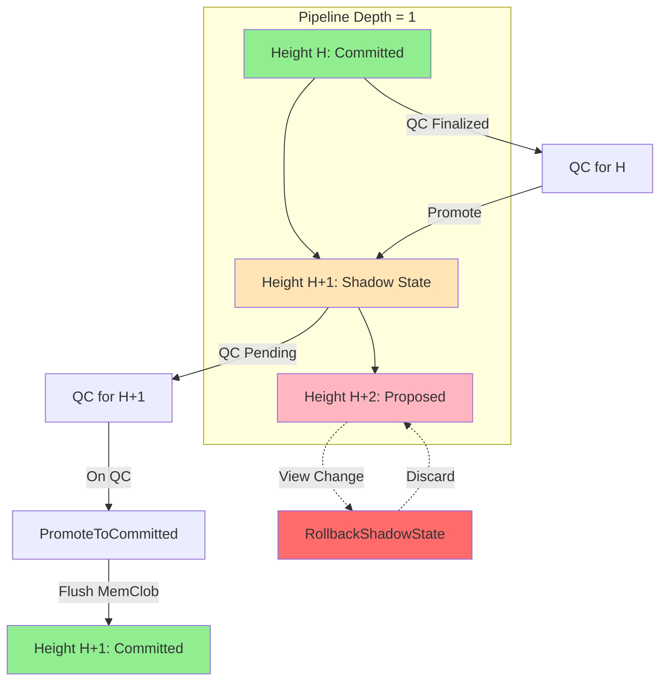
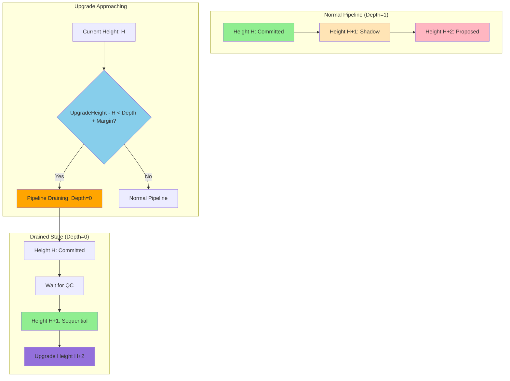
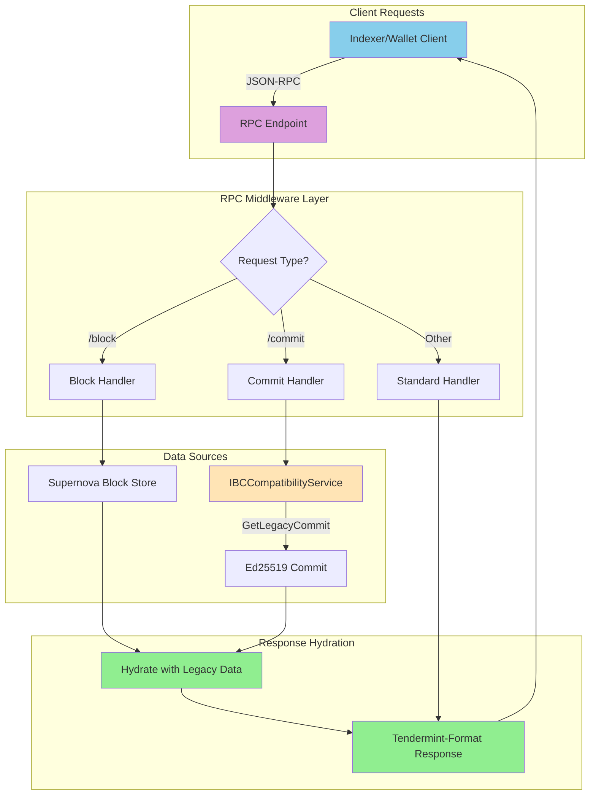
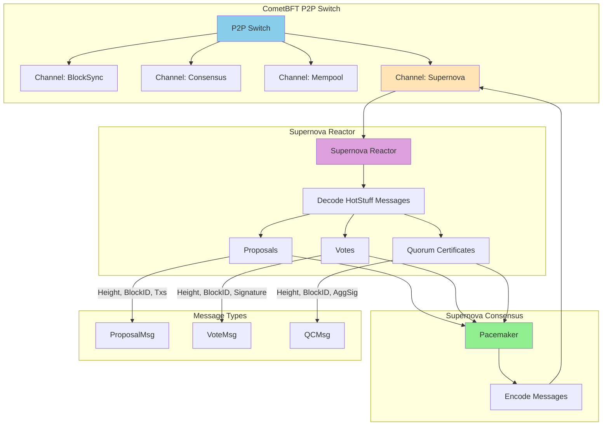

# Supernova Core Integration Plan for dYdX v4

## Overview

This document outlines the complete plan for replacing CometBFT's consensus reactor with **Supernova Core (Pipelined HotStuff)** while maintaining full ABCI++ compatibility and ensuring deterministic execution for dYdX v4's `x/clob` and `x/perpetuals` modules.

**Status**: Core components implemented, integration in progress

**Last Updated**: Jan 2026

---

## Table of Contents

1. [Architecture Overview](#architecture-overview)
2. [Core Challenges & Solutions](#core-challenges--solutions)
3. [IBC & Light Client Compatibility](#ibc--light-client-compatibility)
4. [Node Bootstrapping & State Sync](#node-bootstrapping--state-sync)
5. [Implementation Status](#implementation-status)
6. [Component Details](#component-details)
7. [Integration Steps](#integration-steps)
8. [Remaining Tasks](#remaining-tasks)
9. [Testing Strategy](#testing-strategy)
10. [Performance Considerations](#performance-considerations)

---

## Architecture Overview

### Current State

- **dYdX v4** uses CometBFT v0.47+ with ABCI++ hooks:
  - `PrepareProposal`/`ProcessProposal` in `app/prepare` and `app/process`
  - `ExtendVote`/`VerifyVoteExtension` for Slinky oracle in `app/vote_extensions`
  - `PreBlocker`/`Precommitter` for staged events in `app/app.go`
- **Supernova Core** already implements ABCI++ (`FinalizeBlock`, `Commit`, `ExtendVote`, `VerifyVoteExtension`) and HotStuff consensus via `Pacemaker`

### Integration Approach

- **ABCI-client-only**: Keep CometBFT networking/block-sync, replace consensus reactor with Supernova
- **Configurable pipeline depth** (default=1) with guardrails
- **Shadow state** for in-flight proposals; rollback on consensus failure

### Key Design Principles

1. **FinalizeBlock is the single source of truth** for state transitions
2. **MemClob mutations only occur after QC confirmation** (atomic flush)
3. **Shadow execution never mutates persistent state** (uses `CacheContext()`)
4. **Oracle alignment**: VEs for height H are used for H+1 execution via QC
5. **ABCI++ Lifecycle Compliance**: While `ProcessProposal` validates a **candidate proposal** using Shadow State (read-only, before consensus), the actual call to `PromoteToCommitted()` (which flushes the `VolatileEventBuffer` to MemClob and finalizes sequence numbers) **must occur inside `FinalizeBlock`** (after QC formation, when consensus is reached). This ensures strict ABCI++ compliance where state mutations are exclusive to the Finalize phase.

### Pipeline Depth & Shadow State Visualization



**Legend**:
- 🟢 **Green**: Committed state (persistent)
- 🟡 **Yellow**: Shadow state (speculative, in-flight)
- 🔴 **Pink**: Proposed (not yet in shadow)
- ❌ **Red**: Rollback (discarded)

### Pipeline Draining Before Upgrades



**Pipeline Draining Logic**:
- When `UpgradeHeight - CurrentHeight < PipelineDepth + SafetyMargin`, disable shadow state creation
- Force sequential execution (Depth=0) until upgrade completes
- Prevents speculative execution across binary upgrade boundaries

### RPC Compatibility Layer



**RPC Compatibility Flow**:
- Client requests `/block` or `/commit` via JSON-RPC
- RPC Middleware intercepts and detects request type
- For block/commit requests, fetches Supernova data + Ed25519 signatures
- Hydrates response with Tendermint-format headers/commits
- Returns standard Tendermint response to client (transparent)

### P2P Network Multiplexing



**Network Multiplexing Flow**:
- Supernova Reactor implements CometBFT `p2p.Reactor` interface
- Registers with P2P Switch on dedicated channel ID (e.g., `ChannelSupernova = 0x40`)
- Multiplexes HotStuff messages (Proposals, Votes, QCs) over existing P2P infrastructure
- No new ports required - reuses CometBFT's P2P Switch
- Messages encoded/decoded at reactor boundary

---

## Core Challenges & Solutions

### Challenge 1: Vote Extension Height-Gap

**Problem**: In standard CometBFT, Vote Extensions for height H are available to the proposer of H+1. In Pipelined HotStuff (Depth=1), the QC for H is finalized simultaneously with the proposal of H+1.

**Solution**: `VoteExtensionCache`
- Cache VEs by `(height, blockID)` as they arrive from `ExtendVote`
- Aggregate VEs power-weighted incrementally
- Retrieve VEs using QC's `blockID` when proposing/executing H+1
- **No 1-block look-back delay**; VEs for H are used for H+1 execution

**Status**: ✅ Implemented (`app/consensus/vote_extension_cache.go`)

### Challenge 2: MemClob Atomic Commitment

**Problem**: dYdX v4 uses an in-memory MemClob for sub-second matching. This state is not protected by Cosmos SDK's `CacheMultiStore`.

**Solution**: `VolatileEventBuffer` + `ShadowStateManager`
- Record CLOB events (PlaceOrder, CancelOrder) as abstract events during shadow execution
- Store events in a per-height buffer
- Flush events to MemClob atomically during `PromoteToCommitted` (after FinalizeBlock, before Precommit)
- Shadow execution never mutates MemClob directly

**Status**: ✅ Implemented (`app/consensus/volatile_event_buffer.go`, `app/consensus/shadow_state.go`)

### Challenge 3: Pipeline Reorgs

**Problem**: If a leader fails and HotStuff Pacemaker triggers a view change, shadow state for height H+1 must be discarded without corrupting MemClob sequence numbers. Additionally, we must ensure **ancestry commits** - parent blocks must be committed before discarding children during view changes.

**Solution**: `ShadowSeqManager` + Ancestry-Aware Rollback
- Allocate shadow-local sequences (never applied to MemClob until commit)
- Map shadow sequences to real sequences during `PromoteToCommitted`
- **Ancestry Commits**: When rolling back height H+1, verify that height H is committed first
- Rollback simply deletes metadata (no MemClob unwinding needed)
- Maintain height dependency graph to prevent orphaned shadow states

**Status**: ✅ Implemented (`app/consensus/shadow_seq_manager.go`)

### Challenge 4: Fragile Interception Hooks

**Problem**: Manual hooks in `x/clob` keeper (e.g., `if interceptor.ShouldIntercept()`) are too fragile - developers could accidentally bypass interception by directly calling MemClob methods, leading to MemClob mutations during shadow execution.

**Solution**: `MemClobSafeWrapper` - Structural Enforcement Layer
- Wrap the underlying MemClob struct in an interface that **enforces** the `VolatileEventBuffer` check
- Make it **impossible** to bypass interception - all MemClob operations go through the wrapper
- The wrapper automatically routes to `VolatileEventBuffer` in shadow state, or direct MemClob in committed state
- Type system prevents direct MemClob access from keeper code

**Status**: ❌ Not Started (`x/clob/safe_wrapper.go`)

### Challenge 5: IBC Light Client Compatibility

**Problem**: Switching consensus engines breaks existing IBC Light Clients on counterparty chains (e.g., Noble, Osmosis) because they expect Tendermint-formatted headers and proofs. Standard IBC 07-tendermint clients cannot verify BLS-based HotStuff QCs. **Cryptographically, BLS signatures cannot be "mapped" or converted to Ed25519 signatures** - they are fundamentally different signature schemes.

**Solution**: **Transparent RPC Middleware + Asynchronous Dual-Signing Service (In-App) + On-Chain Evidence Handling**
- Validators sign the finalized Supernova block hash with their legacy Ed25519 consensus keys
- These signatures are aggregated asynchronously to create a valid Tendermint Light Block for IBC Relayers
- In-App Background Service monitors QC finalization and triggers Ed25519 signing
- **RPC Middleware Transparency**: The RPC Middleware intercepts standard JSON-RPC `/commit` and `/block` requests and hydrates them with aggregated Ed25519 signatures from the `IBCCompatibilityService`. Since the middleware serves standard Tendermint-format responses, **standard IBC Relayers (Hermes/Go-Relayer) function without software modifications** - they connect to the standard JSON-RPC endpoint and receive hydrated responses transparently.
- **Relayer Compatibility**: Standard relayers query the same JSON-RPC endpoints (`/block`, `/commit`) they use for any Tendermint chain. The RPC Middleware handles the compatibility layer, making the dual-signing mechanism transparent to relayer software.
- **Unpunished IBC Equivocation Risk**: Local-only "Slashing Protection DB" cannot prevent malicious validators from double-signing Ed25519 headers to attack IBC clients, as the main Supernova consensus doesn't see these off-chain signatures
- **On-Chain Evidence Handling**: `MsgSubmitDualSigningEvidence` allows anyone to submit proof of Ed25519 double-signing to the chain. The application verifies signatures and calls SDK's `slashKeeper.Slash()` to punish malicious validators
- Maintains IBC client compatibility without requiring counterparty chain upgrades or relayer software patches
- **Alternative (Future)**: Migrate to WASM-based IBC clients (08-wasm) that can verify custom consensus proofs

**Status**: ❌ Not Started (`app/consensus/ibc_compatibility_service.go`)

### Challenge 6: Native BLS Equivocation

**Problem**: While IBC double-signing uses Ed25519 signatures (handled by `MsgSubmitDualSigningEvidence`), the core Supernova consensus uses BLS signatures for Quorum Certificates. If a validator signs two conflicting QCs for the same view (height + round), this constitutes equivocation and must be punished on-chain. Unlike Ed25519 equivocation which is detected off-chain and submitted via evidence transaction, BLS equivocation can be detected directly by the `Pacemaker` or `Reactor` when processing conflicting QCs.

**Solution**: **Native BLS Slashing via `MsgSubmitBLSEquivocation`**
- The `Pacemaker` or `SupernovaReactor` detects conflicting BLS signatures for the same view
- When detected, construct `MsgSubmitBLSEquivocation` evidence containing both conflicting QCs
- Broadcast the evidence transaction to the mempool
- The handler verifies both QCs contain valid BLS signatures from the same validator for the same view
- Upon verification, call SDK's `slashKeeper.Slash()` to punish the equivocating validator
- This ensures validators cannot sign conflicting blocks without being slashed

**Key Requirements**:
- Detect conflicting BLS signatures during QC processing
- Construct evidence message with both conflicting QCs
- Verify BLS signatures are valid and from the same validator
- Verify both QCs are for the same view (height + round)
- Trigger on-chain slashing via `x/slashing` module
- Prevent double-slashing for the same equivocation

**Status**: ❌ Not Started (`app/consensus/bls_equivocation_handler.go`, `x/supernova/keeper/msg_server.go`)

### Challenge 7: State Sync & Node Bootstrapping

**Problem**: Standard Cosmos State Sync relies on Tendermint Light Blocks for verification. Supernova blocks use BLS QCs, which cannot be verified by Tendermint light clients.

**Solution**: **Supernova Light Client + Enhanced Snapshot Verification**
- Implement Supernova Light Client for node syncing
- Update `SnapshotManager` to verify Supernova QCs before applying snapshots
- Provide alternative sync path using Supernova's block/QC verification
- Maintain backward compatibility with Tendermint state sync for transition period

**Status**: ❌ Not Started (`app/consensus/supernova_light_client.go`)

### Challenge 8: Mempool Duplicate Nonce Detection

**Problem**: The Mempool checks nonces against **committed** state, ignoring **shadow** state. This allows duplicate nonces to be accepted if a transaction is in the pipeline but not yet committed.

**Solution**: **Shadow Mempool Filter**
- Expose `IsNonceInShadow(address, nonce)` from `ShadowStateManager`
- Integrate shadow filter into `AnteHandler` or Mempool validation
- Prevent re-inclusion of transactions currently in pipeline
- Ensure nonce uniqueness across both committed and shadow state

**Status**: ❌ Not Started (requires `ShadowStateManager` enhancement)

### Challenge 9: Chain Lifecycle & Upgrades

**Problem**: The `x/upgrade` module halts the chain at specific heights for binary upgrades. Speculative Shadow Execution across this boundary (using the old binary to compute the post-upgrade block) will corrupt the state machine upon restart. The old binary's logic may not match the new binary's expectations, causing consensus failure when the new binary starts executing blocks.

**Solution**: **Pipeline Draining Strategy**
- Check `UpgradeKeeper` for pending upgrade plans
- If `UpgradeHeight - CurrentHeight < PipelineDepth + SafetyMargin`, disable Shadow State creation
- Force sequential execution (Depth=0) until the upgrade is complete
- `CreateShadowContext()` returns error when upgrade is pending, forcing consensus to wait for commit before proposing H+1
- After upgrade completes, re-enable pipelining

**Safety Margin**: Configurable parameter (default=3 blocks) to ensure pipeline is fully drained before upgrade height

**Status**: ❌ Not Started (requires `ShadowStateManager` enhancement + `UpgradeKeeper` integration)

### Challenge 10: Ecosystem Tooling & Indexer Compatibility

**Problem**: dYdX Indexer, Wallets, and **IBC Relayers** expect standard Tendermint RPC responses. Raw Supernova blocks (BLS QCs) cause schema validation failures in downstream tools. Existing ecosystem tooling queries standard JSON-RPC endpoints (`/block`, `/commit`) and expects Tendermint-formatted headers and commits. Without compatibility, indexers will fail to parse blocks, wallets will fail to verify transaction inclusion, and IBC relayers will fail to fetch commit proofs for packet verification.

**Solution**: **RPC Compatibility Middleware**
- Intercept JSON-RPC calls at the RPC layer
- Detect requests for `/block` and `/commit` endpoints
- Hydrate responses using Ed25519 signatures stored in `IBCCompatibilityService`
- Return standard Tendermint-format responses to clients
- Make the switch to Supernova transparent to existing tooling
- Maintain backward compatibility with all existing RPC clients

**Key Requirements**:
- RPC middleware wraps standard RPC handlers
- Detects block/commit requests and routes to compatibility layer
- Fetches Supernova block data and Ed25519 commits from `IBCCompatibilityService`
- Constructs Tendermint-format responses before returning to client
- No changes required to existing indexers, wallets, or **IBC Relayers** (Hermes/Go-Relayer)
- Standard relayers connect to the standard JSON-RPC endpoint and receive hydrated responses transparently

**Status**: ❌ Not Started (`app/rpc/middleware.go`, `app/consensus/rpc_compatibility.go`)

### Challenge 11: P2P Network Integration

**Problem**: Supernova consensus messages (Proposals, Votes, Quorum Certificates) need network transport. Opening new ports causes operational friction, firewall configuration complexity, and breaks existing network topology. The system must reuse the existing CometBFT P2P infrastructure without requiring infrastructure changes.

**Solution**: **Supernova Reactor**
- Implement CometBFT's `p2p.Reactor` interface
- Register with the existing P2P Switch on a dedicated channel ID
- Multiplex HotStuff messages over the existing P2P infrastructure
- Encode/decode Supernova messages at the reactor boundary
- No new ports required - transparent to network operators

**Key Requirements**:
- Reactor implements `p2p.Reactor` interface (GetChannels, Receive, etc.)
- Dedicated channel ID for Supernova messages (e.g., `ChannelSupernova = 0x40`)
- Message encoding/decoding for Proposals, Votes, QCs
- Integration with Supernova's Pacemaker for sending/receiving messages
- Backward compatible with existing P2P Switch

**Status**: ❌ Not Started (`app/p2p/supernova_reactor.go`)

### Challenge 12: Live Chain Migration & Consensus Swap

**Problem**: The chain is already live. We cannot rely solely on `InitChain` for a fresh genesis start. We need to transition the consensus engine at a specific Upgrade Height without losing consensus continuity. The Supernova consensus engine must seamlessly take over from CometBFT at the upgrade boundary, requiring a state handoff mechanism that preserves validator set continuity and AppHash consistency.

**Critical Prerequisite - Phase -1: BLS Key Registration**: We cannot mathematically convert Ed25519 keys to BLS keys. Validators must generate new BLS keys and register them on-chain prior to the consensus swap. This is a mandatory prerequisite that must be completed before the upgrade can proceed.

**Solution**: **State Preparation & Restart-Based Initialization**
- **Phase -1: Key Registration**: Validators submit `MsgRegisterBLSKey` to register their BLS public keys on-chain
- **Validator Tooling**: CLI utility for secure BLS key generation and registration
- Implement a "Consensus Handoff" mechanism in the `UpgradeHandler` that focuses on **state preparation only**
- At `UpgradeHeight`, the `x/upgrade` module halts the chain after committing the upgrade block
- In the `UpgradeHandler`, the application must:
  - Extract the current `ValidatorSet` and `LastAppHash` from the SDK state
- Map validators to their registered BLS keys (instead of attempting conversion)
  - Persist Supernova consensus parameters to `x/supernova` module state
  - Validate sufficient voting power (>2/3) has registered BLS keys
- Upon node restart after the upgrade, `app.go` initialization checks `x/supernova` module state
- If Supernova params exist, the node initializes the `SupernovaReactor` instead of the legacy reactor
- The `SupernovaReactor` reads the persisted validator set and AppHash from state, initializing the Pacemaker
- This ensures a clean transition without runtime reactor swapping

**Key Requirements**:
- **BLS Key Registration**: Validators must register BLS keys via `MsgRegisterBLSKey` before upgrade height
- **CLI Utility for BLS Key Generation**: Validators need a secure tool to:
  - Generate a secure BLS key pair
  - Sign a "Proof of Ownership" message using the validator's existing `priv_validator_key.json` (Ed25519) to prevent rogue key registration
  - Output the JSON payload required for `MsgRegisterBLSKey` transaction
- **Upgrade Validation**: If insufficient voting power (>2/3) has registered BLS keys by `UpgradeHeight`, the upgrade handler must panic to prevent consensus halt
- Upgrade handler extracts validator set from SDK state at upgrade height
- Load consensus parameters (Block Max Bytes, Gas Limits) from SDK state
- Load consensus parameters (Timeouts, Pipeline Depth) from upgrade plan or param store
- Map validators to registered BLS keys (not conversion - lookup from on-chain registry)
- Validate sufficient voting power is registered (>2/3 threshold)
- Persist Supernova consensus parameters to `x/supernova` module state (acts as "Consensus Active" marker)
- Persist validator set mapping (BLS keys) to `x/supernova` module state
- Verification that AppHash continuity is maintained
- **No Runtime Reactor Swapping**: Reactor initialization happens at node restart, not during upgrade handler execution

#### CLI Utility for BLS Key Generation

**Command**: `dydx-protocol bls-keygen`

**Location**: `cmd/dydx-protocol/commands/bls_keygen.go`

A command-line utility must be provided to validators for secure BLS key generation and registration payload creation. This tool ensures validators can safely generate BLS keys and create the proof-of-ownership signature required for on-chain registration.

**Tool Specification**:

1. **BLS Key Pair Generation**:
   - Generate a cryptographically secure BLS key pair using BLS12-381 curve
   - Use cryptographically secure random number generator (CSPRNG)
   - Store secret key securely with file permissions 0600

2. **Proof of Ownership Signature**:
   - Load validator's existing Ed25519 consensus key from `priv_validator_key.json`
   - Construct proof message: `"BLS Key Registration: {validator_address} {bls_public_key}"`
   - Sign proof message using Ed25519 private key
   - **Security Rationale**: Only the validator who controls the Ed25519 consensus key can create a valid proof signature, preventing rogue key registration

3. **BLS Proof of Possession Signature**:
   - Sign the same proof message using the newly generated BLS private key
   - **Security Rationale**: Ensures the validator actually owns the BLS private key corresponding to the public key being registered. This prevents accidental self-slashing due to misconfiguration (e.g., registering someone else's BLS public key)

4. **Registration Payload Output**:
   - Create `MsgRegisterBLSKey` message struct with:
     - `ValidatorAddress`: Derived from Ed25519 key's address
     - `BLSPublicKey`: Serialized BLS public key bytes
     - `Proof`: Ed25519 signature of proof message (proof of ownership)
     - `BLSSignature`: BLS signature of proof message (proof of possession)
   - Output JSON payload suitable for transaction submission
   - Provide clear instructions for submitting via governance transaction

> ⚠️ **SECURITY WARNING: Private Key Storage**
> 
> **The `bls_secret_key.json` file contains a raw private key in plaintext on the filesystem. This approach is intended for Testnet environments or disaster recovery scenarios only.**
> 
> **For Mainnet deployments, the CLI tool MUST support (or point to) secure key management backends:**
> - **HSM (Hardware Security Module)**: YubiKey, Ledger, or other HSM devices for generating and storing the BLS secret key
> - **OS Keyring**: Integration with OS-level keyring services (macOS Keychain, Windows Credential Manager, Linux Secret Service) to store keys securely
> 
> **Critical Requirements for Mainnet:**
> - Raw BLS secret keys MUST NOT be stored in plaintext files on the filesystem
> - Keys MUST be generated and stored using HSM or OS Keyring backends
> - The CLI tool MUST provide flags/options to specify the key management backend (e.g., `--hsm`, `--keyring`)
> - If HSM/Keyring backends are not available, the tool MUST fail with a clear error message directing operators to use secure key management
> 
> **Rationale**: Mainnet validators handle significant value and are high-value targets. Storing raw private keys on the filesystem creates unacceptable security risk. HSM/Keyring backends ensure keys are never exposed in plaintext and are protected by hardware or OS-level security mechanisms.

**Implementation**:
```go
// CLI command: dydx-protocol bls-keygen
// Location: cmd/dydx-protocol/commands/bls_keygen.go

package commands

import (
    "encoding/json"
    "fmt"
    "os"
    
    "github.com/dydxprotocol/v4-chain/protocol/x/supernova/types"
    cmtjson "github.com/cometbft/cometbft/libs/json"
    cmttypes "github.com/cometbft/cometbft/types"
    bls "github.com/kilic/bls12-381"
)

// GenerateBLSKeyPair generates a BLS key pair and creates registration payload
func GenerateBLSKeyPair(privValidatorKeyPath string) error {
    // 1. Load existing Ed25519 consensus key
    privValKey, err := cmttypes.LoadPrivValidatorKeyFile(privValidatorKeyPath)
    if err != nil {
        return fmt.Errorf("failed to load priv_validator_key.json: %w", err)
    }
    
    // 2. Generate new BLS key pair
    blsSecretKey := bls.NewSecretKey()
    blsPublicKey := blsSecretKey.PublicKey()
    
    // 3. Create proof of ownership message
    // Message: "BLS Key Registration: {validator_address} {bls_public_key}"
    validatorAddr := privValKey.Address
    proofMessage := fmt.Sprintf(
        "BLS Key Registration: %s %x",
        validatorAddr,
        blsPublicKey.Serialize(),
    )
    
    // 4. Sign proof message with Ed25519 key (proof of ownership)
    proofSignature, err := privValKey.PrivKey.Sign([]byte(proofMessage))
    if err != nil {
        return fmt.Errorf("failed to sign proof message: %w", err)
    }
    
    // 5. Sign proof message with BLS key (proof of possession)
    // This ensures the validator actually owns the BLS private key
    blsSignature := blsSecretKey.Sign([]byte(proofMessage))
    
    // 6. Create MsgRegisterBLSKey payload
    msg := &types.MsgRegisterBLSKey{
        ValidatorAddress: sdk.ValAddress(validatorAddr),
        BLSPublicKey:     blsPublicKey.Serialize(),
        Proof:            proofSignature,      // Ed25519 signature (proof of ownership)
        BLSSignature:     blsSignature.Serialize(), // BLS signature (proof of possession)
    }
    
    // 6. Output JSON payload for transaction
    msgJSON, err := json.MarshalIndent(msg, "", "  ")
    if err != nil {
        return fmt.Errorf("failed to marshal message: %w", err)
    }
    
    fmt.Println("BLS Key Registration Message:")
    fmt.Println(string(msgJSON))
    fmt.Println("\n⚠️  SECURITY WARNING:")
    fmt.Println("- Store the BLS secret key securely (not in this output)")
    fmt.Println("- Submit the above message via governance transaction")
    fmt.Println("- Verify registration on-chain before upgrade height")
    
    // 7. Save BLS secret key to secure file (TESTNET/DISASTER RECOVERY ONLY)
    // WARNING: For Mainnet, use HSM or OS Keyring backend instead of filesystem storage
    blsKeyFile := "bls_secret_key.json"
    blsKeyData := map[string]interface{}{
        "secret_key": blsSecretKey.Serialize(),
        "public_key": blsPublicKey.Serialize(),
        "validator_address": validatorAddr.String(),
    }
    
    blsKeyJSON, _ := json.MarshalIndent(blsKeyData, "", "  ")
    if err := os.WriteFile(blsKeyFile, blsKeyJSON, 0600); err != nil {
        return fmt.Errorf("failed to save BLS key: %w", err)
    }
    
    fmt.Printf("\n⚠️  WARNING: BLS secret key saved to: %s (mode 0600)\n", blsKeyFile)
    fmt.Println("   This filesystem storage is intended for TESTNET or DISASTER RECOVERY only.")
    fmt.Println("   For Mainnet, use HSM (YubiKey/Ledger) or OS Keyring backend instead.")
    
    return nil
}
```

**Usage**:
```bash
# Generate BLS key pair and registration payload
dydx-protocol bls-keygen --priv-validator-key /path/to/priv_validator_key.json

# Output: JSON payload for MsgRegisterBLSKey transaction
# Validator submits this via governance transaction
```

**Security Considerations**:
- **Filesystem Storage (Testnet/Disaster Recovery Only)**: BLS secret key stored in `bls_secret_key.json` with file permissions 0600 is acceptable for testnet environments or disaster recovery scenarios only
- **Mainnet Requirements**: For Mainnet deployments, the CLI tool MUST support HSM (YubiKey/Ledger) or OS Keyring backends. Raw secret keys MUST NOT be stored in plaintext files on the filesystem
- Ed25519 proof signature prevents rogue key registration (only validator with Ed25519 key can register)
- BLS proof of possession ensures validator actually owns the BLS private key, preventing accidental self-slashing due to misconfiguration
- Validator must verify registration on-chain before upgrade height

**Implementation**:
```go
// ConsensusHandoff handles state preparation for the transition from CometBFT to Supernova
// Note: This does NOT perform reactor swapping - that happens at node restart via conditional initialization
type ConsensusHandoff struct {
    app          AppInterface
    supernovaKeeper supernovatypes.Keeper
    params       SupernovaParams // Consensus parameters
}

// ExecuteHandoff performs state preparation at upgrade height
// This function persists Supernova parameters and validator set mapping to x/supernova module state
// The actual reactor switch happens at node restart via conditional initialization in app.go
func (h *ConsensusHandoff) ExecuteHandoff(ctx sdk.Context, plan upgradetypes.Plan) error {
    // 1. Extract current validator set from SDK state
    validatorSet := h.app.GetStakingKeeper().GetBondedValidatorsByPower(ctx)
    
    // 2. Get current AppHash (for Pacemaker initialization at restart)
    appHash := ctx.BlockHeader().AppHash
    
    // 3. Load Consensus Params (Block sizes, Gas limits) from SDK state
    // These will be passed to Pacemaker during initialization at restart
    consensusParams := h.app.GetConsensusParams(ctx)
    
    // 4. Load consensus parameters from upgrade plan or x/supernova module state
    // Parameters can be stored in plan.Info (JSON) or a dedicated param store
    params, err := h.loadParams(ctx, plan)
    if err != nil {
        return fmt.Errorf("failed to load consensus parameters: %w", err)
    }
    h.params = params
    
    // 5. Map validators to registered BLS keys
    // This requires looking up BLS keys from on-chain registry (not conversion)
    supernovaValidators, missingKeys, err := h.MapValidatorsToBLSKeys(ctx, validatorSet)
    if err != nil {
        return fmt.Errorf("failed to map validators to BLS keys: %w", err)
    }
    
    // 6. Validate sufficient voting power is registered (>2/3 threshold)
    // Calculate total voting power and registered voting power
    var totalPower int64
    var registeredPower int64
    
    for _, val := range validatorSet {
        totalPower += val.GetConsensusPower()
    }
    
    for _, sv := range supernovaValidators {
        registeredPower += sv.Power
    }
    
    // Check if registered power meets quorum requirement (>2/3 = 66.67%)
    quorumThreshold := (totalPower * 2) / 3
    if registeredPower <= quorumThreshold {
        return fmt.Errorf(
            "consensus handoff failed: insufficient voting power registered. "+
                "Registered: %d/%d (%.2f%%), Required: >%d (>.67%%). "+
                "Missing validators: %v",
            registeredPower, totalPower,
            (float64(registeredPower)/float64(totalPower))*100.0,
            quorumThreshold,
            missingKeys,
        )
    }
    
    // 7. Persist Supernova consensus parameters to x/supernova module state
    // This acts as the "Consensus Active" marker for conditional reactor initialization
    if err := h.supernovaKeeper.SetParams(ctx, params); err != nil {
        return fmt.Errorf("failed to persist Supernova parameters: %w", err)
    }
    
    // 8. Persist validator set mapping (BLS keys) to x/supernova module state
    // This ensures validators can be loaded at node restart
    if err := h.supernovaKeeper.SetValidatorSet(ctx, supernovaValidators); err != nil {
        return fmt.Errorf("failed to persist validator set: %w", err)
    }
    
    // 9. Persist AppHash and consensus params for Pacemaker initialization at restart
    if err := h.supernovaKeeper.SetHandoffState(ctx, appHash, consensusParams); err != nil {
        return fmt.Errorf("failed to persist handoff state: %w", err)
    }
    
    // Note: Reactor initialization happens at node restart, not here
    // The x/supernova module state now contains all information needed for
    // conditional reactor initialization in app.go:New()
    
    return nil
}

// loadParams extracts Supernova consensus parameters with genesis compatibility
// If node restarts after upgrade, loads from x/supernova module state instead of upgrade plan
func (h *ConsensusHandoff) loadParams(
    ctx sdk.Context,
    plan upgradetypes.Plan,
) (SupernovaParams, error) {
    // Genesis Compatibility: If node restarts after upgrade, load from x/supernova module state
    // This ensures BLS keys and params are preserved across restarts
    supernovaKeeper := h.app.GetSupernovaKeeper()
    if supernovaKeeper != nil {
        // Check if x/supernova module has been initialized (post-upgrade state)
        params, found := supernovaKeeper.GetParams(ctx)
        if found {
            // Module state exists - use persisted params (includes adaptive timeout state)
            return params, nil
        }
    }
    
    // Upgrade path: Load from upgrade plan (first time upgrade executes)
    // Option 1: Parameters stored in plan.Info as JSON
    if len(plan.Info) > 0 {
        var params SupernovaParams
        if err := json.Unmarshal([]byte(plan.Info), &params); err == nil {
            return params, nil
        }
    }
    
    // Option 2: Use default parameters if not specified
    return DefaultSupernovaParams(), nil
}

// MapValidatorsToBLSKeys maps Tendermint validators to their registered BLS keys
func (h *ConsensusHandoff) MapValidatorsToBLSKeys(
    ctx sdk.Context,
    validators []stakingtypes.Validator,
) ([]*SupernovaValidator, []sdk.ValAddress, error) {
    supernovaValidators := make([]*SupernovaValidator, 0, len(validators))
    missingKeys := make([]sdk.ValAddress, 0)
    
    for _, val := range validators {
        valAddr := val.GetOperator()
        
        // Lookup BLS key from on-chain registry
        blsKey, found := h.app.GetSupernovaKeeper().GetBLSKey(ctx, valAddr)
        if !found {
            missingKeys = append(missingKeys, valAddr)
            continue
        }
        
        // Create Supernova validator with registered BLS key
        supernovaVal := &SupernovaValidator{
            Address:    valAddr,
            PubKey:     blsKey,
            Power:      val.GetConsensusPower(),
            Ed25519Key: val.GetConsPubKey(), // Keep for IBC compatibility
        }
        
        supernovaValidators = append(supernovaValidators, supernovaVal)
    }
    
    return supernovaValidators, missingKeys, nil
}

// UpgradeHandler integration
func (app *App) UpgradeHandler(ctx sdk.Context, plan upgradetypes.Plan) error {
    // ... existing upgrade logic ...
    
    // If this is the Supernova consensus upgrade, perform state preparation
    if plan.Name == "supernova-consensus" {
        handoff := &ConsensusHandoff{
            app:            app,
            supernovaKeeper: app.SupernovaKeeper,
        }
        
        if err := handoff.ExecuteHandoff(ctx, plan); err != nil {
            // Critical failure: panic to prevent consensus halt with incomplete validator set
            // The chain will halt after this block due to x/upgrade, so panic is safe
            panic(fmt.Sprintf("consensus handoff failed: %v", err))
        }
        
        // State preparation complete - x/supernova module now contains:
        // - Supernova consensus parameters (acts as "Consensus Active" marker)
        // - Validator set mapping with BLS keys
        // - AppHash and consensus params for Pacemaker initialization
        
        // Note: Reactor initialization happens at node restart, not here
        // The x/upgrade module will halt the chain after this block is committed
    }
    
    return nil
}
```

**Status**: ❌ Not Started (`app/consensus/consensus_handoff.go`)

### Challenge 13: Dynamic Validator Set Synchronization

**Problem**: Supernova needs to know the exact validator set for the _next_ view to validate QCs. In Cosmos, validator sets change during block execution (`x/staking`). These changes are communicated via `FinalizeBlock` responses (`ValidatorUpdates`), but Supernova must apply these updates immediately after block commitment to ensure the next view uses the correct power table.

**Solution**: **ABCI Validator Update Hook**
- Listen to `FinalizeBlock` responses (specifically `ValidatorUpdates`)
- Apply these updates to the `ValidatorSetRegistry` immediately after the block is committed
- Ensure the Supernova `Pacemaker` rotates the leader schedule based on the _updated_ power table for Height H+1
- Maintain validator set consistency between SDK state and Supernova consensus

**Update Delay Logic**:
- Due to pipelining (Depth=1), Validator Updates processed in `FinalizeBlock` for Height `H` must apply to the validator set for **Height `H+2`** (standard Cosmos SDK delay behavior).
- The `Pacemaker` must queue these updates to ensure it doesn't validate the `H+1` QC against the _new_ validator set, as the `H+1` proposal was likely formed using the _old_ set.
- **Implementation Note**: Validator updates from `FinalizeBlock` at Height `H` should be stored in a queue and applied when processing Height `H+2`, ensuring the validator set used for QC validation matches the set that was active when the proposal was created.

**Key Requirements**:
- Hook into `FinalizeBlock` response processing
- Extract `ValidatorUpdates` from response
- Apply updates to `ValidatorSetRegistry` atomically (always, regardless of consensus mode)
- **Activation Guard**: Only update Pacemaker if `ConsensusMode == Supernova`. During Phase 3a (Legacy Passthrough), CometBFT is the source of truth for the validator set. The hook must not attempt to update the Pacemaker in Legacy Mode to avoid conflicts with the "Hollow Adapter" state or panics if the Pacemaker is not fully initialized.
- Update Pacemaker leader schedule for next view (only in Supernova mode)
- Handle validator power changes, additions, and removals
- Ensure QC validation uses updated validator set

**Implementation**:
```go
// ValidatorUpdateHook processes validator updates from FinalizeBlock
type ValidatorUpdateHook struct {
    validatorSet   *ValidatorSetRegistry
    pacemaker      *consensus.Pacemaker
    consensusMode  ConsensusMode // Current consensus mode (Legacy or Supernova)
}

// OnFinalizeBlock processes validator updates
func (h *ValidatorUpdateHook) OnFinalizeBlock(
    ctx sdk.Context,
    resp *abci.ResponseFinalizeBlock,
) error {
    // Extract validator updates from response
    if len(resp.ValidatorUpdates) == 0 {
        return nil // No changes
    }
    
    // Apply updates to validator set registry (always update registry for consistency)
    for _, update := range resp.ValidatorUpdates {
        if err := h.validatorSet.ApplyUpdate(update); err != nil {
            return fmt.Errorf("failed to apply validator update: %w", err)
        }
    }
    
    // ACTIVATION GUARD: Only update Pacemaker if Supernova consensus is active
    // During Phase 3a (Legacy Passthrough), CometBFT is the source of truth for the validator set.
    // If the hook blindly attempts to update the Supernova Pacemaker's validator set every block,
    // it may conflict with the "Hollow Adapter" state or panic if the Pacemaker is not fully initialized.
    if h.consensusMode != ConsensusModeSupernova {
        // Legacy Mode: Only update passive ValidatorSetRegistry, do not trigger Pacemaker logic
        // The Pacemaker may not be initialized or may be in a passive state during legacy mode
        return nil
    }
    
    // CRITICAL: Due to pipelining (Depth=1), validator updates from FinalizeBlock at Height H
    // must apply to the validator set for Height H+2, not H+1.
    // The proposal for Height H+1 has typically already been generated (or is being voted on)
    // using the current validator set. Applying updates immediately would cause the H+1 QC
    // to be validated against a new validator set, while the proposal was formed with the old set.
    targetHeight := ctx.BlockHeight() + 2
    if err := h.pacemaker.UpdateValidatorSet(targetHeight, h.validatorSet); err != nil {
        return fmt.Errorf("failed to update pacemaker: %w", err)
    }
    
    return nil
}

// ApplyUpdate applies a single validator update
func (r *ValidatorSetRegistry) ApplyUpdate(update abci.ValidatorUpdate) error {
    r.mtx.Lock()
    defer r.mtx.Unlock()
    
    pubKey, err := cryptoenc.PubKeyFromProto(update.PubKey)
    if err != nil {
        return err
    }
    
    validatorAddr := sdk.ValAddress(pubKey.Address())
    
    if update.Power == 0 {
        // Remove validator
        delete(r.validators, validatorAddr.String())
    } else {
        // Add or update validator
        validator := &SupernovaValidator{
            Address: validatorAddr,
            PubKey:  pubKey,
            Power:   update.Power,
        }
        r.validators[validatorAddr.String()] = validator
    }
    
    // Recompute total power
    r.recomputeTotalPower()
    
    return nil
}
```

**Status**: ❌ Not Started (`app/consensus/validator_update_hook.go`)

### Challenge 14: Legacy Consensus Detachment

**Problem**: Upon upgrade, the existing CometBFT Consensus Reactor will still attempt to drive the application and communicate with peers. Running two consensus engines simultaneously on the same P2P switch will cause race conditions, message conflicts, and panics. The legacy reactor may continue proposing blocks, forming votes, and attempting to finalize blocks even after Supernova has taken over, leading to consensus failures.

**Solution**: **Conditional Reactor Initialization**
- Since `x/upgrade` halts the chain after the upgrade block is committed, the consensus engine switch happens during node restart, not at runtime
- Implement conditional logic in `app.go` initialization (`New()`) to determine which reactor to register based on chain state
- Check if the upgrade has been applied by querying `x/supernova` module state or comparing current height to upgrade height
- If upgrade has been applied: Initialize and register `SupernovaReactor` with P2P Switch
- If upgrade has not been applied: Initialize and register legacy `ConsensusReactor` (standard CometBFT behavior)
- This ensures only one consensus reactor is active at any time, preventing conflicts

**Key Requirements**:
- Conditional reactor initialization logic in `app/app.go:New()`
- Check for upgrade completion via `x/supernova` module state or height comparison
- Register appropriate reactor (Legacy vs Supernova) based on chain state
- Ensure legacy reactor is never initialized after upgrade height
- Ensure Supernova reactor is never initialized before upgrade height
- State persistence marker (via `x/supernova` params) to indicate consensus switch has occurred

**Implementation**:
```go
// In app/app.go:New()
func New(...) *App {
    // ... existing initialization ...
    
    // Determine which consensus reactor to initialize based on chain state
    // Since x/upgrade halts the chain after upgrade block, this check happens at restart
    consensusMode := determineConsensusMode(ctx, upgradeKeeper, supernovaKeeper)
    
    switch consensusMode {
    case ConsensusModeLegacy:
        // Pre-upgrade: Use standard CometBFT consensus reactor
        app.consensusReactor = initLegacyConsensusReactor(p2pSwitch, ...)
        p2pSwitch.AddReactor("consensus", app.consensusReactor)
        
    case ConsensusModeSupernova:
        // Post-upgrade: Use Supernova consensus reactor
        app.supernovaReactor = initSupernovaReactor(p2pSwitch, ...)
        p2pSwitch.AddReactor("supernova", app.supernovaReactor)
        
    default:
        panic(fmt.Sprintf("unknown consensus mode: %v", consensusMode))
    }
    
    // ... rest of initialization ...
}

// determineConsensusMode checks if Supernova consensus is active
func determineConsensusMode(
    ctx sdk.Context,
    upgradeKeeper upgradetypes.Keeper,
    supernovaKeeper supernovatypes.Keeper,
) ConsensusMode {
    // Method 1: Check if x/supernova module has been initialized (most reliable)
    // If params exist, the upgrade has been applied
    if supernovaKeeper != nil {
        params, found := supernovaKeeper.GetParams(ctx)
        if found && params.PipelineDepth > 0 {
            // Module state exists - upgrade has been applied
            return ConsensusModeSupernova
        }
    }
    
    // Method 2: Check upgrade plan (for nodes restarting at upgrade height)
    plan, found := upgradeKeeper.GetUpgradePlan(ctx)
    if found && plan.Name == "supernova-consensus" {
        currentHeight := ctx.BlockHeight()
        if currentHeight >= plan.Height {
            // Upgrade height reached - Supernova should be active
            return ConsensusModeSupernova
        }
    }
    
    // Default: Legacy CometBFT consensus
    return ConsensusModeLegacy
}

type ConsensusMode int

const (
    ConsensusModeLegacy ConsensusMode = iota
    ConsensusModeSupernova
)
```

**Status**: ❌ Not Started (conditional logic in `app/app.go`)

---

## IBC & Light Client Compatibility

### Problem Statement

IBC Light Clients on counterparty chains (Noble, Osmosis, etc.) expect Tendermint-formatted headers containing:
- Validator set with Ed25519/ECDSA public keys
- Commit signatures from 2/3+ validators
- Standard Tendermint block structure

Supernova Core uses:
- BLS aggregate signatures in QCs
- Different validator set encoding
- HotStuff block structure

**Impact**: Without compatibility layer, all IBC connections break, requiring counterparty chains to upgrade to WASM clients.

**Relayer Data Availability Gap**: Standard IBC Relayers (Hermes/Go-Relayer) expect commit signatures to be embedded in the block header (`LastCommit`). Since we generate Ed25519 signatures asynchronously in an in-app background service, they are **not on-chain**. Relayers will fail to find them without an external API endpoint.

### Solution: Asynchronous Dual-Signing Service

```mermaid
graph TB
    subgraph "Supernova Consensus"
        QC[QC Finalizes Block H]
    end
    
    subgraph "IBC Compatibility Async Service"
        QC --> Sign[Validators Sign with Ed25519]
        Sign --> Broadcast[Broadcast Signatures]
        Broadcast --> Aggregate[Aggregate Signatures]
        Aggregate --> InternalAPI[Internal Service API]
        Aggregate --> Detect[Equivocation Detection]
        Detect -->|If Conflict| Evidence[MsgSubmitDualSigningEvidence]
        Evidence --> Mempool[Broadcast to Mempool]
    end
    
    subgraph "On-Chain Slashing"
        Mempool --> Handler[Evidence Handler]
        Handler --> Verify[Verify Signatures]
        Verify -->|Valid| Slash[x/slashing.Slash]
    end
    
    subgraph "RPC Middleware Layer"
        InternalAPI --> RPC[RPC Middleware]
        RPC -->|Intercepts| BlockReq[/block requests]
        RPC -->|Intercepts| CommitReq[/commit requests]
    end
    
    subgraph "IBC Relayer"
        BlockReq --> Hermes[Standard Hermes/Go-Relayer]
        CommitReq --> Hermes
        Hermes --> Relay[IBC Packet Relay]
    end
    
    style QC fill:#90EE90
    style Sign fill:#FFE4B5
    style Aggregate fill:#87CEEB
    style InternalAPI fill:#DDA0DD
    style RPC fill:#87CEEB
    style Detect fill:#FFB6C1
    style Evidence fill:#FF6B6B
    style Slash fill:#FF6B6B
    style Relay fill:#90EE90
    style Hermes fill:#90EE90
```

**Architecture**:
- **IBC Compatibility Service**: In-App Background Service that monitors Supernova QC finalization
- **Dual Signing**: Validators sign finalized blocks with Ed25519 keys (separate from BLS HotStuff signing)
- **Signature Aggregation**: Collect Ed25519 signatures asynchronously to form Tendermint commit
- **Internal Service API**: Internal service interface used by `RPCMiddleware` to fetch aggregated `tmtypes.Commit` for a given height once sufficient signatures are collected. This is **not** a public endpoint for relayers - relayers connect to the standard JSON-RPC endpoint.
- **RPC Middleware**: Intercepts standard JSON-RPC `/block` and `/commit` requests, fetches hydrated data from the Internal Service API, and returns Tendermint-format responses transparently. Standard relayers (Hermes/Go-Relayer) connect to the standard JSON-RPC port and receive compatible responses without code modifications.
- **Header Generation**: Convert Supernova block metadata to Tendermint header format
- **Proof Generation**: Generate Tendermint-compatible Merkle proofs
- **Double-Sign Safety**: In-App Background Service includes local "Slashing Protection DB" to ensure it never signs conflicting headers for the same height, mirroring main consensus safety

**Critical Insight**: BLS signatures **cannot** be cryptographically converted to Ed25519 signatures. Instead, validators must perform **dual signing** - they sign the same block hash with both their BLS key (for HotStuff consensus) and their Ed25519 key (for IBC compatibility).

**Implementation**:
```go
type IBCCompatibilityService struct {
    privValidator  cmttypes.PrivValidator // Ed25519 consensus key
    supernovaChain *chain.Chain
    storeKey       storetypes.StoreKey      // Persistent storage for commits and signatures
    kvStore        storetypes.KVStore      // KVStore instance (initialized from storeKey)
    validatorSet   *ValidatorSetRegistry
    // In-memory cache for recently aggregated signatures (optional optimization)
    // Note: Persistent storage is the source of truth; cache is for performance only
    signatureCache map[types.Bytes32][]*tmtypes.CommitSig // blockID -> signatures (optional cache)
}

// OnQCFinalized is called when a Supernova QC is finalized
func (s *IBCCompatibilityService) OnQCFinalized(
    block *block.Block,
    qc *block.QuorumCert,
) error {
    // Generate Tendermint header from Supernova block
    header := s.generateTendermintHeader(block, qc)
    
    // Sign the header with Ed25519 key for IBC
    commitSig, err := s.signAndBroadcast(header)
    if err != nil {
        return err
    }
    
    // Store signature for aggregation (in-memory cache for performance)
    s.signatureCache[block.ID()] = append(s.signatureCache[block.ID()], commitSig)
    
    // Persist signature to disk for durability across node restarts
    // This ensures signatures survive node restarts and are available for aggregation
    if err := s.persistSignatures(block.ID(), s.signatureCache[block.ID()]); err != nil {
        s.logger.Warn("failed to persist signature", "error", err, "blockID", block.ID())
        // Continue execution - signature is in cache, persistence failure is non-fatal
    }
    
    // Broadcast signature to other validators
    s.broadcastSignature(block.ID(), commitSig)
    
    return nil
}

// signAndBroadcast signs the header with Ed25519 key
func (s *IBCCompatibilityService) signAndBroadcast(
    header *tmtypes.Header,
) (*tmtypes.CommitSig, error) {
    // Sign header hash with Ed25519 consensus key
    signBytes := tmtypes.VoteSignBytes(
        header.ChainID,
        tmtypes.Vote{
            Type:      tmtypes.PrecommitType,
            Height:    header.Height,
            Round:     int32(qc.Round),
            BlockID:   convertBlockID(header),
            Timestamp: header.Time,
        },
    )
    
    sig, err := s.privValidator.Sign(signBytes)
    if err != nil {
        return nil, err
    }
    
    return &tmtypes.CommitSig{
        BlockIDFlag:      tmtypes.BlockIDFlagCommit,
        ValidatorAddress:  s.privValidator.GetPubKey().Address(),
        Timestamp:        header.Time,
        Signature:        sig,
    }, nil
}

// AggregateSignatures collects signatures from validators to form Tendermint commit
// CRITICAL: When a commit is successfully created, it MUST be persisted to disk before being returned.
// This ensures IBC Relayer queries and State Sync operations work after node restarts.
func (s *IBCCompatibilityService) AggregateSignatures(
    blockID types.Bytes32,
    minPower int64,
) (*tmtypes.Commit, error) {
    // First, check if commit already exists in persistent storage
    if commit := s.getCommitFromStore(blockID); commit != nil {
        return commit, nil
    }
    
    // Load signatures from persistent storage or in-memory cache
    sigs := s.loadSignatures(blockID)
    
    // Verify we have 2/3+ power
    totalPower := s.validatorSet.TotalPower()
    signedPower := s.computeSignedPower(sigs)
    
    if signedPower < (totalPower*2)/3 {
        return nil, fmt.Errorf("insufficient power: %d < %d", signedPower, (totalPower*2)/3)
    }
    
    // Get block metadata for commit construction
    block := s.supernovaChain.GetBlockByBlockID(blockID)
    if block == nil {
        return nil, fmt.Errorf("block not found for blockID %x", blockID)
    }
    qc := s.supernovaChain.GetQCByBlockID(blockID)
    if qc == nil {
        return nil, fmt.Errorf("QC not found for blockID %x", blockID)
    }
    
    // Form Tendermint commit
    commit := &tmtypes.Commit{
        Height:     int64(block.Number()),
        Round:      int32(qc.Round()),
        BlockID:    convertBlockID(block),
        Signatures: sigs,
    }
    
    // CRITICAL: Persist commit to disk before returning
    // This ensures the commit survives node restarts and is available for IBC Relayers and State Sync
    if err := s.persistCommit(block.Number(), commit); err != nil {
        return nil, fmt.Errorf("failed to persist commit: %w", err)
    }
    
    // Also persist individual signatures for this blockID (for future aggregation attempts)
    if err := s.persistSignatures(blockID, sigs); err != nil {
        // Log warning but don't fail - commit is already persisted
        s.logger.Warn("failed to persist signatures", "error", err, "blockID", blockID)
    }
    
    return commit, nil
}

// persistCommit writes a Tendermint commit to persistent storage
// Key format: CommitKey(height) -> protobuf-encoded tmtypes.Commit
func (s *IBCCompatibilityService) persistCommit(height uint64, commit *tmtypes.Commit) error {
    // Serialize commit to protobuf
    commitBytes, err := commit.Marshal()
    if err != nil {
        return fmt.Errorf("failed to marshal commit: %w", err)
    }
    
    // Store commit by height
    key := CommitKey(height)
    s.kvStore.Set(key, commitBytes)
    
    // Also store by blockID for lookup
    blockIDKey := CommitByBlockIDKey(commit.BlockID.Hash)
    s.kvStore.Set(blockIDKey, commitBytes)
    
    return nil
}

// getCommitFromStore retrieves a commit from persistent storage
func (s *IBCCompatibilityService) getCommitFromStore(blockID types.Bytes32) *tmtypes.Commit {
    // Try lookup by blockID first
    blockIDKey := CommitByBlockIDKey(blockID[:])
    commitBytes := s.kvStore.Get(blockIDKey)
    
    if commitBytes == nil {
        return nil
    }
    
    var commit tmtypes.Commit
    if err := commit.Unmarshal(commitBytes); err != nil {
        s.logger.Error("failed to unmarshal commit from store", "error", err, "blockID", blockID)
        return nil
    }
    
    return &commit
}

// GetCommit retrieves a commit by height from persistent storage
// This is the primary method for reading commits after node restart
func (s *IBCCompatibilityService) GetCommit(height uint64) (*tmtypes.Commit, error) {
    key := CommitKey(height)
    commitBytes := s.kvStore.Get(key)
    
    if commitBytes == nil {
        return nil, fmt.Errorf("commit not found at height %d", height)
    }
    
    var commit tmtypes.Commit
    if err := commit.Unmarshal(commitBytes); err != nil {
        return nil, fmt.Errorf("failed to unmarshal commit: %w", err)
    }
    
    return &commit, nil
}

// persistSignatures stores individual signatures for a blockID
// Key format: SignaturesKey(blockID) -> protobuf-encoded []*tmtypes.CommitSig
func (s *IBCCompatibilityService) persistSignatures(blockID types.Bytes32, sigs []*tmtypes.CommitSig) error {
    // Serialize signatures to protobuf
    sigsProto := make([]*tmtypes.CommitSig, len(sigs))
    for i, sig := range sigs {
        sigsProto[i] = sig
    }
    
    sigsBytes, err := proto.Marshal(&SignaturesProto{Signatures: sigsProto})
    if err != nil {
        return fmt.Errorf("failed to marshal signatures: %w", err)
    }
    
    key := SignaturesKey(blockID)
    s.kvStore.Set(key, sigsBytes)
    
    return nil
}

// loadSignatures loads signatures from persistent storage or in-memory cache
func (s *IBCCompatibilityService) loadSignatures(blockID types.Bytes32) []*tmtypes.CommitSig {
    // Check in-memory cache first (optional optimization)
    if sigs, ok := s.signatureCache[blockID]; ok && len(sigs) > 0 {
        return sigs
    }
    
    // Load from persistent storage
    key := SignaturesKey(blockID)
    sigsBytes := s.kvStore.Get(key)
    
    if sigsBytes == nil {
        return nil
    }
    
    var sigsProto SignaturesProto
    if err := proto.Unmarshal(sigsBytes, &sigsProto); err != nil {
        s.logger.Error("failed to unmarshal signatures from store", "error", err, "blockID", blockID)
        return nil
    }
    
    // Update in-memory cache
    s.signatureCache[blockID] = sigsProto.Signatures
    
    return sigsProto.Signatures
}

// SignaturesProto is a protobuf message for storing signatures
type SignaturesProto struct {
    Signatures []*tmtypes.CommitSig `protobuf:"bytes,1,rep,name=signatures,proto3" json:"signatures"`
}

// Helper functions for key generation
func CommitKey(height uint64) []byte {
    return []byte(fmt.Sprintf("commit:%d", height))
}

func CommitByBlockIDKey(blockID []byte) []byte {
    return append([]byte("commit:blockID:"), blockID...)
}

func SignaturesKey(blockID types.Bytes32) []byte {
    return append([]byte("signatures:"), blockID[:]...)
}

// GetLegacyCommit returns the Tendermint commit for a given height
// Intended for internal use by RPC layer
// CRITICAL: This method first checks persistent storage before attempting aggregation.
// This ensures commits are available after node restarts for IBC Relayer queries and State Sync.
func (s *IBCCompatibilityService) GetLegacyCommit(height int64) (*tmtypes.Commit, error) {
    // First, try to load commit from persistent storage
    // This handles the case where the node has restarted and needs to serve historical commits
    if commit, err := s.GetCommit(uint64(height)); err == nil {
        return commit, nil
    }
    
    // If not found in persistent storage, attempt aggregation
    // This handles the case where signatures are still being collected
    block := s.supernovaChain.GetBlockByHeight(height)
    if block == nil {
        return nil, fmt.Errorf("block not found at height %d", height)
    }
    
    blockID := block.ID()
    
    // Aggregate Ed25519 signatures for this block
    // Note: AggregateSignatures will persist the commit if aggregation succeeds
    commit, err := s.AggregateSignatures(blockID, minPowerThreshold)
    if err != nil {
        return nil, fmt.Errorf("failed to aggregate signatures: %w", err)
    }
    
    return commit, nil
}

// GetLegacyHeader returns the Tendermint header for a given height
func (s *IBCCompatibilityService) GetLegacyHeader(height int64) (*tmtypes.Header, error) {
    block := s.supernovaChain.GetBlockByHeight(height)
    if block == nil {
        return nil, fmt.Errorf("block not found at height %d", height)
    }
    
    qc := s.supernovaChain.GetQCByHeight(height)
    if qc == nil {
        return nil, fmt.Errorf("QC not found at height %d", height)
    }
    
    return s.generateTendermintHeader(block, qc), nil
}

// GetLatestSignedHeight returns the highest height for which aggregated Ed25519 signatures are available
// This is used by RPCMiddleware to ensure atomic "Latest" requests (block and commit must match)
// CRITICAL: This method checks persistent storage first, ensuring it works after node restarts
func (s *IBCCompatibilityService) GetLatestSignedHeight() int64 {
    latestHeight := s.supernovaChain.LatestHeight()
    
    // Check from latest height downward to find the highest height with persisted commit
    // This ensures we return a height that has a commit available in persistent storage
    for height := latestHeight; height > 0; height-- {
        // Check persistent storage first (source of truth)
        if commit, err := s.GetCommit(uint64(height)); err == nil && commit != nil {
            // Commit exists in persistent storage - this is the latest signed height
            return height
        }
        
        // Fallback: Check in-memory cache if commit not yet persisted
        // This handles the case where aggregation just completed but persistence is pending
        block := s.supernovaChain.GetBlockByHeight(height)
        if block == nil {
            continue
        }
        
        blockID := block.ID()
        sigs := s.loadSignatures(blockID)
        if len(sigs) == 0 {
            continue
        }
        
        totalPower := s.validatorSet.TotalPower()
        signedPower := s.computeSignedPower(sigs)
        
        if signedPower >= (totalPower*2)/3 {
            // Sufficient signatures aggregated - this is the latest signed height
            return height
        }
    }
    
    // Fallback: return 0 if no signed heights found (shouldn't happen in normal operation)
    return 0
}

func (s *IBCCompatibilityService) generateTendermintHeader(
    supernovaBlock *block.Block,
    qc *block.QuorumCert,
) (*tmtypes.Header, error) {
    // Convert Supernova block metadata to Tendermint header format
    header := &tmtypes.Header{
        Version:         convertVersion(supernovaBlock),
        ChainID:         supernovaBlock.ChainID(),
        Height:          int64(supernovaBlock.Number()),
        Time:            time.Unix(0, int64(supernovaBlock.NanoTimestamp())),
        LastBlockID:     convertBlockID(supernovaBlock.ParentID()),
        DataHash:        computeDataHash(supernovaBlock.Transactions()),
    ValidatorsHash:  s.validatorSet.ComputeHash(),
    NextValidatorsHash: s.validatorSet.ComputeNextHash(),
    // **CRITICAL**: ValidatorsHash and NextValidatorsHash MUST use canonical Tendermint
    // serialization and sorting (lexicographical sort by voting power/address).
    // Any deviation in sorting or Protobuf serialization will result in a hash mismatch,
    // causing IBC Light Clients on counterparty chains to reject the packet.
        ConsensusHash:   computeConsensusHash(),
        AppHash:         supernovaBlock.AppHash(),
        LastResultsHash: computeResultsHash(),
        EvidenceHash:    nil, // No evidence in HotStuff
        ProposerAddress: getProposerAddress(supernovaBlock),
    }
    
    // LastCommitHash will be set after signatures are aggregated
    return header, nil
}
```

**Key Requirements**:
1. **Dual Signing**: Validators must sign with Ed25519 keys after QC finalization (separate from BLS signing)
2. **Asynchronous Aggregation**: Signatures collected asynchronously (not blocking consensus)
3. **Validator Set Consistency**: Validator set changes must be reflected correctly
4. **Height Continuity**: Headers must maintain proper parent-child relationships
5. **Proof Compatibility**: Merkle proofs must work with Tendermint IBC clients
6. **Signature Validity**: Ed25519 signatures must be verifiable by Tendermint light clients
7. **Data Persistence**: **CRITICAL** - All aggregated Tendermint commits MUST be persisted to disk before being served. This ensures:
   - **IBC Relayer Support**: Relayers can query historical commits after node restarts
   - **State Sync Compatibility**: State sync operations require access to historical commits for verification
   - **Node Restart Resilience**: Synthetic Tendermint commits survive node restarts and are available immediately upon restart
   - **Query Reliability**: RPC queries for `/commit` and `/block` endpoints work reliably even after node restarts

**Persistence Rationale**:
The `IBCCompatibilityService` generates "Synthetic Tendermint Commits" that are not part of the core Supernova consensus state. These commits are essential for:
- **IBC Relayer Operations**: Relayers query `/commit` endpoints to verify packet proofs. If commits are lost on restart, relayers cannot verify historical packets.
- **State Sync Operations**: State sync requires access to historical commits for verification. Without persistence, nodes cannot sync from historical checkpoints.
- **Node Restart Recovery**: After a node restart, the in-memory signature cache is empty. Without persistence, the node cannot serve historical commits until signatures are re-aggregated (which may take time or may never complete for old blocks).

**Persistence Implementation**:
- Commits are stored in the node's KVStore (using a dedicated `storeKey` or BadgerDB instance)
- When `AggregateSignatures` successfully creates a commit, it MUST be written to disk via `persistCommit()` before being returned
- `GetLegacyCommit` first checks persistent storage before attempting aggregation
- Signatures are also persisted to enable re-aggregation if needed
- Storage keys: `CommitKey(height)` for height-based lookup, `CommitByBlockIDKey(blockID)` for blockID-based lookup

**Workflow**:
1. Supernova QC finalizes block H → Triggers `OnQCFinalized()`
2. Each validator signs block H header with Ed25519 key → `signAndBroadcast()`
3. Validators broadcast Ed25519 signatures to peers
4. Service aggregates signatures → `AggregateSignatures()`
5. Form Tendermint Light Block with header + commit
6. **RPC Middleware** intercepts standard JSON-RPC `/block` and `/commit` requests
7. Middleware fetches aggregated Ed25519 commit from `IBCCompatibilityService` (Internal Service API)
8. Middleware returns Tendermint-format response to client
9. **Standard IBC Relayer** (Hermes/Go-Relayer) queries standard JSON-RPC endpoint (`/block`, `/commit`) and receives hydrated responses transparently - **no code modifications required**
10. IBC relayer uses Light Block for packet verification

**Internal Service API** (used by RPC Middleware):
```go
// Internal service interface for RPC Middleware to fetch hydrated commits
// This is NOT a public endpoint - relayers connect to standard JSON-RPC
type IBCCompatibilityService struct {
    // ... existing fields ...
}

// GetLegacyCommit returns the Tendermint commit for a given height
// Called internally by RPCMiddleware when intercepting /commit requests
func (s *IBCCompatibilityService) GetLegacyCommit(height int64) (*tmtypes.Commit, error) {
    // Get blockID for this height from Supernova chain
    block := s.supernovaChain.GetBlockByHeight(height)
    if block == nil {
        return nil, fmt.Errorf("block not found at height %d", height)
    }
    
    blockID := block.ID()
    
    // Check slashing protection: ensure we haven't signed conflicting headers
    if s.slashingProtection.IsConflicting(height, blockID) {
        return nil, fmt.Errorf("conflicting header detected at height %d", height)
    }
    
    // Aggregate Ed25519 signatures for this block
    commit, err := s.AggregateSignatures(blockID, minPowerThreshold)
    if err != nil {
        return nil, fmt.Errorf("failed to aggregate signatures: %w", err)
    }
    
    return commit, nil
}
```

**Double-Sign Safety (Slashing Protection DB)**:
```go
type SlashingProtectionDB struct {
    db *badger.DB // or similar
}

// CheckAndRecord ensures we never sign conflicting headers
func (sp *SlashingProtectionDB) CheckAndRecord(
    height int64,
    blockID types.Bytes32,
) error {
    // Check if we've already signed a different blockID at this height
    existing, err := sp.db.Get(height)
    if err == nil && existing != blockID {
        return fmt.Errorf("double-sign detected: height %d, existing %x, new %x",
            height, existing, blockID)
    }
    
    // Record this signature
    return sp.db.Set(height, blockID)
}
```

**Relayer Configuration Guide**:
- Standard IBC Relayers (Hermes/Go-Relayer) connect to the standard JSON-RPC endpoint (typically port 26657)
- No code modifications or patches required - relayers use standard upstream releases
- The RPC Middleware transparently hydrates `/block` and `/commit` responses with Ed25519 signatures
- Relayers query standard endpoints (`/block?height=X`, `/commit?height=X`) and receive Tendermint-format responses
- Configuration is identical to any Tendermint-based chain - point relayer to the node's JSON-RPC endpoint
- **No Maintenance Burden**: Since standard relayers work without patches, there is no need to maintain forked Docker images or coordinate relayer software updates

**Equivocation Detection & Slashing**:

**Problem**: Local-only "Slashing Protection DB" cannot prevent malicious validators from double-signing Ed25519 headers. Since these signatures are off-chain (not part of Supernova consensus), the main chain cannot detect or punish this behavior automatically. This creates a risk of **Unpunished Equivocation** where malicious validators can attack IBC clients by signing conflicting headers without being slashed.

**Solution**: **On-Chain Evidence Handling** via `MsgSubmitDualSigningEvidence`

Since Ed25519 signatures are generated off-chain (asynchronously by the IBC Compatibility Service), they are not part of the Supernova consensus state. To ensure malicious validators are punished for double-signing, we implement an on-chain evidence submission mechanism. This allows any user or relayer to submit proof of double-signing to the chain, which triggers the `x/slashing` module to penalize the validator.

**Evidence Submission Flow**:

When the in-app background service (or any relayer/user) detects two conflicting Ed25519 signatures from the same validator `V` for height `H`:
1. **Construct Evidence**: Create `MsgSubmitDualSigningEvidence` transaction containing:
   - Validator address (`V`)
   - Height `H`
   - Two conflicting headers with Ed25519 signatures
   - Proof that both signatures are valid and from the same validator
   - Block IDs or header hashes to prove conflict

2. **Broadcast Evidence**: Submit the evidence transaction to the Supernova mempool
   - **Transaction Priority**: Evidence transactions should have high priority to prevent censorship or dropping during network congestion
   - The mempool should prioritize evidence transactions to ensure malicious validators are punished promptly

3. **On-Chain Verification**: The transaction handler verifies:
   - Both signatures are valid Ed25519 signatures from validator `V`'s consensus public key
   - Both signatures are for the same height `H` but different blockIDs (proving equivocation)
   - Validator `V` was in the validator set at height `H`
   - The signatures are cryptographically valid and match the headers

4. **Slashing Execution**: If verification passes:
   - Call `x/slashing.Slash()` to slash the validator
   - The slashing module handles the penalty (jailing, token slashing, etc.)
   - The evidence is stored on-chain for historical record

**Key Benefits**:
- **Decentralized Detection**: Any user or relayer can submit evidence, not just nodes
- **On-Chain Punishment**: Malicious validators are punished via standard Cosmos SDK slashing mechanisms
- **IBC Security**: Protects IBC clients from equivocation attacks without requiring counterparty chain upgrades

**Implementation**:
```go
// MsgSubmitDualSigningEvidence is submitted to the chain
type MsgSubmitDualSigningEvidence struct {
    ValidatorAddress sdk.ValAddress
    Height           int64
    Header1          *tmtypes.Header
    Signature1       []byte
    Header2          *tmtypes.Header
    Signature2       []byte
}

// Handler verifies and slashes
func (k Keeper) HandleDualSigningEvidence(
    ctx sdk.Context,
    msg *MsgSubmitDualSigningEvidence,
) error {
    // 1. Verify both signatures are valid
    val, err := k.stakingKeeper.GetValidator(ctx, msg.ValidatorAddress)
    if err != nil {
        return err
    }
    
    pubKey := val.GetConsPubKey()
    
    // Verify signature 1
    signBytes1 := tmtypes.VoteSignBytes(chainID, vote1)
    if !pubKey.VerifySignature(signBytes1, msg.Signature1) {
        return errors.New("invalid signature 1")
    }
    
    // Verify signature 2
    signBytes2 := tmtypes.VoteSignBytes(chainID, vote2)
    if !pubKey.VerifySignature(signBytes2, msg.Signature2) {
        return errors.New("invalid signature 2")
    }
    
    // 2. Verify both are for same height but different blockIDs
    if msg.Header1.Height != msg.Header2.Height {
        return errors.New("signatures must be for same height")
    }
    if msg.Header1.Hash() == msg.Header2.Hash() {
        return errors.New("signatures must be for different blockIDs")
    }
    
    // 3. Verify validator was in set at height
    valSet := k.GetValidatorSetAtHeight(ctx, msg.Height)
    if !valSet.Contains(msg.ValidatorAddress) {
        return errors.New("validator not in set at height")
    }
    
    // 4. Slash the validator
    return k.slashingKeeper.Slash(
        ctx,
        msg.ValidatorAddress,
        msg.Height,
        slashing.SlashFractionDoubleSign,
    )
}

// In-App Background Service detection logic
func (s *IBCCompatibilityService) DetectEquivocation(
    validatorAddr sdk.ValAddress,
    height int64,
    blockID1, blockID2 types.Bytes32,
    sig1, sig2 []byte,
) error {
    // Check if we've seen conflicting signatures
    if s.hasConflictingSignatures(validatorAddr, height, blockID1, blockID2) {
        // Construct evidence message
        evidence := &MsgSubmitDualSigningEvidence{
            ValidatorAddress: validatorAddr,
            Height:           height,
            Header1:          s.getHeader(height, blockID1),
            Signature1:       sig1,
            Header2:          s.getHeader(height, blockID2),
            Signature2:       sig2,
        }
        
        // Broadcast to mempool
        return s.broadcastEvidence(evidence)
    }
    return nil
}
```

**Verification Strategy**:
- Test dual-signing service against live IBC relayer on testnet
- Verify Ed25519 signatures pass Tendermint light client validation
- Test RPC Middleware intercepts `/block` and `/commit` requests correctly
- Verify standard Hermes/Go-Relayer can successfully fetch commits via standard JSON-RPC endpoints
- Ensure IBC packets can be relayed successfully with standard relayer software
- Monitor signature aggregation latency (should not block consensus)
- Test validator set changes during IBC packet relay
- Test slashing protection prevents double-signing
- Verify RPC Middleware handles latency of dual-signing (returns previous block or waits briefly if signatures not yet aggregated for latest block)

**Future Migration Path**:
- Phase 1: Asynchronous dual-signing (current approach)
- Phase 2: Migrate to WASM IBC clients (08-wasm) for custom consensus verification
- Phase 3: Deprecate dual-signing once WASM clients are standard

### Relayer Configuration Guide

**Standard Relayer Compatibility**: Since the RPC Middleware intercepts standard JSON-RPC calls and returns Tendermint-format responses, **standard IBC Relayers (Hermes/Go-Relayer) work without any code modifications**. Relayers connect to the standard JSON-RPC endpoint and receive hydrated responses transparently.

**Configuration Steps**:
1. **Point Relayer to JSON-RPC Endpoint**: Configure relayer to connect to the node's standard JSON-RPC endpoint (typically `http://node-ip:26657`)
2. **Use Standard Upstream Releases**: No need for patched binaries - use standard Hermes v1.x or Go-Relayer releases from upstream repositories
3. **Standard Chain Configuration**: Configure the chain in relayer config file exactly as you would for any Tendermint-based chain
4. **No Special Endpoints**: Relayers query standard endpoints (`/block`, `/commit`) - the RPC Middleware handles compatibility transparently

**Relayer Operator Coordination**:
- **Standard Deployment**: Relayer operators deploy standard upstream releases (no custom Docker images required)
- **Dry-Run Drill**: Conduct a coordinated test on testnet where major relayer operators (Imperator, Chorus One, etc.) verify their standard Hermes/Go-Relayer configurations work correctly with Supernova nodes
- **Drill Objectives**:
  - Measure downtime and IBC packet relay interruption during the drill
  - Validate relayer operators can successfully fetch commits via standard JSON-RPC endpoints
  - Verify IBC packets can be relayed successfully with dual-signed headers
  - Document lessons learned and refine deployment procedures
- **Pre-Mainnet Readiness**: Ensure all major relayers have tested their standard configurations against Supernova testnet nodes before mainnet upgrade

**Future Migration Path**:
- **WASM Light Client Migration**: Plan migration to WASM-based IBC clients (08-wasm) that can verify custom consensus proofs. WASM clients can execute custom verification logic, potentially eliminating the need for dual-signing. Timeline: 12-24 months (depends on IBC WASM client standardization and ecosystem adoption)

---

## Node Bootstrapping & State Sync

### Problem Statement

Standard Cosmos State Sync uses Tendermint Light Blocks for verification:
- Light clients verify block headers using Tendermint validator sets
- Snapshots are verified against light block proofs
- Node syncs from trusted checkpoint using light client

Supernova blocks cannot be verified by Tendermint light clients, breaking standard state sync.

### Solution: Supernova Light Client + Enhanced Snapshot Verification

#### Supernova Light Client

**Purpose**: Verify Supernova blocks and QCs for node bootstrapping.

**Architecture**:
- **QC Verification**: Verify BLS aggregate signatures in QCs
- **Block Verification**: Verify block structure and parent relationships
- **Validator Set Tracking**: Track validator set changes across epochs
- **Trusted Checkpoint**: Start from trusted genesis or checkpoint

**Implementation**:
```go
type SupernovaLightClient struct {
    trustedCheckpoint *TrustedCheckpoint
    validatorSet      *ValidatorSetRegistry
    qcVerifier        *BLSQCVerifier
}

func (lc *SupernovaLightClient) VerifyBlock(
    block *block.Block,
    qc *block.QuorumCert,
) error {
    // Verify QC signature
    if err := lc.qcVerifier.Verify(qc); err != nil {
        return err
    }
    
    // Verify block structure
    if err := verifyBlockStructure(block); err != nil {
        return err
    }
    
    // Verify parent relationship
    if err := verifyParent(block, lc.lastVerified); err != nil {
        return err
    }
    
    return nil
}
```

#### Enhanced Snapshot Verification

**Update `SnapshotManager`**:
- Verify Supernova QC before applying snapshot
- Check snapshot height matches verified block height
- Validate snapshot hash against block app hash

**Implementation**:
```go
func (sm *SnapshotManager) VerifySnapshotWithSupernovaQC(
    snapshot *snapshottypes.Snapshot,
    block *block.Block,
    qc *block.QuorumCert,
) error {
    // Verify QC first
    if err := lightClient.VerifyBlock(block, qc); err != nil {
        return fmt.Errorf("QC verification failed: %w", err)
    }
    
    // Verify snapshot matches block
    if snapshot.Height != int64(block.Number()) {
        return fmt.Errorf("height mismatch")
    }
    
    if !bytes.Equal(snapshot.Hash, block.AppHash()) {
        return fmt.Errorf("hash mismatch")
    }
    
    return nil
}
```

#### Sync Paths

**Path 1: Supernova Light Client Sync** (Primary)
- Use Supernova Light Client to verify blocks
- Sync from trusted checkpoint
- Verify QCs at each height

**Path 2: Tendermint State Sync** (Fallback during transition)
- Use synthetic headers for Tendermint light client
- Maintain compatibility during migration
- Gradually migrate to Supernova-only sync

**Path 3: Full Node Sync** (Always available)
- Download and verify all blocks
- Slower but most secure
- Required for validator nodes

---

## Implementation Status

### ✅ Completed Components

#### 1. VoteExtensionCache (`app/consensus/vote_extension_cache.go`)
- [x] Cache structure with `(height, blockID)` indexing
- [x] Power-weighted aggregation
- [x] `GetForQC()` retrieval method
- [x] Pruning support
- [x] Integration with `ExtendVote` handler

#### 2. ShadowStateManager (`app/consensus/shadow_state.go`)
- [x] Shadow context creation using `CacheContext()`
- [x] Proposal staging
- [x] `PromoteToCommitted()` with atomic MemClob flush
- [x] `RollbackShadowState()` for view changes
- [x] Pipeline depth management
- [x] Height continuity validation

#### 3. VolatileEventBuffer (`app/consensus/volatile_event_buffer.go`)
- [x] Event interface (`ClobEvent`)
- [x] Per-height event storage
- [x] `PlaceOrderEvent` and `CancelOrderEvent` types
- [x] Atomic flush to MemClob

#### 4. ShadowSeqManager (`app/consensus/shadow_seq_manager.go`)
- [x] Shadow-local sequence allocation
- [x] Base sequence snapshotting
- [x] Reset on rollback/commit

#### 5. PipelinePriceUpdateGenerator (`app/consensus/pipeline_oracle.go`)
- [x] QC-based VE retrieval
- [x] Fallback to base generator
- [x] Price aggregation from VEs

#### 6. ClobInterceptor (`app/consensus/clob_interceptor.go`)
- [x] Shadow state detection
- [x] Event recording helpers
- [x] Integration hooks for CLOB keeper

#### 7. App Integration (`app/app.go`)
- [x] Added `veCache`, `shadowMgr`, `clobInterceptor` fields
- [x] Initialization in `New()`
- [x] VE cache wiring in `initOracle()`
- [x] `GetClobKeeper()` helper
- [x] `NewContext()` wrapper for shadow state

#### 8. CLOB Keeper Integration (`x/clob/keeper/`)
- [x] Added `interceptor` field to `Keeper`
- [x] `SetInterceptor()` method
- [x] `GetMemClob()` accessor
- [x] Shadow-safe `PlaceShortTermOrder()` implementation

### 🚧 In Progress

#### 1. QC Provider Implementation
- [ ] Create adapter to read Supernova QC for given height
- [ ] Wire into `PipelinePriceUpdateGenerator`
- [ ] Handle QC not yet formed scenarios

#### 2. MemClobSafeWrapper Implementation
- [ ] Create wrapper implementing `types.MemClob` interface
- [ ] Implement shadow state routing for all MemClob operations
- [ ] Replace keeper's MemClob with wrapper instance
- [ ] Remove manual interception hooks

#### 3. PrepareProposal Integration
- [ ] Replace base `SlinkyPriceUpdateGenerator` with `PipelinePriceUpdateGenerator`
- [ ] Wire QC provider
- [ ] Test VE retrieval via QC

### ❌ Not Started

#### 1. Supernova Adapter Bridge with Ring Buffer
- [ ] Implement lock-free ring buffer for proposals/QCs
- [ ] Create `SupernovaAdapter` bridging consensus messages to ABCI++
- [ ] **Leader Flow**: Handle proposal → `PrepareProposal` mapping (Adapter triggers PrepareProposal, then broadcasts Proposal)
- [ ] **Replica Flow (Proposal Phase)**: Handle Proposal (Network) → `ProcessProposal` mapping via ring buffer (shadow execution, read-only validation)
- [ ] **Replica Flow (Decision Phase)**: Handle QC (Network/Pacemaker) → `FinalizeBlock` mapping (PromoteToCommitted, state mutations)
- [ ] Integrate with Supernova's `Pacemaker` (push model)
- [ ] Implement backpressure mechanism
- [ ] Implement Ring Buffer Pruning Logic (stale slot removal on view changes)

#### 2. View Change Handling
- [ ] Hook `RollbackShadowState` into Supernova view change events
- [ ] Test reorg scenarios
- [ ] Verify MemClob consistency

#### 3. Testing Suite
- [ ] Determinism tests
- [ ] Rollback tests
- [ ] Order matching regression tests
- [ ] E2E pipeline tests
- [ ] Oracle alignment tests

#### 4. IBC Compatibility Service
- [ ] Dual-signing service implementation
- [ ] Ed25519 signature collection and aggregation
- [ ] RPC Middleware implementation (intercepts `/block` and `/commit` requests)
- [ ] Internal Service API (used by RPC Middleware to fetch aggregated commits)
- [ ] Slashing Protection DB implementation (local double-sign prevention)
- [ ] Equivocation detection logic (detect conflicting signatures)
- [ ] `MsgSubmitDualSigningEvidence` message type definition
- [ ] Evidence handler implementation (verify and slash)
- [ ] Tendermint header generation from Supernova blocks
- [ ] Signature broadcasting and aggregation workflow
- [ ] RPC Middleware latency handling (fallback to previous block if signatures not yet aggregated)
- [ ] IBC relayer compatibility testing with standard Hermes/Go-Relayer on testnet

#### 5. State Sync & Bootstrapping
- [ ] Supernova Light Client implementation
- [ ] Enhanced snapshot verification
- [ ] Sync path testing

#### 6. Shadow Mempool Filter
- [ ] Add nonce tracking to ShadowStateManager
- [ ] Integrate into AnteHandler
- [ ] Test duplicate nonce prevention

#### 7. BLS Networking Optimizations
- [ ] BLS signature aggregation layer
- [ ] P2P message batching
- [ ] Gossip optimizations

---

## Component Details

### VoteExtensionCache

**File**: `app/consensus/vote_extension_cache.go`

**Purpose**: Resolves vote extension height-gap in pipelined HotStuff.

**Key Methods**:
- `OnExtendVote()`: Cache VE by (height, blockID, validator)
- `GetForQC()`: Retrieve aggregated VE for QC's blockID
- `PruneBelow()`: Cleanup old entries

**Usage**:
```go
veCache := consensus.NewVoteExtensionCache(veCodec)
// In ExtendVote handler:
veCache.OnExtendVote(ctx, height, blockID, valPower, vePayload)
// In PrepareProposal for H+1:
agg, ok := veCache.GetForQC(h-1, qc.BlockID, minPower)
```

### ShadowStateManager

**File**: `app/consensus/shadow_state.go`

**Purpose**: Manages pipelined proposal execution with rollback support.

**Key Methods**:
- `CreateShadowContext()`: Branch state for pipelined execution
- `StageProposal()`: Store proposal response
- `PromoteToCommitted()`: Move shadow to committed after QC (atomic MemClob flush)
- `RollbackShadowState()`: Discard failed proposals
- `IsNonceInShadow()`: Check if nonce is used in shadow state (for mempool filtering)

**Critical Path**:
1. Create shadow context → Execute proposal → Stage proposal
2. On QC: Promote to committed → FinalizeBlock → Flush MemClob → Precommit → Commit
3. On view change: Rollback shadow state (metadata deletion only)

**Deterministic Gas Metering**:

**Requirement**: The `CacheContext` used for shadow execution must be initialized with the **exact same gas meter limit and configuration** as the `FinalizeBlock` context. This is a critical requirement for deterministic state transitions.

**Why**: `AppHash` calculation depends on gas consumption. If Shadow Context uses an infinite gas meter while the block uses a strict one, the AppHashes will mismatch even if the transaction logic is identical.

**Critical Requirement**: 
- The `CacheContext` must use identical gas meter configuration as `FinalizeBlock`:
  - **Same gas limit**: `shadowCtx.GasMeter().Limit() == committedCtx.GasMeter().Limit()`
  - **Same meter type**: Both must use `storetypes.GasMeter` (strict) or `storetypes.InfiniteGasMeter` (frozen)
  - **Same consumption tracking logic**: Gas consumption must be tracked identically in both contexts
  - **Same gas consumption per operation**: Every SDK operation (KVStore read/write, bank transfer, etc.) must consume identical gas in shadow and committed execution

**AppHash Dependency on Gas Consumption**:

**Critical**: `AppHash` calculation depends on gas consumption. If the Shadow Context uses an infinite gas meter while the block uses a strict one (or vice versa), or if the gas limits differ, the AppHashes will mismatch even if the transaction logic is identical.

**Why Gas Determinism Matters**:
- **AppHash Calculation**: The Cosmos SDK computes `AppHash` by hashing the Merkle root of all KVStore state. Gas consumption affects state transitions indirectly through gas metering logic, but more critically, **gas meter state is included in context metadata** that can affect deterministic execution paths.
- **Consensus Failure Prevention**: Any discrepancy in gas metering between shadow execution and final execution will cause the AppHash computed during shadow execution to differ from the AppHash computed during `FinalizeBlock`, even if the transaction logic is identical.
- **AppHash Mismatch Impact**: When `ProcessProposal` validates a **candidate proposal** using shadow state (before consensus), it computes an AppHash. This AppHash must match the AppHash computed during `FinalizeBlock` (after QC formation) for the same proposal. If they don't match, the node will panic with "AppHash mismatch", causing consensus failure.
- **Deterministic State Transitions**: Shadow execution must produce identical AppHash as `FinalizeBlock` for the same transactions to ensure all nodes agree on state transitions.
- **Gas Meter Type Mismatch**: If the Shadow Context uses `storetypes.InfiniteGasMeter` (frozen) while `FinalizeBlock` uses `storetypes.GasMeter` (strict with limit), the gas consumption tracking will differ, causing AppHash mismatch.

**Implementation Details**:
- Shadow context must copy the gas meter from the committed context, not create a new one
- Gas meter limit must be read from committed context's gas meter, not from block header or consensus params
- Gas consumption tracking must use identical logic (same gas costs for same operations)
- **Critical**: The `CacheContext` must inherit the gas meter's **limit** and **consumption logic** from the parent/committed block context. This ensures that gas consumption calculations are identical between shadow execution and `FinalizeBlock` execution.
- **AppHash Dependency**: `AppHash` calculation depends on gas consumption. If the Shadow Context doesn't use the exact same gas meter logic as the `FinalizeBlock` context, the AppHash will differ even if the transaction logic is identical, causing consensus failure.

**Testing**: 
- **Gas Parity Test**: Add a requirement for a "Gas Parity Test" that asserts `GasConsumed()` is identical between standard Context and Shadow CacheContext. This test must:
  - Execute identical transactions in both contexts
  - Verify `shadowCtx.GasMeter().GasConsumed() == committedCtx.GasMeter().GasConsumed()`
  - Verify `shadowCtx.GasMeter().Limit() == committedCtx.GasMeter().Limit()`
  - Verify gas meter type is identical (strict vs frozen)
  - Fail the test if any discrepancy is detected

**Implementation**:
```go
func (m *ShadowStateManager) CreateShadowContext(height uint64, blockID []byte) (sdk.Context, error) {
    // ... existing code ...
    
    // Get committed context with exact gas configuration
    committedCtx := m.app.NewContext(false, tmproto.Header{
        Height: int64(m.committedH),
    })
    
    // Create shadow context
    shadowCtx, _ := committedCtx.CacheContext()
    
    // CRITICAL: Use identical gas meter configuration as FinalizeBlock
    // AppHash depends on gas consumption - any mismatch causes consensus failure
    // Must inherit the exact same limit and meter type from the committed context
    committedLimit := committedCtx.GasMeter().Limit()
    shadowCtx = shadowCtx.WithGasMeter(storetypes.NewGasMeter(committedLimit))
    
    // Tag context to prevent accidental commits
    shadowCtx = shadowCtx.WithValue(ShadowStateKey, true)
    
    // ... rest of implementation ...
}
```

**Shadow Mempool Filter**:
- Tracks nonces used in shadow state (per address)
- Exposes `IsNonceInShadow(address, nonce)` for AnteHandler/Mempool
- Prevents duplicate nonce acceptance during pipelining
- Cleared on commit or rollback

**Implementation**:
```go
type ShadowStateManager struct {
    // ... existing fields ...
    shadowNonces map[string]map[uint64]bool // address -> nonce -> in shadow
}

func (m *ShadowStateManager) IsNonceInShadow(address string, nonce uint64) bool {
    m.mtx.RLock()
    defer m.mtx.RUnlock()
    
    nonces, ok := m.shadowNonces[address]
    if !ok {
        return false
    }
    return nonces[nonce]
}

func (m *ShadowStateManager) recordNonceInShadow(ctx sdk.Context, address string, nonce uint64) {
    height := uint64(ctx.BlockHeight())
    m.mtx.Lock()
    defer m.mtx.Unlock()
    
    if m.shadowNonces[address] == nil {
        m.shadowNonces[address] = make(map[uint64]bool)
    }
    m.shadowNonces[address][nonce] = true
}
```

**Upgrade Awareness**:
- `CheckUpgradePending()`: Queries `UpgradeKeeper` for pending upgrade plans
- If upgrade is within `PipelineDepth + SafetyMargin` blocks, returns error
- `CreateShadowContext()` checks upgrade status before creating shadow state
- Forces sequential execution (Depth=0) when upgrade is pending
- Prevents speculative execution across binary upgrade boundaries

**Implementation**:
```go
func (m *ShadowStateManager) CheckUpgradePending(ctx sdk.Context) (bool, int64, error) {
    // Query UpgradeKeeper for pending upgrade plan
    plan, found := m.upgradeKeeper.GetUpgradePlan(ctx)
    if !found {
        return false, 0, nil
    }
    
    currentHeight := ctx.BlockHeight()
    upgradeHeight := plan.Height
    
    // Check if upgrade is within safety margin
    safetyMargin := int64(m.maxDepth + 3) // PipelineDepth + SafetyMargin
    if upgradeHeight-currentHeight < safetyMargin {
        return true, upgradeHeight, nil
    }
    
    return false, 0, nil
}

func (m *ShadowStateManager) CreateShadowContext(height uint64, blockID []byte) (sdk.Context, error) {
    // GLOBAL ON-CHAIN CIRCUIT BREAKER: Check global EnablePipelining param
    // This allows governance/security council to globally disable pipelining instantly
    ctx := m.app.NewContext(false, tmproto.Header{Height: int64(m.committedH)})
    if supernovaKeeper := m.app.GetSupernovaKeeper(); supernovaKeeper != nil {
        params, found := supernovaKeeper.GetParams(ctx)
        if found && !params.EnablePipelining {
            // Global circuit breaker: EnablePipelining is false, force Depth=0
            return sdk.Context{}, fmt.Errorf(
                "cannot create shadow context: global circuit breaker enabled (EnablePipelining=false)",
            )
        }
    }
    
    // EMERGENCY CIRCUIT BREAKER: Check local configuration override
    // This allows immediate disablement of pipelining without waiting for governance proposal
    // Note: Both local force_sequential AND global EnablePipelining must allow pipelining
    if m.isForceSequentialEnabled() {
        return sdk.Context{}, fmt.Errorf(
            "cannot create shadow context: emergency circuit breaker enabled (force_sequential=true)",
        )
    }
    
    // Check for pending upgrade
    upgradePending, upgradeHeight, err := m.CheckUpgradePending(ctx)
    if err != nil {
        return sdk.Context{}, err
    }
    
    if upgradePending {
        return sdk.Context{}, fmt.Errorf(
            "cannot create shadow context: upgrade pending at height %d (current: %d, safety margin: %d)",
            upgradeHeight, height, m.maxDepth+3,
        )
    }
    
    // ... rest of existing implementation ...
}

// isForceSequentialEnabled checks local configuration for emergency circuit breaker
func (m *ShadowStateManager) isForceSequentialEnabled() bool {
    // Check environment variable first (highest priority)
    if os.Getenv("SUPERNOVA_FORCE_SEQUENTIAL") == "true" {
        return true
    }
    
    // Check app.toml configuration
    if m.config != nil && m.config.GetBool("supernova.force_sequential") {
        return true
    }
    
    return false
}
```

### VolatileEventBuffer

**File**: `app/consensus/volatile_event_buffer.go`

**Purpose**: Buffers MemClob operations during shadow execution.

**Event Types**:
- `PlaceOrderEvent`: MemClob.PlaceOrder intent
- `CancelOrderEvent`: MemClob.CancelOrder intent
- `MatchOrdersEvent`: Order matching tracking

**Flow**:
- Shadow execution: `Append()` events to buffer
- On commit: `Flush()` events to MemClob atomically

### BLS Equivocation Handler

**File**: `app/consensus/bls_equivocation_handler.go` (new), `x/supernova/keeper/msg_server.go` (new)

**Purpose**: Detects and punishes validators who sign conflicting BLS QCs for the same view.

**Problem**: Unlike Ed25519 equivocation (handled by `MsgSubmitDualSigningEvidence`), BLS equivocation occurs in the core consensus. If a validator signs two conflicting QCs for the same view (height + round), this must be detected and punished on-chain.

**Solution**: Native BLS Slashing via `MsgSubmitBLSEquivocation`

**Flow**:
1. `Pacemaker` or `SupernovaReactor` detects conflicting BLS signatures during QC processing
2. When two QCs are found with valid BLS signatures from the same validator for the same view:
   - Construct `MsgSubmitBLSEquivocation` containing both conflicting QCs
   - Broadcast evidence transaction to mempool
3. Handler verifies:
   - Both QCs contain valid BLS signatures from the same validator
   - Both QCs are for the same view (height + round)
   - Validator was in the validator set at that height
4. If verification passes, call `x/slashing.Slash()` to punish the equivocating validator

**Implementation**:
```go
// MsgRegisterBLSKey registers a validator's BLS public key on-chain
// This must be submitted before the consensus upgrade
type MsgRegisterBLSKey struct {
    ValidatorAddress sdk.ValAddress
    BLSPublicKey     []byte // BLS public key bytes
    Proof            []byte // Required: proof that validator controls the Ed25519 key (signature of "BLS Key Registration: {validator_address} {bls_public_key}")
    BLSSignature     []byte // Required: BLS proof of possession - signature of "BLS Key Registration: {validator_address} {bls_public_key}" signed by the BLS private key
}

// Handler validates and stores BLS key
func (k Keeper) HandleRegisterBLSKey(
    ctx sdk.Context,
    msg *MsgRegisterBLSKey,
) error {
    // 1. Verify validator exists and is bonded
    val, err := k.stakingKeeper.GetValidator(ctx, msg.ValidatorAddress)
    if err != nil {
        return err
    }
    
    if !val.IsBonded() {
        return errors.New("validator must be bonded to register BLS key")
    }
    
    // 2. Verify BLS key format
    if err := validateBLSPublicKey(msg.BLSPublicKey); err != nil {
        return fmt.Errorf("invalid BLS public key: %w", err)
    }
    
    // 3. Verify proof of ownership (signature linking BLS key to Ed25519 key)
    if len(msg.Proof) == 0 {
        return errors.New("proof of ownership is required")
    }
    
    // Construct proof message
    proofMessage := fmt.Sprintf(
        "BLS Key Registration: %s %x",
        msg.ValidatorAddress,
        msg.BLSPublicKey,
    )
    
    // Get validator's Ed25519 consensus public key
    ed25519PubKey := val.GetConsPubKey()
    
    // Verify Ed25519 signature
    if !ed25519PubKey.VerifySignature([]byte(proofMessage), msg.Proof) {
        return errors.New("invalid proof of ownership: Ed25519 signature verification failed")
    }
    
    // 4. Verify BLS proof of possession (ensures registrar actually owns the BLS private key)
    if len(msg.BLSSignature) == 0 {
        return errors.New("BLS proof of possession is required")
    }
    
    // Verify BLS signature against the provided BLS public key
    blsPubKey, err := bls.NewPublicKeyFromBytes(msg.BLSPublicKey)
    if err != nil {
        return fmt.Errorf("invalid BLS public key format: %w", err)
    }
    
    blsSig, err := bls.NewSignatureFromBytes(msg.BLSSignature)
    if err != nil {
        return fmt.Errorf("invalid BLS signature format: %w", err)
    }
    
    // Verify BLS signature on proof message
    if !blsSig.Verify(blsPubKey, []byte(proofMessage)) {
        return errors.New("invalid BLS proof of possession: signature verification failed")
    }
    
    // 5. Store BLS key in registry
    k.SetBLSKey(ctx, msg.ValidatorAddress, msg.BLSPublicKey)
    
    return nil
}

// MsgUpdateBLSKey allows validators to rotate their BLS keys without unbonding
// This is critical for security: validators must be able to rotate compromised keys
type MsgUpdateBLSKey struct {
    ValidatorAddress sdk.ValAddress
    NewBLSPublicKey  []byte // New BLS public key bytes
    Proof            []byte // Required: proof signed by existing Ed25519 key (signature of "BLS Key Update: {validator_address} {new_bls_public_key}")
    BLSSignature     []byte // Required: BLS proof of possession - signature of "BLS Key Update: {validator_address} {new_bls_public_key}" signed by the new BLS private key
}

// Handler validates and updates BLS key in registry
func (k Keeper) HandleUpdateBLSKey(
    ctx sdk.Context,
    msg *MsgUpdateBLSKey,
) error {
    // 1. Verify validator exists and is bonded
    val, err := k.stakingKeeper.GetValidator(ctx, msg.ValidatorAddress)
    if err != nil {
        return err
    }
    
    if !val.IsBonded() {
        return errors.New("validator must be bonded to update BLS key")
    }
    
    // 2. Verify new BLS key format
    if err := validateBLSPublicKey(msg.NewBLSPublicKey); err != nil {
        return fmt.Errorf("invalid BLS public key: %w", err)
    }
    
    // 3. Verify proof of ownership (signature linking new BLS key to Ed25519 key)
    if len(msg.Proof) == 0 {
        return errors.New("proof of ownership is required")
    }
    
    // Construct proof message
    proofMessage := fmt.Sprintf(
        "BLS Key Update: %s %x",
        msg.ValidatorAddress,
        msg.NewBLSPublicKey,
    )
    
    // Get validator's Ed25519 consensus public key
    ed25519PubKey := val.GetConsPubKey()
    
    // Verify Ed25519 signature - must be signed by existing Ed25519 key
    if !ed25519PubKey.VerifySignature([]byte(proofMessage), msg.Proof) {
        return errors.New("invalid proof of ownership: Ed25519 signature verification failed")
    }
    
    // 4. Verify BLS proof of possession (ensures registrar actually owns the new BLS private key)
    if len(msg.BLSSignature) == 0 {
        return errors.New("BLS proof of possession is required")
    }
    
    // Verify BLS signature against the provided new BLS public key
    blsPubKey, err := bls.NewPublicKeyFromBytes(msg.NewBLSPublicKey)
    if err != nil {
        return fmt.Errorf("invalid BLS public key format: %w", err)
    }
    
    blsSig, err := bls.NewSignatureFromBytes(msg.BLSSignature)
    if err != nil {
        return fmt.Errorf("invalid BLS signature format: %w", err)
    }
    
    // Verify BLS signature on proof message
    if !blsSig.Verify(blsPubKey, []byte(proofMessage)) {
        return errors.New("invalid BLS proof of possession: signature verification failed")
    }
    
    // 5. Update BLS key in registry
    // This allows key rotation without requiring unbonding
    k.SetBLSKey(ctx, msg.ValidatorAddress, msg.NewBLSPublicKey)
    
    // 5. Emit event for monitoring
    ctx.EventManager().EmitEvent(
        sdk.NewEvent(
            "bls_key_updated",
            sdk.NewAttribute("validator", msg.ValidatorAddress.String()),
        ),
    )
    
    return nil
}

// MsgSubmitBLSEquivocation is submitted to the chain
type MsgSubmitBLSEquivocation struct {
    ValidatorAddress sdk.ValAddress
    Height           uint64
    Round            uint32
    QC1              *block.QuorumCert
    QC2              *block.QuorumCert
}

// Handler verifies and slashes
func (k Keeper) HandleBLSEquivocation(
    ctx sdk.Context,
    msg *MsgSubmitBLSEquivocation,
) error {
    // 1. Verify both QCs are valid
    if err := k.verifyQC(msg.QC1); err != nil {
        return fmt.Errorf("invalid QC1: %w", err)
    }
    if err := k.verifyQC(msg.QC2); err != nil {
        return fmt.Errorf("invalid QC2: %w", err)
    }
    
    // 2. Verify both QCs are for the same view
    if msg.QC1.Height() != msg.QC2.Height() || msg.QC1.Round() != msg.QC2.Round() {
        return errors.New("QCs must be for same view (height + round)")
    }
    
    // 3. Verify both QCs are for different blockIDs (conflicting)
    if msg.QC1.BlockID() == msg.QC2.BlockID() {
        return errors.New("QCs must be for different blockIDs")
    }
    
    // 4. Verify validator signed both QCs
    valPubKey := k.getValidatorPubKey(ctx, msg.ValidatorAddress)
    if !k.verifyBLSSignatureInQC(msg.QC1, valPubKey) {
        return errors.New("validator did not sign QC1")
    }
    if !k.verifyBLSSignatureInQC(msg.QC2, valPubKey) {
        return errors.New("validator did not sign QC2")
    }
    
    // 5. Verify validator was in set at height
    valSet := k.GetValidatorSetAtHeight(ctx, int64(msg.Height))
    if !valSet.Contains(msg.ValidatorAddress) {
        return errors.New("validator not in set at height")
    }
    
    // 6. Check if already slashed for this equivocation
    if k.isAlreadySlashed(ctx, msg.ValidatorAddress, msg.Height, msg.Round) {
        return errors.New("already slashed for this equivocation")
    }
    
    // 7. Slash the validator
    return k.slashingKeeper.Slash(
        ctx,
        msg.ValidatorAddress,
        int64(msg.Height),
        slashing.SlashFractionDoubleSign,
    )
}

// MsgUpdateBLSKey allows validators to rotate their BLS keys without unbonding
// This is critical for security: validators must be able to rotate compromised keys
// The message includes a Proof (signature) signed by the validator's existing Ed25519 consensus key
type MsgUpdateBLSKey struct {
    ValidatorAddress sdk.ValAddress
    NewBLSPublicKey  []byte // New BLS public key bytes
    Proof            []byte // Required: proof signed by existing Ed25519 key (signature of "BLS Key Update: {validator_address} {new_bls_public_key}")
    BLSSignature     []byte // Required: BLS proof of possession - signature of "BLS Key Update: {validator_address} {new_bls_public_key}" signed by the new BLS private key
}

// HandleUpdateBLSKey validates and updates BLS key in registry
func (k Keeper) HandleUpdateBLSKey(
    ctx sdk.Context,
    msg *MsgUpdateBLSKey,
) error {
    // 1. Verify validator exists and is bonded
    val, err := k.stakingKeeper.GetValidator(ctx, msg.ValidatorAddress)
    if err != nil {
        return err
    }
    
    if !val.IsBonded() {
        return errors.New("validator must be bonded to update BLS key")
    }
    
    // 2. Verify new BLS key format
    if err := validateBLSPublicKey(msg.NewBLSPublicKey); err != nil {
        return fmt.Errorf("invalid BLS public key: %w", err)
    }
    
    // 3. Verify proof of ownership (signature linking new BLS key to Ed25519 key)
    if len(msg.Proof) == 0 {
        return errors.New("proof of ownership is required")
    }
    
    // Construct proof message
    proofMessage := fmt.Sprintf(
        "BLS Key Update: %s %x",
        msg.ValidatorAddress,
        msg.NewBLSPublicKey,
    )
    
    // Get validator's Ed25519 consensus public key
    ed25519PubKey := val.GetConsPubKey()
    
    // Verify Ed25519 signature - must be signed by existing Ed25519 key
    if !ed25519PubKey.VerifySignature([]byte(proofMessage), msg.Proof) {
        return errors.New("invalid proof of ownership: Ed25519 signature verification failed")
    }
    
    // 4. Verify BLS proof of possession (ensures registrar actually owns the new BLS private key)
    if len(msg.BLSSignature) == 0 {
        return errors.New("BLS proof of possession is required")
    }
    
    // Verify BLS signature against the provided new BLS public key
    blsPubKey, err := bls.NewPublicKeyFromBytes(msg.NewBLSPublicKey)
    if err != nil {
        return fmt.Errorf("invalid BLS public key format: %w", err)
    }
    
    blsSig, err := bls.NewSignatureFromBytes(msg.BLSSignature)
    if err != nil {
        return fmt.Errorf("invalid BLS signature format: %w", err)
    }
    
    // Verify BLS signature on proof message
    if !blsSig.Verify(blsPubKey, []byte(proofMessage)) {
        return errors.New("invalid BLS proof of possession: signature verification failed")
    }
    
    // 5. Update BLS key in registry
    // This allows key rotation without requiring unbonding
    k.SetBLSKey(ctx, msg.ValidatorAddress, msg.NewBLSPublicKey)
    
    // 6. Emit event for monitoring
    ctx.EventManager().EmitEvent(
        sdk.NewEvent(
            "bls_key_updated",
            sdk.NewAttribute("validator", msg.ValidatorAddress.String()),
        ),
    )
    
    return nil
}

// Detection in Pacemaker/Reactor
func (p *Pacemaker) DetectBLSEquivocation(
    height uint64,
    round uint32,
    qc1, qc2 *block.QuorumCert,
) error {
    // Find validators who signed both QCs
    validators1 := p.extractSigners(qc1)
    validators2 := p.extractSigners(qc2)
    
    // Find intersection (validators who signed both)
    equivocators := p.findIntersection(validators1, validators2)
    
    // For each equivocator, submit evidence
    for _, valAddr := range equivocators {
        evidence := &MsgSubmitBLSEquivocation{
            ValidatorAddress: valAddr,
            Height:           height,
            Round:            round,
            QC1:              qc1,
            QC2:              qc2,
        }
        
        // Broadcast to mempool
        if err := p.broadcastEvidence(evidence); err != nil {
            return fmt.Errorf("failed to broadcast evidence: %w", err)
        }
    }
    
    return nil
}
```

**BLS Key Rotation Support**:

Validators must be able to rotate their BLS keys if compromised without requiring unbonding. The `MsgUpdateBLSKey` message type enables secure key rotation:

**Key Requirements**:
- Validator must be bonded to update BLS key
- New BLS key must be valid format
- Proof signature must be signed by validator's existing Ed25519 consensus key
- Proof message format: `"BLS Key Update: {validator_address} {new_bls_public_key}"`
- Key update takes effect immediately after transaction execution
- Event emitted for monitoring (`bls_key_updated`)

**Security Considerations**:
- Only the validator with the Ed25519 consensus key can rotate the BLS key
- Proof signature prevents rogue key updates
- Key rotation does not require unbonding, allowing validators to respond quickly to security incidents

**Key Requirements**:
- Detect conflicting BLS signatures during QC processing
- Construct evidence message with both conflicting QCs
- Verify BLS signatures are valid and from the same validator
- Verify both QCs are for the same view (height + round)
- Prevent double-slashing for the same equivocation
- Trigger on-chain slashing via `x/slashing` module

**Transaction Priority Note**: To ensure equivocation evidence is not censored or dropped during congestion, `MsgSubmitBLSEquivocation` should be treated as a high-priority system transaction or processed via a dedicated lane if using a request-for-comment (RFC) compliant block builder. This ensures malicious validators cannot prevent their equivocation from being submitted and processed.

**Status**: ❌ Not Started

---

### ShadowSeqManager

**File**: `app/consensus/shadow_seq_manager.go`

**Purpose**: Manages sequence number allocation for shadow execution.

**Key Insight**: Shadow sequences never applied to MemClob until commit, so rollback requires no unwinding.

**Methods**:
- `NextForHeight()`: Allocate shadow sequence
- `ResetHeight()`: Cleanup on rollback/commit
- `GetBaseSeq()`: Retrieve base for mapping

### MemClobSafeWrapper

**File**: `x/clob/safe_wrapper.go` (new)

**Purpose**: Structural enforcement layer that makes interception impossible to bypass.

**Performance Constraint**: Wrapper overhead must be **< 10 microseconds** per operation. This is a hard performance constraint that must be met before production deployment, as the wrapper sits in the hot path of every order placement. A micro-benchmark task is included in "High Priority" tasks to verify this constraint.

**Architecture**:
- Wraps the underlying `MemClob` implementation
- Implements the same `types.MemClob` interface
- Automatically checks shadow state and routes to `VolatileEventBuffer` or direct MemClob
- Type system prevents direct MemClob access

**Key Methods**:
- `PlaceOrder()`: Checks shadow state, buffers or executes directly
- `CancelOrder()`: Checks shadow state, buffers or executes directly
- All other `MemClob` interface methods pass through with shadow check

**Usage**:
```go
// In keeper initialization:
safeMemClob := NewMemClobSafeWrapper(underlyingMemClob, shadowMgr, volEventBuffer)
keeper.MemClob = safeMemClob // Now all operations are automatically intercepted
```

**Benefits**:
- **Impossible to bypass**: Type system enforces wrapper usage
- **Zero manual hooks**: No `if interceptor.ShouldIntercept()` checks needed
- **Compile-time safety**: Direct MemClob access causes compilation errors

### Supernova Adapter Bridge

**File**: `app/consensus/supernova_adapter.go` (new)

**Purpose**: Bridge Supernova's push-based HotStuff consensus to ABCI++'s pull-based model.

**Architecture**: Lock-Free Ring Buffer

**Problem**: Supernova's `Pacemaker` pushes proposals/QCs asynchronously (push model), while ABCI++ expects synchronous request/response (pull model). This creates an impedance mismatch.

**Solution**: Lock-Free Ring Buffer
- **Ring Buffer**: Fixed-size circular buffer storing pending proposals/QCs
- **Lock-Free**: Uses atomic operations for thread-safe producer/consumer pattern
- **Producer (Supernova)**: Pushes proposals/QCs into ring buffer slots
- **Consumer (ABCI++)**: Pulls from ring buffer when `PrepareProposal`/`ProcessProposal` called
- **Backpressure**: Ring buffer full → Supernova blocks until slot available

**Key Components**:
- `RingBuffer`: Lock-free circular buffer with atomic read/write pointers
- `ProposalSlot`: Type-safe union storing either Supernova or Legacy block data + metadata (height, blockID, QC)
  - **Note**: `ProposalSlot` stores candidate proposals. When a QC is formed, it references the proposal by BlockID/Height, and `FinalizeBlock` retrieves the confirmed proposal from the ring buffer
- `QCNotification`: Signals QC formation for a proposal (triggers `FinalizeBlock`)
- `Adapter`: Bridges ring buffer to ABCI++ handlers

**Leader Flow**:
1. Supernova `Pacemaker` selects leader for current view → Adapter triggers `PrepareProposal`
2. `PrepareProposal` constructs block from mempool → Returns block to Adapter
3. Adapter wraps block in `ProposalSlot` → Push to ring buffer slot
4. Supernova `Pacemaker` broadcasts `ProposalMessage` to network

**Replica Flow (Proposal Phase)**:
1. Replica receives `ProposalMessage` from network → Adapter extracts proposal block
2. Adapter wraps proposal in `ProposalSlot` → Push to ring buffer slot
3. ABCI++ `ProcessProposal` called → Pull proposal from ring buffer (or wait)
4. `ProcessProposal` validates proposal using Shadow State (read-only execution)
5. If validation succeeds, Adapter sends Vote to network
6. If validation fails, Adapter rejects proposal (no vote sent)

**Replica Flow (Decision Phase)**:
1. Supernova `Pacemaker` forms or receives `QuorumCertificate` (QC) for current view → Consensus reached
2. Adapter receives QC notification → Triggers `FinalizeBlock` for the proposal confirmed by QC
3. `FinalizeBlock` pulls the confirmed proposal from ring buffer (using QC's block reference)
4. `FinalizeBlock` calls `PromoteToCommitted()` → Flushes `VolatileEventBuffer` to MemClob
5. State mutations occur (sequence numbers finalized, events persisted)

**Critical ABCI++ Lifecycle Note**: 
- `ProcessProposal` validates a **candidate proposal** using Shadow State (read-only) **before** consensus is reached
- `FinalizeBlock` is triggered **after** consensus is reached (QC formed), and performs state mutations via `PromoteToCommitted()`
- The actual call to `PromoteToCommitted()` (which flushes the `VolatileEventBuffer` to MemClob and finalizes sequence numbers) **must occur inside `FinalizeBlock`**. This ensures strict ABCI++ compliance where state mutations are exclusive to the Finalize phase.

**ProposalSlot Usage Clarification**:
- **Proposal Phase**: `ProposalSlot` stores candidate proposals with `QC` field initially `nil`. Proposals are pushed to the ring buffer when received from the network (replica) or constructed by the leader.
- **Decision Phase**: When a QC is formed, it references the proposal by `BlockID` and `Height`. The Adapter uses the QC to look up the confirmed proposal from the ring buffer (via `BlockID`/`Height` matching) and triggers `FinalizeBlock` with that proposal.
- **Alternative Design**: The ring buffer may store QCs separately and `FinalizeBlock` retrieves both the QC and the referenced proposal. The key requirement is that `FinalizeBlock` receives the confirmed proposal data (not just the QC) to execute state mutations.

**Implementation**:
```go
// ProposalSlot is a type-safe union supporting both Supernova and Legacy blocks
type ProposalSlot struct {
    // Common metadata
    Height  uint64
    BlockID []byte
    
    // Type-safe block storage: exactly one must be non-nil
    SupernovaBlock *block.Block      // Supernova consensus block
    LegacyBlock    *cmttypes.Block  // CometBFT block (Phase 3a)
    
    // QC (nil for legacy blocks during Phase 3a)
    QC *block.QuorumCert
    
    // Metadata
    CreatedAt int64
}

// IsLegacy returns true if this slot contains a legacy CometBFT block
func (s *ProposalSlot) IsLegacy() bool {
    return s.LegacyBlock != nil
}

// Validate ensures exactly one block type is set
func (s *ProposalSlot) Validate() error {
    if s.SupernovaBlock == nil && s.LegacyBlock == nil {
        return errors.New("ProposalSlot must have either SupernovaBlock or LegacyBlock")
    }
    if s.SupernovaBlock != nil && s.LegacyBlock != nil {
        return errors.New("ProposalSlot cannot have both SupernovaBlock and LegacyBlock")
    }
    return nil
}

type RingBuffer struct {
    slots     []ProposalSlot
    writeIdx  atomic.Uint64
    readIdx   atomic.Uint64
    size      uint64
}

func (rb *RingBuffer) Push(proposal *ProposalSlot) error {
    if err := proposal.Validate(); err != nil {
        return err
    }
    // Atomic compare-and-swap to claim slot
    // Block if buffer full (backpressure)
}

func (rb *RingBuffer) Pull() (*ProposalSlot, error) {
    // Atomic read, return nil if empty
}
```

**Benefits**:
- **Zero-copy**: Proposals stored directly in ring buffer
- **Low latency**: Lock-free operations minimize contention
- **Backpressure**: Prevents unbounded memory growth
- **Thread-safe**: Atomic operations ensure correctness

**Phase 3a (Legacy Passthrough Mode / Hollow Adapter)**:

During **Phase 3a**, the Adapter must support processing standard CometBFT blocks before the full consensus swap. This allows testing the plumbing infrastructure (Shadow State, Event Buffer, Ring Buffer) with real legacy blocks without requiring Supernova consensus to be active.

**Purpose**:
- Test adapter plumbing with production CometBFT blocks
- Validate Shadow State creation and rollback mechanisms
- Verify VolatileEventBuffer behavior with real transaction flows
- Ensure Ring Buffer handles proposal slots correctly
- Identify any integration issues before the consensus swap

**Implementation**:
- The Adapter maintains a `legacyMode` flag (set during Phase 3a, disabled for Phase 3c)
- When `legacyMode` is enabled, the Adapter accepts standard `abci.RequestPrepareProposal` inputs (CometBFT style)
- These requests are wrapped in a **type-safe synthetic `ProposalSlot`** with:
  - Original transaction list from CometBFT
  - Dummy QC (not used for validation, but maintains type safety)
  - Height and block metadata from CometBFT header
  - `LegacyBlock` field populated, `SupernovaBlock` field set to `nil`
- The synthetic slot is then passed through the normal adapter flow (Ring Buffer → Shadow State → Event Buffer)
- This ensures the adapter plumbing is tested with real CometBFT blocks before the consensus swap
- During Phase 3a, the adapter acts as a pass-through, allowing validation of the entire pipeline without changing consensus behavior

**Code Example**:
```go
type SupernovaAdapter struct {
    ringBuffer *RingBuffer
    legacyMode bool
    pacemaker  *Pacemaker
}

func (a *SupernovaAdapter) PrepareProposal(req *abci.RequestPrepareProposal) (*abci.ResponsePrepareProposal, error) {
    if a.legacyMode {
        // Wrap CometBFT request in type-safe ProposalSlot
        slot := &ProposalSlot{
            Height:       uint64(req.Height),
            BlockID:      req.BlockID.Hash,
            LegacyBlock:  convertCometBFTBlock(req), // Convert to cmttypes.Block
            SupernovaBlock: nil, // Explicitly nil for type safety
            QC:           nil, // No QC for legacy blocks
        }
        
        if err := slot.Validate(); err != nil {
            return nil, fmt.Errorf("invalid legacy ProposalSlot: %w", err)
        }
        
        // Process through normal flow
        return a.processProposalSlot(slot)
    }
    
    // Normal Supernova flow: pull from ring buffer
    slot, err := a.ringBuffer.Pull()
    if err != nil {
        return nil, err
    }
    
    // Validate slot type
    if slot.IsLegacy() {
        return nil, errors.New("unexpected legacy block in Supernova mode")
    }
    
    return a.processProposalSlot(slot)
}

// processProposalSlot handles both Supernova and Legacy blocks
func (a *SupernovaAdapter) processProposalSlot(slot *ProposalSlot) (*abci.ResponsePrepareProposal, error) {
    if slot.IsLegacy() {
        // Process legacy CometBFT block
        return a.processLegacyBlock(slot.LegacyBlock)
    }
    
    // Process Supernova block
    return a.processSupernovaBlock(slot.SupernovaBlock, slot.QC)
}
```

**Crash Recovery**:

Since the Ring Buffer is in-memory, node restarts will lose any pending proposals. To ensure no valid network proposals are ignored after a restart, the Adapter must query the `Pacemaker` for the "Current View" upon node startup.

**Recovery Flow**:
1. On node restart, the Adapter queries `Pacemaker.GetCurrentView()` to determine the current height and round
2. The Adapter checks if there are any pending proposals in the network that should be in the buffer
3. If the Pacemaker reports a view that is ahead of the last committed block, the Adapter requests missing proposals from peers
4. The Ring Buffer is repopulated with any valid proposals that were in-flight at the time of crash
5. This ensures continuity: proposals that were being processed before the crash are not lost

**Implementation**:
```go
func (a *SupernovaAdapter) RecoverFromCrash(ctx context.Context) error {
    // 1. Load persisted adaptive timeouts from x/supernova module state
    // This ensures Pacemaker initializes with last known timeout, not default minimum
    // Prevents network thrashing during mass restarts (all nodes restart with same timeout)
    persistedTimeouts, err := a.loadPersistedAdaptiveTimeouts(ctx)
    if err != nil {
        return fmt.Errorf("failed to load persisted timeouts: %w", err)
    }
    
    // 2. Initialize Pacemaker with persisted timeouts
    if err := a.pacemaker.SetAdaptiveTimeouts(
        persistedTimeouts.CurrentTimeoutQC,
        persistedTimeouts.CurrentTimeoutViewChange,
    ); err != nil {
        return fmt.Errorf("failed to set adaptive timeouts: %w", err)
    }
    
    // 3. Query Pacemaker for current view
    currentView := a.pacemaker.GetCurrentView()
    lastCommitted := a.getLastCommittedHeight()
    
    // 4. If Pacemaker is ahead, there may be pending proposals
    if currentView.Height > lastCommitted {
        // 5. Request missing proposals from peers
        missingProposals, err := a.requestProposalsFromPeers(
            ctx,
            lastCommitted+1,
            currentView.Height,
        )
        if err != nil {
            return fmt.Errorf("failed to recover proposals: %w", err)
        }
        
        // 6. Repopulate ring buffer
        for _, proposal := range missingProposals {
            if err := a.ringBuffer.Push(proposal); err != nil {
                // Buffer may be full if proposals already processed
                // Log and continue
                a.logger.Warn("failed to push recovered proposal", "error", err)
            }
        }
    }
    
    return nil
}
```

**Key Requirements**:
- Adapter must call `RecoverFromCrash()` during node startup (before accepting new proposals)
- **Load Persisted Adaptive Timeouts**: Adapter must load `CurrentTimeoutQC` and `CurrentTimeoutViewChange` from `x/supernova` module state
- **Pacemaker Initialization**: Pacemaker must initialize with the _last known_ timeout duration (from persisted state), not the default minimum
- This ensures stability during mass network restarts - all nodes restart with the same adaptive timeout, preventing network thrashing
- Pacemaker must maintain view state across restarts (persisted to disk)
- Network layer must support requesting proposals by height range from peers
- Recovery must complete before the adapter starts accepting new proposals

#### Stale Slot Pruning

When the `Pacemaker` signals a view change (timeout or leader failure), the Adapter must inspect the Ring Buffer and discard/skip any `ProposalSlot` matching the old View (Height/Round) to prevent processing obsolete proposals. This ensures that only proposals for the current view are processed, preventing stale proposals from causing consensus failures or state inconsistencies.

**Implementation**:
```go
// OnViewChange is called when Pacemaker signals a view change
func (a *SupernovaAdapter) OnViewChange(oldView View, newView View) error {
    // Prune stale slots from ring buffer
    pruned := a.ringBuffer.PruneByView(oldView)
    
    // Log pruning event for observability
    a.metrics.RingBufferPrunedTotal.Add(float64(pruned))
    
    // Clear any shadow state associated with old view
    if err := a.shadowMgr.RollbackShadowState(oldView.Height, "view_change"); err != nil {
        return fmt.Errorf("failed to rollback shadow state: %w", err)
    }
    
    return nil
}

// PruneByView removes all slots matching the given view
func (rb *RingBuffer) PruneByView(view View) int {
    pruned := 0
    // Iterate through buffer slots
    // Remove slots matching view.Height and view.Round
    // Return count of pruned slots
    return pruned
}
```

**Key Requirements**:
- Adapter must register view change callback with Pacemaker
- Ring Buffer must support efficient pruning by View (Height/Round)
- Pruned slots must be skipped during `Pull()` operations
- Shadow state associated with pruned proposals must be rolled back
- Metrics must track pruning events for observability

### RPCMiddleware

**File**: `app/rpc/middleware.go` (new)

**Purpose**: Intercepts RPC requests and hydrates responses with Tendermint-format data for ecosystem compatibility.

**Architecture**:
- Wraps standard RPC handlers (HTTP JSON-RPC)
- Wraps WebSocket handlers for event stream interception
- Detects requests for `/block`, `/commit`, `/status`, and `/validators` endpoints
- Intercepts `/websocket` endpoint for event subscriptions
- Fetches Supernova block data and Ed25519 commits from `IBCCompatibilityService`
- Constructs Tendermint-format responses before returning to client
- Hydrates WebSocket event streams (NewBlock, NewBlockHeader, Tx) with Tendermint-format data
- Provides node status and validator information from Supernova consensus state
- Transparent to existing clients (no changes required)

**Key Methods**:
- `WrapRPC()`: Wraps standard RPC handler with compatibility layer
- `WrapWebsocket()`: Wraps WebSocket handler to intercept and hydrate event streams
- `HandleBlockRequest()`: Intercepts `/block` requests, hydrates with Tendermint header/commit
- `HandleCommitRequest()`: Intercepts `/commit` requests, hydrates with Ed25519 commit
- `HandleStatusRequest()`: Intercepts `/status` requests, constructs `coretypes.ResultStatus` from Supernova state
- `HandleValidatorsRequest()`: Intercepts `/validators` requests, returns validator set from `ValidatorSetRegistry`
- `HydrateBlockResponse()`: Constructs Tendermint-format block response
- `handleWebSocketConnection()`: Manages WebSocket connection and hydrates event streams

**Dual-Signing Latency Handling**:
Since Ed25519 signatures are aggregated asynchronously after QC finalization, there may be a brief delay before signatures are available for the latest block. The middleware handles this gracefully:
- **For Historical Blocks**: If requesting a specific height, return error if signatures not yet aggregated (block may still be finalizing)
- **For Latest Block**: If requesting latest block and signatures not yet aggregated:
  - **Option 1 (Recommended)**: Return the previous block's commit (most recent block with aggregated signatures). This ensures relayers always receive valid data without blocking.
  - **Option 2**: Wait briefly (configurable timeout, e.g., 500ms) for signatures to aggregate, then return latest block. If timeout expires, fall back to previous block.
- **Configuration**: Expose configurable parameters for timeout and fallback behavior

**Implementation**:
```go
// Required imports:
// import (
//     "context"
//     "encoding/json"
//     "fmt"
//     "time"
//     coretypes "github.com/cometbft/cometbft/v2/rpc/core/types"
//     tmtypes "github.com/cometbft/cometbft/v2/types"
//     "github.com/meterio/supernova/chain"
//     "github.com/meterio/supernova/consensus"
//     "github.com/meterio/supernova/libs/p2p"
// )

type RPCMiddleware struct {
    ibcService         *IBCCompatibilityService
    supernovaChain    *chain.Chain
    pacemaker         *consensus.Pacemaker // For determining catching_up state
    validatorSetRegistry *consensus.ValidatorSetRegistry // For validator queries
    nodeInfo          *p2p.NodeInfo // Static P2P node information
    baseHandler       rpc.Handler // Standard RPC handler
}

// WrapRPC wraps the standard RPC handler with compatibility layer
func (m *RPCMiddleware) WrapRPC(baseHandler rpc.Handler) rpc.Handler {
    return func(ctx context.Context, method string, params json.RawMessage) (json.RawMessage, error) {
        // Intercept block, commit, status, and validators requests
        switch method {
        case "block":
            return m.HandleBlockRequest(ctx, params)
        case "commit":
            return m.HandleCommitRequest(ctx, params)
        case "status":
            return m.HandleStatusRequest(ctx, params)
        case "validators":
            return m.HandleValidatorsRequest(ctx, params)
        default:
            // Pass through to standard handler
            return baseHandler(ctx, method, params)
        }
    }
}

// HandleBlockRequest intercepts /block requests
func (m *RPCMiddleware) HandleBlockRequest(
    ctx context.Context,
    params json.RawMessage,
) (json.RawMessage, error) {
    // Parse height from params
    var req struct {
        Height *int64 `json:"height"`
    }
    if err := json.Unmarshal(params, &req); err != nil {
        return nil, err
    }
    
    height := req.Height
    latestHeight := m.supernovaChain.LatestHeight()
    isLatestBlock := height == nil || *height == latestHeight
    
    // ATOMIC LATEST LOGIC: For "Latest" requests, ensure atomicity between block and commit
    // If the node has Block H but only has aggregated signatures for Commit H-1,
    // we MUST return Block H-1 and Commit H-1 (not Block H with Commit H-1).
    // This prevents breaking IBC relayers that require atomic block/commit pairs.
    if isLatestBlock {
        // Check IBCCompatibilityService for the latest *signed* height before fetching block data
        // This ensures we return an atomic block/commit pair
        latestSignedHeight := m.ibcService.GetLatestSignedHeight()
        if latestSignedHeight < latestHeight {
            // Latest block exists but signatures not yet aggregated - use latest signed height
            height = &latestSignedHeight
        } else {
            height = &latestHeight
        }
    } else if height == nil {
        height = &latestHeight
    }
    
    // Get Supernova block at the determined height
    block := m.supernovaChain.GetBlockByHeight(*height)
    if block == nil {
        return nil, fmt.Errorf("block not found at height %d", *height)
    }
    
    // Get Tendermint header and commit from IBCCompatibilityService
    header, err := m.ibcService.GetLegacyHeader(*height)
    if err != nil {
        return nil, fmt.Errorf("failed to get legacy header: %w", err)
    }
    
    commit, err := m.ibcService.GetLegacyCommit(*height)
    if err != nil {
        // For "Latest" requests, we've already ensured atomicity above by checking latest signed height
        // For specific height requests, return error if commit not available
        return nil, fmt.Errorf("failed to get legacy commit: %w", err)
    }
    
    // Hydrate response with Tendermint-format data
    response := m.HydrateBlockResponse(block, header, commit)
    
    return json.Marshal(response)
}

// HandleCommitRequest intercepts /commit requests
func (m *RPCMiddleware) HandleCommitRequest(
    ctx context.Context,
    params json.RawMessage,
) (json.RawMessage, error) {
    // Parse height from params
    var req struct {
        Height *int64 `json:"height"`
    }
    if err := json.Unmarshal(params, &req); err != nil {
        return nil, err
    }
    
    height := req.Height
    latestHeight := m.supernovaChain.LatestHeight()
    isLatestBlock := height == nil || *height == latestHeight
    
    // ATOMIC LATEST LOGIC: For "Latest" requests, ensure atomicity between block and commit
    // If the node has Block H but only has aggregated signatures for Commit H-1,
    // we MUST return Commit H-1 (not Commit H which doesn't exist yet).
    // This ensures consistency with HandleBlockRequest and prevents breaking IBC relayers.
    if isLatestBlock {
        // Check IBCCompatibilityService for the latest *signed* height before fetching commit
        // This ensures we return a commit that actually exists
        latestSignedHeight := m.ibcService.GetLatestSignedHeight()
        if latestSignedHeight < latestHeight {
            // Latest block exists but signatures not yet aggregated - use latest signed height
            height = &latestSignedHeight
        } else {
            height = &latestHeight
        }
    } else if height == nil {
        height = &latestHeight
    }
    
    // Get Ed25519 commit from IBCCompatibilityService
    commit, err := m.ibcService.GetLegacyCommit(*height)
    if err != nil {
        // For "Latest" requests, we've already ensured atomicity above by checking latest signed height
        // For specific height requests, return error if commit not available
        return nil, fmt.Errorf("failed to get legacy commit: %w", err)
    }
    
    // Return Tendermint-format commit response
    response := struct {
        SignedHeader struct {
            Header *tmtypes.Header `json:"header"`
            Commit *tmtypes.Commit `json:"commit"`
        } `json:"signed_header"`
    }{
        SignedHeader: struct {
            Header *tmtypes.Header `json:"header"`
            Commit *tmtypes.Commit `json:"commit"`
        }{
            Header: nil, // Can be fetched if needed
            Commit: commit,
        },
    }
    
    return json.Marshal(response)
}

// HandleStatusRequest intercepts /status requests
// CRITICAL: This endpoint is frequently polled by IBC Relayers (Hermes/Go-Relayer) to check
// catching_up status and latest_block_height. If this fails or returns stale data, relaying stops.
func (m *RPCMiddleware) HandleStatusRequest(
    ctx context.Context,
    params json.RawMessage,
) (json.RawMessage, error) {
    // Get latest block height from Supernova chain
    latestHeight := m.supernovaChain.LatestHeight()
    
    // Determine catching_up status from Pacemaker state
    // A node is "catching up" if it's not fully synced or if Pacemaker indicates sync state
    catchingUp := false
    // TODO: Implement sync state check from Pacemaker
    // For now, assume node is caught up if it has blocks
    // In production, check Pacemaker.IsSyncing() or similar method
    
    // Get validator set for current height
    validatorSet := m.validatorSetRegistry.Get(uint32(latestHeight))
    if validatorSet == nil {
        // Fallback to best validator set if height-specific set not found
        validatorSet = m.supernovaChain.GetBestValidatorSet()
    }
    
    // Construct NodeInfo from static P2P info
    nodeInfo := &coretypes.NodeInfo{
        ProtocolVersion: coretypes.ProtocolVersion{
            P2P:   m.nodeInfo.ProtocolVersion.P2P,
            Block: m.nodeInfo.ProtocolVersion.Block,
            App:   m.nodeInfo.ProtocolVersion.App,
        },
        ID:         m.nodeInfo.ID(),
        ListenAddr: m.nodeInfo.ListenAddr(),
        Network:    m.nodeInfo.Network(),
        Version:    m.nodeInfo.Version(),
        Channels:   m.nodeInfo.Channels(),
        Moniker:    m.nodeInfo.Moniker(),
        Other:      m.nodeInfo.Other(),
    }
    
    // Construct SyncInfo from Supernova chain state
    syncInfo := &coretypes.SyncInfo{
        LatestBlockHash:   m.supernovaChain.BestBlock().ID().Bytes(),
        LatestAppHash:     m.supernovaChain.BestBlock().BlockHeader.AppHash,
        LatestBlockHeight: int64(latestHeight),
        LatestBlockTime:   time.Unix(int64(m.supernovaChain.BestBlock().Timestamp()), 0),
        CatchingUp:        catchingUp,
    }
    
    // Construct ValidatorInfo from validator set
    validatorInfo := &coretypes.ValidatorInfo{
        Address:     validatorSet.Proposer.Address,
        PubKey:      validatorSet.Proposer.PubKey,
        VotingPower: validatorSet.Proposer.VotingPower,
    }
    
    // Construct ResultStatus response
    result := &coretypes.ResultStatus{
        NodeInfo:      nodeInfo,
        SyncInfo:      syncInfo,
        ValidatorInfo: validatorInfo,
    }
    
    return json.Marshal(result)
}

// HandleValidatorsRequest intercepts /validators requests
// Since the legacy consensus reactor is not initialized post-upgrade, standard validator
// queries would fail. This method serves validator data from ValidatorSetRegistry in
// standard Tendermint format (tmtypes.ResultValidators).
func (m *RPCMiddleware) HandleValidatorsRequest(
    ctx context.Context,
    params json.RawMessage,
) (json.RawMessage, error) {
    // Parse height from params (optional, defaults to latest)
    var req struct {
        Height *int64 `json:"height"`
    }
    if err := json.Unmarshal(params, &req); err != nil {
        // If params are empty or invalid, default to latest height
        req.Height = nil
    }
    
    height := req.Height
    latestHeight := m.supernovaChain.LatestHeight()
    
    // Default to latest height if not specified
    if height == nil {
        height = &latestHeight
    }
    
    // Get validator set from ValidatorSetRegistry
    validatorSet := m.validatorSetRegistry.Get(uint32(*height))
    if validatorSet == nil {
        // Fallback to best validator set if height-specific set not found
        validatorSet = m.supernovaChain.GetBestValidatorSet()
        if validatorSet == nil {
            return nil, fmt.Errorf("validator set not found for height %d", *height)
        }
    }
    
    // Construct ResultValidators response in standard Tendermint format
    result := &tmtypes.ResultValidators{
        BlockHeight: int64(*height),
        Validators:  validatorSet.Validators,
        Count:       len(validatorSet.Validators),
        Total:       len(validatorSet.Validators),
    }
    
    return json.Marshal(result)
}

// HydrateBlockResponse constructs Tendermint-format block response
func (m *RPCMiddleware) HydrateBlockResponse(
    block *block.Block,
    header *tmtypes.Header,
    commit *tmtypes.Commit,
) map[string]interface{} {
    return map[string]interface{}{
        "block": map[string]interface{}{
            "header": header,
            "data": map[string]interface{}{
                "txs": block.Transactions(),
            },
            "last_commit": commit,
        },
    }
}
```

**Transaction Routing**:
- Intercept `broadcast_tx_sync`, `broadcast_tx_async`, `broadcast_tx_commit` RPC calls
- Route transaction payloads directly to Supernova Mempool
- Bypass legacy CometBFT mempool for Supernova consensus
- Maintain transaction format compatibility
- **No Client-Side Changes Required**: End-user transaction signing and wallet interactions remain unchanged. Users continue to sign transactions using standard Cosmos SDK (Secp256k1) keys. BLS keys are strictly for Validator consensus and are not required for user transactions.

**Implementation**:
```go
// HandleBroadcastTx intercepts broadcast_tx_* requests
func (m *RPCMiddleware) HandleBroadcastTx(
    ctx context.Context,
    method string,
    params json.RawMessage,
) (json.RawMessage, error) {
    // Parse transaction from params
    var req struct {
        Tx []byte `json:"tx"`
    }
    if err := json.Unmarshal(params, &req); err != nil {
        return nil, err
    }
    
    // Route to Supernova Mempool
    err := m.supernovaMempool.CheckTx(req.Tx)
    if err != nil {
        return nil, fmt.Errorf("mempool check failed: %w", err)
    }
    
    // Return response based on method
    switch method {
    case "broadcast_tx_sync":
        return m.handleBroadcastTxSync(req.Tx)
    case "broadcast_tx_async":
        return m.handleBroadcastTxAsync(req.Tx)
    case "broadcast_tx_commit":
        return m.handleBroadcastTxCommit(req.Tx)
    default:
        return nil, fmt.Errorf("unknown broadcast method: %s", method)
    }
}

// WrapRPC updated to include transaction routing, status, and validators
func (m *RPCMiddleware) WrapRPC(baseHandler rpc.Handler) rpc.Handler {
    return func(ctx context.Context, method string, params json.RawMessage) (json.RawMessage, error) {
        // Intercept block, commit, status, validators, and broadcast_tx requests
        switch method {
        case "block":
            return m.HandleBlockRequest(ctx, params)
        case "commit":
            return m.HandleCommitRequest(ctx, params)
        case "status":
            return m.HandleStatusRequest(ctx, params)
        case "validators":
            return m.HandleValidatorsRequest(ctx, params)
        case "broadcast_tx_sync", "broadcast_tx_async", "broadcast_tx_commit":
            return m.HandleBroadcastTx(ctx, method, params)
        default:
            // Pass through to standard handler
            return baseHandler(ctx, method, params)
        }
    }
}
```

**WebSocket Event Interception**:
- **Problem**: The current design focuses on HTTP JSON-RPC. dYdX frontends use WebSockets. If the middleware only wraps HTTP handlers, WebSocket connections will bypass the compatibility layer, receiving raw Supernova events (or silence) instead of Tendermint-formatted events.
- **Solution**: Add a `WrapWebsocket` method to `RPCMiddleware`. It must intercept the `/websocket` endpoint, upgrade the connection, and wrap the event stream. When the client subscribes to `NewBlock`, `NewBlockHeader`, or `Tx`, the middleware must intercept the raw Supernova events, hydrate them with the necessary Tendermint tags/structure (using `IBCCompatibilityService` data), and emit them to the subscriber.

**Implementation**:
```go
// WrapWebsocket wraps the WebSocket handler to intercept and hydrate event streams
func (m *RPCMiddleware) WrapWebsocket(baseWSHandler http.Handler) http.Handler {
    return http.HandlerFunc(func(w http.ResponseWriter, r *http.Request) {
        // Only intercept /websocket endpoint
        if r.URL.Path != "/websocket" {
            baseWSHandler.ServeHTTP(w, r)
            return
        }
        
        // Upgrade connection
        upgrader := websocket.Upgrader{
            CheckOrigin: func(r *http.Request) bool { return true },
        }
        conn, err := upgrader.Upgrade(w, r, nil)
        if err != nil {
            http.Error(w, "failed to upgrade connection", http.StatusInternalServerError)
            return
        }
        defer conn.Close()
        
        // Wrap connection with event hydration layer
        m.handleWebSocketConnection(conn)
    })
}

// handleWebSocketConnection manages the WebSocket connection and hydrates events
func (m *RPCMiddleware) handleWebSocketConnection(conn *websocket.Conn) {
    // Subscribe to Supernova event bus
    eventBus := m.supernovaChain.EventBus()
    
    // Create channels for different event types
    blockSub, err := eventBus.Subscribe(context.Background(), "supernova", "NewBlock")
    if err != nil {
        conn.WriteJSON(map[string]interface{}{
            "error": fmt.Sprintf("failed to subscribe to blocks: %v", err),
        })
        return
    }
    defer blockSub.Unsubscribe()
    
    headerSub, err := eventBus.Subscribe(context.Background(), "supernova", "NewBlockHeader")
    if err != nil {
        conn.WriteJSON(map[string]interface{}{
            "error": fmt.Sprintf("failed to subscribe to headers: %v", err),
        })
        return
    }
    defer headerSub.Unsubscribe()
    
    txSub, err := eventBus.Subscribe(context.Background(), "supernova", "Tx")
    if err != nil {
        conn.WriteJSON(map[string]interface{}{
            "error": fmt.Sprintf("failed to subscribe to transactions: %v", err),
        })
        return
    }
    defer txSub.Unsubscribe()
    
    // Handle incoming subscription requests from client
    go func() {
        for {
            var msg map[string]interface{}
            if err := conn.ReadJSON(&msg); err != nil {
                return // Connection closed
            }
            
            // Handle subscription requests (e.g., {"jsonrpc": "2.0", "method": "subscribe", "params": ["tm.event='NewBlock'"]})
            if method, ok := msg["method"].(string); ok && method == "subscribe" {
                // Acknowledge subscription
                conn.WriteJSON(map[string]interface{}{
                    "jsonrpc": "2.0",
                    "id":     msg["id"],
                    "result": map[string]interface{}{
                        "subscription_id": "1",
                    },
                })
            }
        }
    }()
    
    // Hydrate and forward events
    for {
        select {
        case event := <-blockSub.Out():
            // Intercept raw Supernova block event
            blockEvent := event.Data().(*block.Block)
            height := blockEvent.Height()
            
            // Hydrate with Tendermint header and commit
            header, err := m.ibcService.GetLegacyHeader(height)
            if err != nil {
                continue // Skip if header not available
            }
            
            commit, err := m.ibcService.GetLegacyCommit(height)
            if err != nil {
                continue // Skip if commit not available
            }
            
            // Emit Tendermint-formatted event
            tendermintEvent := map[string]interface{}{
                "jsonrpc": "2.0",
                "method":  "tm.event",
                "params": map[string]interface{}{
                    "subscription_id": "1",
                    "result": map[string]interface{}{
                        "query": "tm.event='NewBlock'",
                        "data": map[string]interface{}{
                            "type":  "tendermint/event/NewBlock",
                            "value": map[string]interface{}{
                                "block": map[string]interface{}{
                                    "header": header,
                                    "data": map[string]interface{}{
                                        "txs": blockEvent.Transactions(),
                                    },
                                    "last_commit": commit,
                                },
                            },
                        },
                    },
                },
            }
            conn.WriteJSON(tendermintEvent)
            
        case event := <-headerSub.Out():
            // Intercept raw Supernova header event
            headerEvent := event.Data().(*block.Header)
            height := headerEvent.Height()
            
            // Hydrate with Tendermint header
            header, err := m.ibcService.GetLegacyHeader(height)
            if err != nil {
                continue // Skip if header not available
            }
            
            // Emit Tendermint-formatted event
            tendermintEvent := map[string]interface{}{
                "jsonrpc": "2.0",
                "method":  "tm.event",
                "params": map[string]interface{}{
                    "subscription_id": "1",
                    "result": map[string]interface{}{
                        "query": "tm.event='NewBlockHeader'",
                        "data": map[string]interface{}{
                            "type":  "tendermint/event/NewBlockHeader",
                            "value": map[string]interface{}{
                                "header": header,
                            },
                        },
                    },
                },
            }
            conn.WriteJSON(tendermintEvent)
            
        case event := <-txSub.Out():
            // Intercept raw Supernova transaction event
            txEvent := event.Data().(*types.Transaction)
            
            // Emit Tendermint-formatted transaction event
            // Note: Transaction events may need additional hydration depending on Supernova's event structure
            tendermintEvent := map[string]interface{}{
                "jsonrpc": "2.0",
                "method":  "tm.event",
                "params": map[string]interface{}{
                    "subscription_id": "1",
                    "result": map[string]interface{}{
                        "query": "tm.event='Tx'",
                        "data": map[string]interface{}{
                            "type":  "tendermint/event/Tx",
                            "value": map[string]interface{}{
                                "TxResult": map[string]interface{}{
                                    "tx": txEvent.Bytes(),
                                    // Additional fields may be needed based on Tendermint spec
                                },
                            },
                        },
                    },
                },
            }
            conn.WriteJSON(tendermintEvent)
        }
    }
}
```

**Architecture Notes**:
- The WebSocket handler intercepts the `/websocket` endpoint before the standard handler processes it
- Raw Supernova events are subscribed from the internal event bus
- Events are hydrated synchronously using `IBCCompatibilityService` to fetch Tendermint-format headers and commits
- The hydrated event stream maintains Tendermint RPC specification compliance for `tm.event='NewBlock'`, `tm.event='NewBlockHeader'`, and `tm.event='Tx'` subscriptions
- Event ordering and timestamps are preserved from the original Supernova event stream
- Connection lifecycle management (upgrade, subscription handling, cleanup) follows standard WebSocket patterns

**Benefits**:
- **Transparent**: Existing clients require no changes
- **Backward Compatible**: Standard Tendermint RPC responses (HTTP and WebSocket)
- **Ecosystem Safe**: Indexers and wallets work without modification
- **WebSocket Compatibility**: Frontend WebSocket subscriptions receive Tendermint-formatted events, ensuring dYdX frontends continue to function without modifications
- **No Client-Side Changes Required**: End-user transaction signing and wallet interactions remain unchanged. Users continue to sign transactions using standard Cosmos SDK (Secp256k1) keys. BLS keys are strictly for Validator consensus and are not required for user transactions.
- **Performance**: Minimal overhead (only intercepts block/commit requests and WebSocket event streams)
- **Transaction Routing**: Direct routing to Supernova Mempool bypasses legacy mempool

---

## Debugging & Tooling

### Debug CLI Command: `dydx-protocol query supernova debug-state`

**Purpose**: Expose internal engine state for debugging stuck chains. Provide developers and operators with visibility into the Supernova consensus engine's internal state for debugging and monitoring purposes.

**Command**: `dydx-protocol query supernova debug-state [flags]`

**Location**: `cmd/dydx-protocol/commands/query_supernova_debug.go`

**Output Format**: JSON (default) or human-readable table format (with `--output table` flag)

**Exposed State Information**:

1. **Ring Buffer State**:
   - **Read Pointer**: Current read position in ring buffer (atomic value)
   - **Write Pointer**: Current write position in ring buffer (atomic value)
   - **Buffer Size**: Total capacity of ring buffer (slots)
   - **Occupied Slots**: Number of slots currently containing proposals
   - **Saturation Percentage**: `(occupied_slots / buffer_size) * 100`
   - **Pending Proposals**: List of proposal slots with metadata:
     - Height, BlockID, Round
     - Proposal type (Supernova or Legacy)
     - Creation timestamp
     - QC status (pending, formed, none)

2. **Pipeline State**:
   - **Current Pipeline Depth**: Number of in-flight shadow states
   - **Pipeline Lag**: `ShadowHeadHeight - CommittedHeight` (heights)
   - **Committed Height**: Last committed block height
   - **Shadow Head Height**: Highest shadow state height currently in pipeline
   - **Max Pipeline Depth**: Configured maximum pipeline depth (from `x/supernova` params)

3. **VolatileEventBuffer State**:
   - **Total Buffered Events**: Count of events across all heights
   - **Events Per Height**: Map of height → event count
   - **Event Type Breakdown**: Count of `PlaceOrderEvent`, `CancelOrderEvent`, `MatchOrdersEvent`
   - **Oldest Buffered Height**: Lowest height with buffered events
   - **Newest Buffered Height**: Highest height with buffered events

4. **Shadow State Summary**:
   - **Active Shadow States**: Number of shadow contexts currently active
   - **Shadow State Heights**: List of heights with active shadow states
   - **Last Rollback**: Height and reason of last shadow state rollback (if any)
   - **Rollback Count**: Total number of rollbacks since node start

5. **Emergency Circuit Breaker Status**:
   - **Force Sequential Enabled**: Whether emergency circuit breaker is active
   - **Configuration Source**: `app.toml` or `SUPERNOVA_FORCE_SEQUENTIAL` environment variable
   - **Effective Pipeline Depth**: Actual pipeline depth (0 if circuit breaker enabled)

**Implementation**:
```go
// In cmd/dydx-protocol/commands/query_supernova_debug.go
package commands

import (
    "encoding/json"
    "fmt"
    "github.com/spf13/cobra"
    "github.com/dydxprotocol/v4-chain/protocol/app/consensus"
)

type DebugStateResponse struct {
    RingBuffer struct {
        ReadPtr        uint64 `json:"read_ptr"`
        WritePtr       uint64 `json:"write_ptr"`
        BufferSize     uint64 `json:"buffer_size"`
        OccupiedSlots  uint64 `json:"occupied_slots"`
        SaturationPct  float64 `json:"saturation_percentage"`
        PendingProposals []ProposalSlotInfo `json:"pending_proposals"`
    } `json:"ring_buffer"`
    
    Pipeline struct {
        CurrentDepth    uint64 `json:"current_depth"`
        PipelineLag     int64  `json:"pipeline_lag"`
        CommittedHeight uint64 `json:"committed_height"`
        ShadowHeadHeight uint64 `json:"shadow_head_height"`
        MaxDepth        uint64 `json:"max_depth"`
    } `json:"pipeline"`
    
    VolatileEventBuffer struct {
        TotalEvents      int64             `json:"total_events"`
        EventsPerHeight  map[uint64]int64  `json:"events_per_height"`
        EventTypeBreakdown map[string]int64 `json:"event_type_breakdown"`
        OldestHeight     uint64            `json:"oldest_height"`
        NewestHeight     uint64            `json:"newest_height"`
    } `json:"volatile_event_buffer"`
    
    ShadowState struct {
        ActiveStates    int    `json:"active_states"`
        ShadowHeights   []uint64 `json:"shadow_heights"`
        LastRollback    *RollbackInfo `json:"last_rollback,omitempty"`
        RollbackCount   int64  `json:"rollback_count"`
    } `json:"shadow_state"`
    
    CircuitBreaker struct {
        ForceSequentialEnabled bool   `json:"force_sequential_enabled"`
        ConfigSource           string `json:"config_source"`
        EffectivePipelineDepth uint64 `json:"effective_pipeline_depth"`
    } `json:"circuit_breaker"`
}

type ProposalSlotInfo struct {
    Height      uint64 `json:"height"`
    BlockID     string `json:"block_id"`
    Round       uint32 `json:"round"`
    Type        string `json:"type"` // "supernova" or "legacy"
    CreatedAt   int64  `json:"created_at"`
    QCStatus    string `json:"qc_status"` // "pending", "formed", "none"
}

type RollbackInfo struct {
    Height uint64 `json:"height"`
    Reason string `json:"reason"`
    Time   int64  `json:"time"`
}

func QuerySupernovaDebugState(cmd *cobra.Command, args []string) error {
    // Get app instance (via client context or direct access)
    app := getAppFromContext(cmd.Context())
    
    // Collect debug state from various components
    response := DebugStateResponse{}
    
    // 1. Ring Buffer State
    if adapter := app.GetSupernovaAdapter(); adapter != nil {
        rbState := adapter.GetRingBufferState()
        response.RingBuffer.ReadPtr = rbState.ReadPtr
        response.RingBuffer.WritePtr = rbState.WritePtr
        response.RingBuffer.BufferSize = rbState.Size
        response.RingBuffer.OccupiedSlots = rbState.OccupiedSlots
        response.RingBuffer.SaturationPct = (float64(rbState.OccupiedSlots) / float64(rbState.Size)) * 100
        response.RingBuffer.PendingProposals = rbState.PendingProposals
    }
    
    // 2. Pipeline State
    if shadowMgr := app.GetShadowStateManager(); shadowMgr != nil {
        pipelineState := shadowMgr.GetPipelineState()
        response.Pipeline.CurrentDepth = pipelineState.CurrentDepth
        response.Pipeline.PipelineLag = pipelineState.ShadowHeadHeight - pipelineState.CommittedHeight
        response.Pipeline.CommittedHeight = pipelineState.CommittedHeight
        response.Pipeline.ShadowHeadHeight = pipelineState.ShadowHeadHeight
        response.Pipeline.MaxDepth = pipelineState.MaxDepth
    }
    
    // 3. VolatileEventBuffer State
    if eventBuf := app.GetVolatileEventBuffer(); eventBuf != nil {
        bufState := eventBuf.GetState()
        response.VolatileEventBuffer.TotalEvents = bufState.TotalEvents
        response.VolatileEventBuffer.EventsPerHeight = bufState.EventsPerHeight
        response.VolatileEventBuffer.EventTypeBreakdown = bufState.EventTypeBreakdown
        response.VolatileEventBuffer.OldestHeight = bufState.OldestHeight
        response.VolatileEventBuffer.NewestHeight = bufState.NewestHeight
    }
    
    // 4. Shadow State Summary
    if shadowMgr := app.GetShadowStateManager(); shadowMgr != nil {
        shadowState := shadowMgr.GetShadowStateSummary()
        response.ShadowState.ActiveStates = shadowState.ActiveStates
        response.ShadowState.ShadowHeights = shadowState.ShadowHeights
        response.ShadowState.LastRollback = shadowState.LastRollback
        response.ShadowState.RollbackCount = shadowState.RollbackCount
    }
    
    // 5. Emergency Circuit Breaker Status
    if shadowMgr := app.GetShadowStateManager(); shadowMgr != nil {
        cbState := shadowMgr.GetCircuitBreakerState()
        response.CircuitBreaker.ForceSequentialEnabled = cbState.Enabled
        response.CircuitBreaker.ConfigSource = cbState.ConfigSource
        response.CircuitBreaker.EffectivePipelineDepth = cbState.EffectiveDepth
    }
    
    // Output based on format flag
    outputFormat, _ := cmd.Flags().GetString("output")
    if outputFormat == "table" {
        return outputTableFormat(response)
    }
    
    // Default: JSON output
    jsonBytes, err := json.MarshalIndent(response, "", "  ")
    if err != nil {
        return fmt.Errorf("failed to marshal debug state: %w", err)
    }
    
    fmt.Println(string(jsonBytes))
    return nil
}
```

**Usage Examples**:
```bash
# Query debug state (JSON output)
dydx-protocol query supernova debug-state

# Query debug state (table output)
dydx-protocol query supernova debug-state --output table

# Query debug state from remote node
dydx-protocol query supernova debug-state --node tcp://localhost:26657
```

**Use Cases**:
- **Debugging Pipeline Issues**: Check pipeline lag and depth to identify stuck proposals
- **Ring Buffer Monitoring**: Monitor buffer saturation to detect backpressure
- **Event Buffer Analysis**: Inspect buffered events to verify correct event buffering
- **Rollback Investigation**: Review rollback history to understand view change frequency
- **Circuit Breaker Verification**: Confirm emergency circuit breaker status during incidents

**Performance Considerations**:
- Query should be read-only (no state mutations)
- Should use read locks to avoid blocking consensus operations
- Consider caching frequently accessed values to reduce overhead
- Query execution should complete in < 100ms to avoid blocking RPC calls

---

## Governance & Parameters

### Problem Statement

Supernova consensus parameters (Pipeline Depth, Timeouts, etc.) are currently managed via configuration files. This requires node restarts and manual coordination, making it difficult to adjust parameters dynamically based on network conditions or operational requirements.

### Solution: On-Chain Parameter Management

**Implementation**: Dedicated `x/supernova` Module

A new Cosmos SDK module `x/supernova` is defined to manage all Supernova consensus-related state and parameters. This module provides:

#### Module State Structure

The `x/supernova` module maintains the following on-chain state:

1. **BLS Key Registry** (`BLSKeyRegistry`): Maps Validator Address → BLS Public Key
   - **Storage**: KVStore key `BLSKeyKey(validatorAddress)` → `BLSPublicKey` (bytes)
   - Stores registered BLS keys for all validators
   - Required for consensus handoff and validator set mapping
   - Supports key rotation via `MsgUpdateBLSKey` (validators can rotate compromised keys without unbonding)
   - **Genesis Export**: All registered BLS keys are exported via `ExportGenesis` to enable chain restarts/exports without forcing validators to re-register

2. **Consensus Parameters** (`Params`): PipelineDepth, TimeoutQC, UpgradeSafetyMargin, etc.
   - **Storage**: KVStore key `ParamsKey` → `Params` (protobuf)
   - On-chain governance-controlled parameters
   - Can be adjusted via `x/gov` proposals without binary upgrades
   - Changes take effect immediately (read from state on next block)

3. **Adaptive Timeout State**: Persisted state of current timeout durations
   - **Storage**: Stored within `Params` struct as `CurrentTimeoutQC` and `CurrentTimeoutViewChange`
   - Prevents network thrashing on restart (nodes restart with last known timeout, not minimum)
   - Updated dynamically by the AdaptiveTimeoutManager during consensus
   - **Genesis Export**: Adaptive timeout state is included in genesis export to maintain network stability across restarts
   - **Critical Requirement**: `ExportGenesis` and `InitGenesis` **must** persist/load the `CurrentTimeoutQC` and `CurrentTimeoutViewChange` values (the learned timeouts), not just the static Min/Max parameters. This ensures that when nodes restart or during a "halt-and-export" upgrade, the network doesn't reset to minimum timeouts (1s), which could cause network thrashing and block production failures if the actual network latency requires higher timeouts (e.g., 3s).

#### Message Types

The module defines the following message types:

1. **`MsgRegisterBLSKey`**: Validators register their BLS public key on-chain
   - **Fields**: 
     - `ValidatorAddress` (sdk.ValAddress): Validator's operator address
     - `BLSPublicKey` ([]byte): Serialized BLS public key (48 bytes for BLS12-381)
     - `Proof` ([]byte): Ed25519 signature of proof message `"BLS Key Registration: {validator_address} {bls_public_key}"` (proof of ownership)
     - `BLSSignature` ([]byte): BLS signature of proof message signed by the BLS private key (proof of possession)
   - **Handler**: `HandleRegisterBLSKey()` validates:
     - Validator exists and is bonded
     - BLS public key format is valid
     - Ed25519 proof signature is valid (signed by validator's Ed25519 consensus key)
     - BLS proof of possession signature is valid (signed by the BLS private key corresponding to `BLSPublicKey`)
   - **Storage**: Stores BLS key in `BLSKeyRegistry` KVStore
   - **Security**: 
     - Ed25519 proof signature prevents rogue key registration (only validator with Ed25519 key can register)
     - BLS proof of possession ensures validator actually owns the BLS private key, preventing accidental self-slashing due to misconfiguration
   - **Genesis Export**: Registered BLS keys are exported via `ExportGenesis` to enable chain restarts without re-registration

2. **`MsgUpdateBLSKey`**: Validators rotate their BLS keys without unbonding
   - **Fields**: 
     - `ValidatorAddress` (sdk.ValAddress): Validator's operator address
     - `NewBLSPublicKey` ([]byte): Serialized new BLS public key (48 bytes for BLS12-381)
     - `Proof` ([]byte): Ed25519 signature of proof message `"BLS Key Update: {validator_address} {new_bls_public_key}"` signed by the validator's _existing_ Ed25519 consensus key (proof of ownership)
     - `BLSSignature` ([]byte): BLS signature of proof message signed by the _new_ BLS private key (proof of possession)
   - **Handler**: `HandleUpdateBLSKey()` validates:
     - Validator exists and is bonded
     - New BLS public key format is valid
     - Ed25519 proof signature is valid (signed by validator's _existing_ Ed25519 consensus key)
     - BLS proof of possession signature is valid (signed by the _new_ BLS private key corresponding to `NewBLSPublicKey`)
   - **Storage**: Updates BLS key in `BLSKeyRegistry` KVStore
   - **Security**: 
     - Ed25519 proof signature prevents unauthorized key rotation (only validator with existing Ed25519 key can rotate)
     - BLS proof of possession ensures validator actually owns the new BLS private key, preventing accidental self-slashing due to misconfiguration
   - **Use Case**: Critical for security - validators must be able to rotate compromised keys without unbonding
   - **Genesis Export**: Updated BLS keys are exported via `ExportGenesis` to enable chain restarts without re-registration

3. **`MsgUpdateSupernovaParams`**: Governance-controlled parameter updates
   - **Fields**: `Authority` (governance module), optional parameter fields (nil = no change)
   - **Handler**: `UpdateParams()` validates authority and updates only non-nil fields
   - **Governance**: Must be submitted via `x/gov` proposal

#### Genesis Compatibility

**Critical Requirement**: The module **must** implement `InitGenesis` and `ExportGenesis` to preserve BLS keys and consensus parameters across chain restarts and disaster recovery scenarios.

**`ExportGenesis` Implementation**:
- Exports all registered BLS keys from `BLSKeyRegistry` KVStore
- Exports current `Params` (including adaptive timeout state)
- Returns `GenesisState` containing BLS keys map and Params struct
- **Purpose**: Enables "halt and export" recovery scenarios where the chain state is exported to genesis

**`InitGenesis` Implementation**:
- Imports BLS keys from genesis state into `BLSKeyRegistry` KVStore
- Imports `Params` from genesis state
- Validates BLS key formats and parameter ranges
- **Purpose**: Allows chain restart from exported genesis without requiring validators to re-register BLS keys

**Genesis State Structure**:
```go
type GenesisState struct {
    BLSKeys map[string][]byte  // Validator address (string) -> BLS public key (bytes)
    Params  Params              // Consensus parameters (CRITICAL: Must include CurrentTimeoutQC and CurrentTimeoutViewChange - the learned adaptive timeout values)
}
```

**Disaster Recovery Flow**:
1. Chain halts due to critical bug or network partition
2. Export current state to genesis file (includes all BLS keys and params)
3. Validators restart nodes from exported genesis
4. `InitGenesis` restores all BLS keys and consensus parameters
5. Chain resumes without requiring validators to re-register keys

### Parameter Definitions

**PipelineDepth** (`uint64`):
- Maximum number of pipelined blocks (default: 1)
- Range: 0-3 (0 = sequential, 1-3 = pipelined)
- **Storage**: Stored in `x/supernova` module state
- **Governance**: Can be adjusted via `x/gov` proposals (e.g., `MsgUpdateSupernovaParams`)
- **Modification**: Changes take effect immediately without requiring binary upgrades
- **Safety**: Cannot be increased beyond 3 without code changes

**TimeoutQC** (`time.Duration`): **Adaptive Timeout**
- **MinTimeoutQC** (`time.Duration`): Minimum timeout for QC formation (default: 1s)
- **MaxTimeoutQC** (`time.Duration`): Maximum timeout for QC formation (default: 10s)
- **CurrentTimeoutQC** (`time.Duration`): Current adaptive timeout (starts at MinTimeoutQC)
- **Adaptive Algorithm**: 
    - If a view times out, the next view's timeout increases by a multiplier (e.g., 1.2x), capped at MaxTimeoutQC
    - If a block is successfully committed, the timeout slowly decays back to MinTimeoutQC (e.g., 0.95x per successful block)
    - This adapts to network conditions dynamically without requiring governance proposals
- Range: MinTimeoutQC to MaxTimeoutQC
- Governance: MinTimeoutQC and MaxTimeoutQC can be adjusted via proposal

**TimeoutViewChange** (`time.Duration`): **Adaptive Timeout**
- **MinTimeoutViewChange** (`time.Duration`): Minimum timeout for view change (default: 2s)
- **MaxTimeoutViewChange** (`time.Duration`): Maximum timeout for view change (default: 30s)
- **CurrentTimeoutViewChange** (`time.Duration`): Current adaptive timeout (starts at MinTimeoutViewChange)
- **Adaptive Algorithm**: Same as TimeoutQC - increases on timeout, decays on success
- Range: MinTimeoutViewChange to MaxTimeoutViewChange
- Governance: MinTimeoutViewChange and MaxTimeoutViewChange can be adjusted via proposal

**UpgradeSafetyMargin** (`uint64`):
- Blocks before upgrade height to drain pipeline (default: 3)
- Range: 2-10
- **Storage**: Stored in `x/supernova` module state
- **Governance**: Can be adjusted via `x/gov` proposals (e.g., `MsgUpdateSupernovaParams`)
- **Modification**: Changes take effect immediately, allowing network tuning without binary upgrades
- **Usage**: Used by `ShadowStateManager.CheckUpgradePending()` to determine when to disable pipelining

**EnablePipelining** (`bool`):
- Global on-chain circuit breaker to enable/disable pipelining (default: true)
- **Storage**: Stored in `x/supernova` module state
- **Governance**: Can be adjusted via `x/gov` proposals (e.g., `MsgUpdateSupernovaParams`)
- **Modification**: Changes take effect immediately without requiring binary upgrades
- **Usage**: Used by `ShadowStateManager.CreateShadowContext()` to check if pipelining is globally enabled
- **Logic**: When `EnablePipelining` is false, `CreateShadowContext` forces `Depth=0` (sequential execution) regardless of `PipelineDepth` parameter or local `force_sequential` flag
- **Rationale**: Allows governance/security council to globally disable pipelining instantly without waiting for node operators to update local configs during an incident
- **Priority**: Global `EnablePipelining` param is checked in conjunction with local `force_sequential` flag - if EITHER disables pipelining, it is disabled

**Emergency Circuit Breaker** (Local Configuration Override):
- **Purpose**: Enable immediate disablement of pipelining without waiting for governance proposals
- **Configuration**: Local node configuration (not on-chain)
  - **app.toml**: `[supernova]` section with `force_sequential = true`
  - **Environment Variable**: `SUPERNOVA_FORCE_SEQUENTIAL=true`
  - **Priority**: Environment variable overrides `app.toml` setting
- **Behavior**: When enabled, forces `PipelineDepth = 0` (sequential execution) regardless of on-chain governance parameter
- **Use Case**: Emergency incident mitigation when pipelining causes issues (node-level override)
- **Implementation**: `ShadowStateManager.CreateShadowContext()` checks this local flag AND the global `EnablePipelining` param before creating shadow state
- **Safety**: Requires node restart to change, preventing accidental toggling during runtime
- **Priority**: Local `force_sequential` flag is checked in conjunction with global `EnablePipelining` param - if EITHER disables pipelining, it is disabled

### Implementation

```go
// In x/supernova module
type Params struct {
    PipelineDepth         uint64        `protobuf:"varint,1,opt,name=pipeline_depth,json=pipelineDepth,proto3" json:"pipeline_depth"`
    MinTimeoutQC          time.Duration `protobuf:"bytes,2,opt,name=min_timeout_qc,json=minTimeoutQc,proto3,stdduration" json:"min_timeout_qc"`
    MaxTimeoutQC          time.Duration `protobuf:"bytes,3,opt,name=max_timeout_qc,json=maxTimeoutQc,proto3,stdduration" json:"max_timeout_qc"`
    MinTimeoutViewChange  time.Duration `protobuf:"bytes,4,opt,name=min_timeout_view_change,json=minTimeoutViewChange,proto3,stdduration" json:"min_timeout_view_change"`
    MaxTimeoutViewChange  time.Duration `protobuf:"bytes,5,opt,name=max_timeout_view_change,json=maxTimeoutViewChange,proto3,stdduration" json:"max_timeout_view_change"`
    TimeoutMultiplier     float64       `protobuf:"fixed64,6,opt,name=timeout_multiplier,json=timeoutMultiplier,proto3" json:"timeout_multiplier"` // e.g., 1.2
    TimeoutDecayFactor    float64       `protobuf:"fixed64,7,opt,name=timeout_decay_factor,json=timeoutDecayFactor,proto3" json:"timeout_decay_factor"` // e.g., 0.95
    UpgradeSafetyMargin   uint64        `protobuf:"varint,8,opt,name=upgrade_safety_margin,json=upgradeSafetyMargin,proto3" json:"upgrade_safety_margin"`
    CurrentTimeoutQC      time.Duration `protobuf:"bytes,9,opt,name=current_timeout_qc,json=currentTimeoutQc,proto3,stdduration" json:"current_timeout_qc"` // Persisted adaptive timeout
    CurrentTimeoutViewChange time.Duration `protobuf:"bytes,10,opt,name=current_timeout_view_change,json=currentTimeoutViewChange,proto3,stdduration" json:"current_timeout_view_change"` // Persisted adaptive timeout
    EnablePipelining      bool          `protobuf:"varint,11,opt,name=enable_pipelining,json=enablePipelining,proto3" json:"enable_pipelining"` // Global on-chain circuit breaker (default: true)
}

// AdaptiveTimeoutManager manages dynamic timeout adjustment
type AdaptiveTimeoutManager struct {
    currentTimeoutQC         time.Duration
    currentTimeoutViewChange time.Duration
    params                   Params
}

// OnTimeout increases timeout by multiplier (capped at max)
func (m *AdaptiveTimeoutManager) OnTimeout(timeoutType TimeoutType) {
    if timeoutType == TimeoutQC {
        m.currentTimeoutQC = time.Duration(float64(m.currentTimeoutQC) * m.params.TimeoutMultiplier)
        if m.currentTimeoutQC > m.params.MaxTimeoutQC {
            m.currentTimeoutQC = m.params.MaxTimeoutQC
        }
    } else if timeoutType == TimeoutViewChange {
        m.currentTimeoutViewChange = time.Duration(float64(m.currentTimeoutViewChange) * m.params.TimeoutMultiplier)
        if m.currentTimeoutViewChange > m.params.MaxTimeoutViewChange {
            m.currentTimeoutViewChange = m.params.MaxTimeoutViewChange
        }
    }
}

// OnSuccess decays timeout back toward minimum
func (m *AdaptiveTimeoutManager) OnSuccess(timeoutType TimeoutType) {
    if timeoutType == TimeoutQC {
        m.currentTimeoutQC = time.Duration(float64(m.currentTimeoutQC) * m.params.TimeoutDecayFactor)
        if m.currentTimeoutQC < m.params.MinTimeoutQC {
            m.currentTimeoutQC = m.params.MinTimeoutQC
        }
    } else if timeoutType == TimeoutViewChange {
        m.currentTimeoutViewChange = time.Duration(float64(m.currentTimeoutViewChange) * m.params.TimeoutDecayFactor)
        if m.currentTimeoutViewChange < m.params.MinTimeoutViewChange {
            m.currentTimeoutViewChange = m.params.MinTimeoutViewChange
        }
    }
}

// Governance proposal type
type MsgUpdateSupernovaParams struct {
    Authority             string
    PipelineDepth         *uint64        // nil = no change
    MinTimeoutQC          *time.Duration // nil = no change
    MaxTimeoutQC          *time.Duration // nil = no change
    MinTimeoutViewChange *time.Duration // nil = no change
    MaxTimeoutViewChange *time.Duration // nil = no change
    TimeoutMultiplier     *float64       // nil = no change
    TimeoutDecayFactor    *float64       // nil = no change
    UpgradeSafetyMargin   *uint64        // nil = no change
    EnablePipelining      *bool          // nil = no change
}

func (k Keeper) UpdateParams(ctx sdk.Context, msg *MsgUpdateSupernovaParams) error {
    // Verify authority (governance module)
    if !k.authority.Equal(msg.Authority) {
        return errors.New("unauthorized")
    }
    
    params := k.GetParams(ctx)
    
    // Update only non-nil fields
    if msg.PipelineDepth != nil {
        if *msg.PipelineDepth > 3 {
            return errors.New("pipeline depth cannot exceed 3")
        }
        params.PipelineDepth = *msg.PipelineDepth
    }
    
    if msg.TimeoutQC != nil {
        params.TimeoutQC = *msg.TimeoutQC
    }
    
    if msg.TimeoutViewChange != nil {
        params.TimeoutViewChange = *msg.TimeoutViewChange
    }
    
    if msg.UpgradeSafetyMargin != nil {
        params.UpgradeSafetyMargin = *msg.UpgradeSafetyMargin
    }
    
    if msg.EnablePipelining != nil {
        params.EnablePipelining = *msg.EnablePipelining
    }
    
    k.SetParams(ctx, params)
    return nil
}

// MsgUpdateBLSKey allows validators to rotate their BLS keys without unbonding
// Rationale: Validators must be able to rotate compromised keys without unbonding
// The message includes a Proof (signature) signed by the validator's existing Ed25519 consensus key
type MsgUpdateBLSKey struct {
    ValidatorAddress sdk.ValAddress
    NewBLSPublicKey  []byte // New BLS public key bytes
    Proof            []byte // Required: proof signed by existing Ed25519 key (signature of "BLS Key Update: {validator_address} {new_bls_public_key}")
    BLSSignature     []byte // Required: BLS proof of possession - signature of "BLS Key Update: {validator_address} {new_bls_public_key}" signed by the new BLS private key
}

func (k Keeper) HandleUpdateBLSKey(
    ctx sdk.Context,
    msg *MsgUpdateBLSKey,
) error {
    // 1. Verify validator exists and is bonded
    val, err := k.stakingKeeper.GetValidator(ctx, msg.ValidatorAddress)
    if err != nil {
        return err
    }
    
    if !val.IsBonded() {
        return errors.New("validator must be bonded to update BLS key")
    }
    
    // 2. Verify new BLS key format
    if err := validateBLSPublicKey(msg.NewBLSPublicKey); err != nil {
        return fmt.Errorf("invalid BLS public key: %w", err)
    }
    
    // 3. Verify proof of ownership (signature linking new BLS key to Ed25519 key)
    if len(msg.Proof) == 0 {
        return errors.New("proof of ownership is required")
    }
    
    // Construct proof message
    proofMessage := fmt.Sprintf(
        "BLS Key Update: %s %x",
        msg.ValidatorAddress,
        msg.NewBLSPublicKey,
    )
    
    // Get validator's Ed25519 consensus public key
    ed25519PubKey := val.GetConsPubKey()
    
    // Verify Ed25519 signature - must be signed by existing Ed25519 key
    if !ed25519PubKey.VerifySignature([]byte(proofMessage), msg.Proof) {
        return errors.New("invalid proof of ownership: Ed25519 signature verification failed")
    }
    
    // 4. Verify BLS proof of possession (ensures registrar actually owns the new BLS private key)
    if len(msg.BLSSignature) == 0 {
        return errors.New("BLS proof of possession is required")
    }
    
    // Verify BLS signature against the provided new BLS public key
    blsPubKey, err := bls.NewPublicKeyFromBytes(msg.NewBLSPublicKey)
    if err != nil {
        return fmt.Errorf("invalid BLS public key format: %w", err)
    }
    
    blsSig, err := bls.NewSignatureFromBytes(msg.BLSSignature)
    if err != nil {
        return fmt.Errorf("invalid BLS signature format: %w", err)
    }
    
    // Verify BLS signature on proof message
    if !blsSig.Verify(blsPubKey, []byte(proofMessage)) {
        return errors.New("invalid BLS proof of possession: signature verification failed")
    }
    
    // 5. Update BLS key in registry
    k.SetBLSKey(ctx, msg.ValidatorAddress, msg.NewBLSPublicKey)
    
    // 5. Emit event for monitoring
    ctx.EventManager().EmitEvent(
        sdk.NewEvent(
            "bls_key_updated",
            sdk.NewAttribute("validator", msg.ValidatorAddress.String()),
        ),
    )
    
    return nil
}
```

### Governance Workflow

1. **Proposal Creation**: Governance proposal to update Supernova parameters
2. **Voting Period**: Validators vote on parameter changes
3. **Execution**: If passed, parameters updated on-chain
4. **Consensus Engine**: Reads updated parameters from state
5. **Dynamic Application**: Changes take effect without node restart

### Upgrade Handler Integration

During the consensus handoff at upgrade height, the `ConsensusHandoff` must load initial parameters from the upgrade plan. Parameters can be provided in one of three ways:

1. **Via `plan.Info` (JSON)**: Parameters serialized as JSON in the upgrade plan's `Info` field
2. **Via Param Store**: Parameters stored in `x/params` or dedicated `x/supernova` module param store
3. **Via Default Values**: Fallback to hardcoded default parameters if not specified

The `loadParamsFromPlan()` function (implemented in `ConsensusHandoff`) handles this loading logic, ensuring parameters are available immediately upon consensus swap.

**Example Upgrade Plan**:
```json
{
  "name": "supernova-consensus",
  "height": 1000000,
  "info": "{\"pipeline_depth\":1,\"min_timeout_qc\":\"1s\",\"max_timeout_qc\":\"10s\",\"min_timeout_view_change\":\"2s\",\"max_timeout_view_change\":\"30s\",\"timeout_multiplier\":1.2,\"timeout_decay_factor\":0.95,\"upgrade_safety_margin\":3}"
}
```

After the upgrade, parameters can be modified via governance proposals without requiring binary upgrades.

### Genesis Compatibility

**Requirement**: The `x/supernova` module must implement `ExportGenesis` and `InitGenesis` to ensure that registered BLS keys and consensus parameters are preserved in genesis files.

**Critical for Disaster Recovery**: If the chain undergoes a "halt and export" recovery scenario (e.g., after a critical bug, network partition, or catastrophic failure), the registered BLS keys and consensus parameters must be included in the new genesis file. Without proper genesis export/import logic, validators would need to re-register their BLS keys, and consensus parameters would be lost, requiring a complex and error-prone recovery process. This genesis compatibility ensures that the chain can be safely restarted from an exported state snapshot with all Supernova-specific configuration intact.

**Implementation**:
```go
// ExportGenesis exports the current state of the x/supernova module
func (k Keeper) ExportGenesis(ctx sdk.Context) *types.GenesisState {
    // Export registered BLS keys
    blsKeys := make(map[string][]byte)
    k.IterateBLSKeys(ctx, func(valAddr sdk.ValAddress, blsKey []byte) bool {
        blsKeys[valAddr.String()] = blsKey
        return false
    })
    
    // Export consensus parameters (CRITICAL: Must include CurrentTimeoutQC and CurrentTimeoutViewChange)
    // These learned adaptive timeout values must be persisted to prevent network thrashing upon restart.
    // If these values reset to minimum (1s) when the network actually requires higher timeouts (e.g., 3s),
    // the chain will fail to produce blocks due to premature timeouts.
    params := k.GetParams(ctx)
    
    // Explicitly verify that adaptive timeouts are included in exported params
    // This ensures genesis export captures the learned network latency state
    if params.CurrentTimeoutQC == 0 || params.CurrentTimeoutViewChange == 0 {
        panic("ExportGenesis: CurrentTimeoutQC and CurrentTimeoutViewChange must be set in params")
    }
    
    return &types.GenesisState{
        BLSKeys: blsKeys,
        Params:  params, // Includes CurrentTimeoutQC and CurrentTimeoutViewChange (learned adaptive timeouts)
    }
}

// InitGenesis initializes the x/supernova module from genesis state
func (k Keeper) InitGenesis(ctx sdk.Context, genState *types.GenesisState) {
    // Import registered BLS keys
    for valAddrStr, blsKey := range genState.BLSKeys {
        valAddr, err := sdk.ValAddressFromBech32(valAddrStr)
        if err != nil {
            panic(fmt.Sprintf("invalid validator address in genesis: %s", valAddrStr))
        }
        
        // Validate BLS key format
        if err := validateBLSPublicKey(blsKey); err != nil {
            panic(fmt.Sprintf("invalid BLS key in genesis for validator %s: %v", valAddrStr, err))
        }
        
        k.SetBLSKey(ctx, valAddr, blsKey)
    }
    
    // Import consensus parameters (CRITICAL: Must restore CurrentTimeoutQC and CurrentTimeoutViewChange)
    // These learned adaptive timeout values are restored from genesis to prevent network thrashing.
    // If genesis does not include these values (or they reset to minimum), the network may fail to
    // produce blocks if actual network latency requires higher timeouts than the minimum (1s).
    if err := k.SetParams(ctx, genState.Params); err != nil {
        panic(fmt.Sprintf("failed to set params from genesis: %v", err))
    }
    
    // Validate parameters are within acceptable ranges
    if err := genState.Params.Validate(); err != nil {
        panic(fmt.Sprintf("invalid params in genesis: %v", err))
    }
    
    // Explicitly verify that adaptive timeouts were restored from genesis
    // This ensures the learned network latency state is preserved across restarts
    restoredParams := k.GetParams(ctx)
    if restoredParams.CurrentTimeoutQC == 0 || restoredParams.CurrentTimeoutViewChange == 0 {
        panic("InitGenesis: CurrentTimeoutQC and CurrentTimeoutViewChange must be restored from genesis")
    }
}

// GenesisState represents the genesis state of x/supernova module
type GenesisState struct {
    BLSKeys map[string][]byte  // Validator address -> BLS public key
    Params  Params              // Consensus parameters (includes CurrentTimeoutQC and CurrentTimeoutViewChange)
}
```

**Key Requirements**:
- `ExportGenesis` must export all registered BLS keys (validator address → BLS public key mapping)
- `ExportGenesis` must export current consensus parameters, including `CurrentTimeoutQC` and `CurrentTimeoutViewChange` (persisted adaptive timeouts)
- `InitGenesis` must restore BLS keys to the registry
- `InitGenesis` must restore consensus parameters, including adaptive timeout state
- **Critical - Genesis Persistence for Adaptive Timeouts**: `CurrentTimeoutQC` and `CurrentTimeoutViewChange` must be persisted in genesis to prevent network thrashing upon node restart. When nodes restart (or during a "halt-and-export" upgrade), if `CurrentTimeoutQC` resets to the default minimum (1s), the network might thrash and fail to produce blocks if the actual network latency requires higher timeouts (e.g., 3s). The genesis file must contain the **learned timeout values**, not just the static Min/Max parameters.
- **Network Stability**: This ensures that after a chain restart or disaster recovery scenario, all nodes initialize with the same adaptive timeout state, preventing network fragmentation and consensus failures.
- Genesis validation must ensure BLS keys are valid format
- Genesis validation must ensure parameters are within acceptable ranges
- Genesis validation must ensure `CurrentTimeoutQC` and `CurrentTimeoutViewChange` are within their respective Min/Max bounds
- Module must register genesis import/export handlers with Cosmos SDK

---

## Integration Steps

### Step 1: Implement IBC Compatibility Service (❌ Not Started)

**Location**: `app/consensus/ibc_compatibility_service.go` (new file)

**Required**:
1. Create `IBCCompatibilityService` monitoring QC finalization
2. Implement dual-signing workflow (Ed25519 signing after QC)
3. Implement signature aggregation from validators
4. **Implement gRPC Commit Endpoint**: Expose `/supernova/ibc/commit/{height}` endpoint serving aggregated commits
5. **Implement Slashing Protection DB**: Local database preventing double-signing of conflicting headers
6. Generate Tendermint headers and commits for IBC relayers
7. **Implement Service Supervisor/Watchdog**: Background service with panic recovery and restart logic to ensure IBC liveness
8. **Patch Hermes/Go-Relayer**: Create custom adapter to fetch commits from API endpoint instead of block headers
9. Test against live IBC relayer on testnet

**Implementation**:
```go
type IBCCompatibilityService struct {
    privValidator  cmttypes.PrivValidator // Ed25519 consensus key
    supernovaChain *chain.Chain
    storeKey       storetypes.StoreKey      // Persistent storage for commits and signatures
    kvStore        storetypes.KVStore      // KVStore instance (initialized from storeKey)
    validatorSet   *ValidatorSetRegistry
    // In-memory cache for recently aggregated signatures (optional optimization)
    // Note: Persistent storage is the source of truth; cache is for performance only
    signatureCache map[types.Bytes32][]*tmtypes.CommitSig // blockID -> signatures (optional cache)
    logger         log.Logger
}

// OnQCFinalized is called when Supernova QC finalizes
func (s *IBCCompatibilityService) OnQCFinalized(
    block *block.Block,
    qc *block.QuorumCert,
) error {
    // Generate Tendermint header
    header := s.generateTendermintHeader(block, qc)
    
    // Sign with Ed25519 key
    commitSig, err := s.signAndBroadcast(header)
    if err != nil {
        return err
    }
    
    // Broadcast signature to peers for aggregation
    s.broadcastSignature(block.ID(), commitSig)
    
    return nil
}

// AggregateSignatures collects Ed25519 signatures to form Tendermint commit
// CRITICAL: When a commit is successfully created, it MUST be persisted to disk before being returned.
// This ensures IBC Relayer queries and State Sync operations work after node restarts.
func (s *IBCCompatibilityService) AggregateSignatures(
    blockID types.Bytes32,
) (*tmtypes.Commit, error) {
    // First, check if commit already exists in persistent storage
    if commit := s.getCommitFromStore(blockID); commit != nil {
        return commit, nil
    }
    
    // Load signatures from persistent storage or in-memory cache
    sigs := s.loadSignatures(blockID)
    
    // Verify we have 2/3+ power threshold
    totalPower := s.validatorSet.TotalPower()
    signedPower := s.computeSignedPower(sigs)
    
    if signedPower < (totalPower*2)/3 {
        return nil, fmt.Errorf("insufficient power: %d < %d", signedPower, (totalPower*2)/3)
    }
    
    // Get block metadata for commit construction
    block := s.supernovaChain.GetBlockByBlockID(blockID)
    if block == nil {
        return nil, fmt.Errorf("block not found for blockID %x", blockID)
    }
    qc := s.supernovaChain.GetQCByBlockID(blockID)
    if qc == nil {
        return nil, fmt.Errorf("QC not found for blockID %x", blockID)
    }
    
    // Form Tendermint commit
    commit := &tmtypes.Commit{
        Height:     int64(block.Number()),
        Round:      int32(qc.Round()),
        BlockID:    convertBlockID(block),
        Signatures: sigs,
    }
    
    // CRITICAL: Persist commit to disk before returning
    if err := s.persistCommit(block.Number(), commit); err != nil {
        return nil, fmt.Errorf("failed to persist commit: %w", err)
    }
    
    return commit, nil
}

// GetCommit retrieves a commit by height from persistent storage
// This is the primary method for reading commits after node restart
func (s *IBCCompatibilityService) GetCommit(height uint64) (*tmtypes.Commit, error) {
    key := CommitKey(height)
    commitBytes := s.kvStore.Get(key)
    
    if commitBytes == nil {
        return nil, fmt.Errorf("commit not found at height %d", height)
    }
    
    var commit tmtypes.Commit
    if err := commit.Unmarshal(commitBytes); err != nil {
        return nil, fmt.Errorf("failed to unmarshal commit: %w", err)
    }
    
    return &commit, nil
}

// ServiceSupervisor manages the IBC Compatibility Service lifecycle
// Ensures service restarts on panic to maintain IBC liveness
type ServiceSupervisor struct {
    service      *IBCCompatibilityService
    logger       log.Logger
    restartDelay time.Duration
    maxRestarts  int
    restartCount int64
    mu           sync.RWMutex
}

// NewServiceSupervisor creates a new supervisor for IBC Compatibility Service
func NewServiceSupervisor(
    service *IBCCompatibilityService,
    logger log.Logger,
) *ServiceSupervisor {
    return &ServiceSupervisor{
        service:      service,
        logger:       logger,
        restartDelay: 5 * time.Second,
        maxRestarts:  10, // Maximum restarts per hour
    }
}

// Start runs the service in a goroutine with panic recovery
func (s *ServiceSupervisor) Start(ctx context.Context) {
    go s.runWithRecovery(ctx)
}

// runWithRecovery runs the service with panic recovery and restart logic
func (s *ServiceSupervisor) runWithRecovery(ctx context.Context) {
    defer func() {
        if r := recover(); r != nil {
            s.mu.Lock()
            restartCount := s.restartCount
            s.mu.Unlock()
            
            s.logger.Error(
                "IBC Compatibility Service panic recovered",
                "error", r,
                "restart_count", restartCount,
                "stack", string(debug.Stack()),
            )
            
            // Check restart limit
            if restartCount >= int64(s.maxRestarts) {
                s.logger.Error(
                    "IBC Compatibility Service exceeded max restarts",
                    "max_restarts", s.maxRestarts,
                )
                // Alert operators but don't crash node
                // Service will remain down until manual intervention
                return
            }
            
            // Increment restart count
            s.mu.Lock()
            s.restartCount++
            s.mu.Unlock()
            
            // Wait before restart
            time.Sleep(s.restartDelay)
            
            // Restart service
            s.logger.Info(
                "restarting IBC Compatibility Service",
                "restart_count", s.restartCount,
            )
            go s.runWithRecovery(ctx)
        }
    }()
    
    // Run service main loop
    s.service.Run(ctx)
}

// GetRestartCount returns the current restart count
func (s *ServiceSupervisor) GetRestartCount() int64 {
    s.mu.RLock()
    defer s.mu.RUnlock()
    return s.restartCount
}

// NewIBCCompatibilityService creates a new IBC Compatibility Service with persistent storage
func NewIBCCompatibilityService(
    privValidator cmttypes.PrivValidator,
    supernovaChain *chain.Chain,
    storeKey storetypes.StoreKey,
    validatorSet *ValidatorSetRegistry,
    logger log.Logger,
) *IBCCompatibilityService {
    return &IBCCompatibilityService{
        privValidator:  privValidator,
        supernovaChain: supernovaChain,
        storeKey:       storeKey,
        validatorSet:   validatorSet,
        signatureCache: make(map[types.Bytes32][]*tmtypes.CommitSig), // Optional in-memory cache
        logger:         logger,
    }
}

// InitializeKVStore initializes the KVStore from the storeKey
// This must be called after the app's MultiStore is initialized
func (s *IBCCompatibilityService) InitializeKVStore(ctx sdk.Context) {
    s.kvStore = ctx.KVStore(s.storeKey)
}

// In app initialization
func (app *App) StartIBCCompatibilityService(ctx context.Context) {
    // Create dedicated storeKey for IBC Compatibility Service
    // This can use a module storeKey or a dedicated BadgerDB instance
    ibcStoreKey := storetypes.NewKVStoreKey("ibc_compatibility")
    
    ibcService := NewIBCCompatibilityService(
        app.privValidator,      // Ed25519 consensus key
        app.supernovaChain,
        ibcStoreKey,
        app.validatorSetRegistry,
        app.Logger(),
    )
    
    // Initialize KVStore from context
    ibcService.InitializeKVStore(ctx)
    
    supervisor := NewServiceSupervisor(ibcService, app.Logger())
    
    // Start service with supervisor
    supervisor.Start(ctx)
    
    app.ibcCompatibilityService = ibcService
    app.ibcServiceSupervisor = supervisor
}
```

**Note**: See [IBC Compatibility Service Implementation](#ibc-compatibility-service) in Component Details for full code details.

---

### Step 2: Implement RPC Middleware (❌ Not Started)

**Location**: `app/rpc/middleware.go` (new file), `app/consensus/rpc_compatibility.go` (new file)

**Required**:
1. Create `RPCMiddleware` struct wrapping standard RPC handler
2. Implement `GetLegacyCommit()` and `GetLegacyHeader()` in `IBCCompatibilityService`
3. Implement `HandleBlockRequest()` to intercept `/block` requests
4. Implement `HandleCommitRequest()` to intercept `/commit` requests
5. Implement `HydrateBlockResponse()` to construct Tendermint-format responses
6. Wire middleware into RPC server initialization
7. Test with standard dYdX Indexer to verify compatibility

**Note**: See [RPCMiddleware](#rpcmiddleware) in Component Details for full code details.

**Testing**:
- Test `/block` endpoint returns Tendermint-format response
- Test `/commit` endpoint returns Ed25519 commit
- Test response schema matches standard Tendermint RPC format
- Test with dYdX Indexer to verify no parsing errors
- Test with wallet clients to verify transaction verification works
- Test backward compatibility with existing RPC clients
- Test transaction routing to Supernova Mempool
- Test broadcast_tx_* endpoints route correctly

---

### Step 3: Initialize Components (✅ Done)

**Location**: `app/app.go:New()`

```go
// After module initialization, before returning app
veCodec := compression.NewCompressionVoteExtensionCodec(...)
app.veCache = consensus.NewVoteExtensionCache(veCodec)
app.shadowMgr = consensus.NewShadowStateManager(app, maxDepth)
app.clobInterceptor = consensus.NewClobInterceptor(app.shadowMgr)
app.ClobKeeper.SetInterceptor(app.clobInterceptor)
```

### Step 3.5: Register Module Genesis Handlers (❌ Not Started)

**Location**: `app/app.go` (ModuleManager initialization)

**Purpose**: Explicitly register `x/supernova` module in the `ModuleManager`'s `InitGenesis`, `ExportGenesis`, and `OrderInitGenesis` lists. This is critical for the "Halt-and-Export" disaster recovery path and preserving BLS keys/params across restarts.

**Rationale**: 
- **Disaster Recovery**: The "Halt-and-Export" procedure requires `ExportGenesis` to capture the full chain state, including all BLS keys and consensus parameters stored in `x/supernova`
- **State Persistence**: Without proper genesis registration, BLS keys and validator configurations may be lost during node restarts or state exports
- **Genesis Ordering**: `OrderInitGenesis` ensures `x/supernova` initializes in the correct sequence relative to other modules (e.g., after `x/staking` but before modules that depend on consensus state)

**Implementation**:
```go
// In app/app.go, locate ModuleManager initialization (typically in New() function)
// Find the module manager setup and ensure x/supernova is registered:

func New(
    // ... existing parameters ...
) *App {
    // ... existing initialization ...
    
    // Module Manager setup
    app.mm = module.NewManager(
        // ... existing modules ...
        supernova.NewAppModule(appCodec, app.SupernovaKeeper),
        // ... other modules ...
    )
    
    // CRITICAL: Register x/supernova in genesis handlers
    // This ensures BLS keys and consensus params are preserved during state exports
    // SetOrderInitGenesis defines the order in which modules initialize during genesis
    app.mm.SetOrderInitGenesis(
        // ... existing order (e.g., auth, bank, staking, ...) ...
        stakingtypes.ModuleName,    // x/supernova must come after x/staking
        supernovatypes.ModuleName,  // Add x/supernova to initialization order
        // ... rest of order (modules that depend on consensus state) ...
    )
    
    // SetOrderExportGenesis defines the order in which modules export state during genesis export
    app.mm.SetOrderExportGenesis(
        // ... existing order ...
        supernovatypes.ModuleName,  // Ensure x/supernova is included for "Halt-and-Export"
        // ... other modules ...
    )
    
    // Note: InitGenesis and ExportGenesis handlers are automatically registered
    // when the module is added to ModuleManager via supernova.NewAppModule()
    
    // ... rest of initialization ...
}
```

**Key Requirements**:
- `x/supernova` must be registered in `InitGenesis` to restore BLS keys and params on chain restart
- `x/supernova` must be registered in `ExportGenesis` to enable "Halt-and-Export" disaster recovery
- `OrderInitGenesis` must place `x/supernova` after `x/staking` (since it depends on validator set) but before modules that depend on consensus state
- Verify that genesis export includes all BLS keys and consensus parameters

**Testing**:
- Test genesis export includes `x/supernova` state
- Test genesis import restores BLS keys and params correctly
- Test "Halt-and-Export" procedure preserves all consensus state
- Verify genesis ordering does not cause initialization dependencies

### Step 4: Wire VE Cache into ExtendVote (✅ Done)

**Location**: `app/app.go:initOracle()`

```go
dydxExtendVoteHandler := vote_extensions.ExtendVoteHandler{
    SlinkyExtendVoteHandler: slinkyVoteExtensionsHandler.ExtendVoteHandler(),
    PricesTxDecoder:         pricesTxDecoder,
    PricesKeeper:            app.PricesKeeper,
    VECache:                 app.veCache, // ✅ Added
}
```

### Step 5: Use PipelinePriceUpdateGenerator (🚧 In Progress)

**Location**: `app/app.go:createProposalHandlers()`

**Required**:
1. Create QC provider adapter
2. Wrap `SlinkyPriceUpdateGenerator` with `PipelinePriceUpdateGenerator`
3. Wire QC provider

**Code**:
```go
if appFlags.VEOracleEnabled {
    baseGen := prices.NewSlinkyPriceUpdateGenerator(...)
    
    // TODO: Create QC provider
    qcProvider := consensus.NewSupernovaQCProvider(...)
    
    priceUpdateGenerator = consensus.NewPipelinePriceUpdateGenerator(
        baseGen,
        app.veCache,
        qcProvider,
        minPower,
    )
}
```

### Step 6: Implement Safe MemClob Wrapper (❌ Not Started)

**Location**: `x/clob/safe_wrapper.go` (new file)

**Required**:
1. Create `MemClobSafeWrapper` implementing `types.MemClob` interface
2. Wrap all MemClob operations with shadow state check
3. Route to `VolatileEventBuffer` in shadow state, direct MemClob in committed state
4. Replace keeper's MemClob field with wrapper instance
5. **Performance Constraint**: Wrapper overhead must be **< 10 microseconds** per operation. This is a hard performance constraint that must be met before production deployment, as the wrapper sits in the hot path of every order placement.
6. **MANDATORY: Execute MemClob Safe Wrapper Micro-benchmark** (See [MemClob Safe Wrapper Micro-benchmark](#memclob-safe-wrapper-micro-benchmark) in Remaining Tasks):
   - Run the benchmark suite measuring `PlaceOrder` overhead with the wrapper
   - **Stop Ship**: If overhead exceeds 10µs (p99), deployment is blocked until performance is optimized
   - Benchmark must pass before proceeding to Phase 3c rollout

**Implementation**:
```go
type MemClobSafeWrapper struct {
    underlying types.MemClob
    shadowMgr  *consensus.ShadowStateManager
    eventBuf   *consensus.VolatileEventBuffer
}

func (w *MemClobSafeWrapper) PlaceOrder(ctx sdk.Context, order types.Order) (...) {
    if consensus.IsShadowState(ctx) {
        // Buffer event
        height := uint64(ctx.BlockHeight())
        w.eventBuf.Append(height, consensus.PlaceOrderEvent{Order: order})
        return 0, types.OrderStatus_SUCCESS, nil, nil
    }
    // Committed state: execute directly
    return w.underlying.PlaceOrder(ctx, order)
}
```

**Migration**:
- Replace `keeper.MemClob` assignment with wrapper
- Remove all manual `interceptor.ShouldIntercept()` checks
- Type system now enforces safe access

### Step 7: Create Supernova Adapter with Ring Buffer (❌ Not Started)

**Location**: `app/consensus/supernova_adapter.go` (new file)

**Required**:
1. Implement lock-free ring buffer for proposal/QC storage
2. Bridge Supernova's `Pacemaker` push model to ABCI++ pull model
3. **Leader Flow**: Handle proposal → `PrepareProposal` mapping
   - Adapter triggers `PrepareProposal` when Pacemaker selects leader
   - Adapter wraps returned block in `ProposalSlot` and pushes to ring buffer
   - Adapter broadcasts `ProposalMessage` to network
4. **Replica Flow (Proposal Phase)**: Handle Proposal (Network) → `ProcessProposal` mapping via ring buffer
   - Upon receiving `ProposalMessage`, Adapter wraps proposal in `ProposalSlot` and pushes to ring buffer
   - `ProcessProposal` pulls proposal from ring buffer and validates using Shadow State (read-only)
   - If validation succeeds, Adapter sends Vote; if fails, proposal is rejected
5. **Replica Flow (Decision Phase)**: Handle QC (Network/Pacemaker) → `FinalizeBlock` mapping
   - Upon forming or receiving QC, Adapter triggers `FinalizeBlock` for the confirmed proposal
   - `FinalizeBlock` pulls confirmed proposal from ring buffer (using QC's block reference)
   - `FinalizeBlock` calls `PromoteToCommitted()` to flush `VolatileEventBuffer` and finalize state
6. Integrate with Supernova's block/QC types
7. Ensure `ProposalSlot` supports storing proposals separately from QC decisions (QC references proposal but stored separately)

**Ring Buffer Implementation**:
```go
// Lock-free ring buffer
type ProposalRingBuffer struct {
    slots    []ProposalSlot
    writePtr atomic.Uint64
    readPtr  atomic.Uint64
    size     uint64
}

// Producer: Supernova Pacemaker pushes proposals
func (rb *ProposalRingBuffer) PushProposal(proposal *block.DraftBlock) error {
    // Atomic slot claim, block if full (backpressure)
}

// Consumer: ABCI++ PrepareProposal pulls proposals
func (rb *ProposalRingBuffer) PullProposal() (*ProposalSlot, error) {
    // Atomic read, return nil if empty
}

// Adapter bridges ring buffer to ABCI++
type SupernovaAdapter struct {
    ringBuffer *ProposalRingBuffer
    shadowMgr  *ShadowStateManager
    app        AppInterface
}
```

### Step 8: Validate Phase 3a (Legacy Passthrough Mode) (❌ Not Started)

**Location**: `app/consensus/supernova_adapter.go` (Phase 3a), Test Suite

**Purpose**: Deploy the `SupernovaAdapter` with `legacyMode = true` during **Phase 3a** _before_ the actual consensus upgrade to validate that the adapter's plumbing (Ring Buffer, Shadow State, etc.) works correctly with standard CometBFT blocks without breaking the chain.

**Release Logistics**:
- This step corresponds to a **distinct binary release** (e.g., `v6.0.0`) that must be deployed to Mainnet/Testnet _before_ the binary containing the Consensus Handoff logic (e.g., `v7.0.0`).
- This allows verifying the `RingBuffer` and `ShadowState` logic in production under the safety of CometBFT before the actual switch occurs.
- The Phase 3a binary runs in legacy passthrough mode, providing a safety buffer to validate the adapter architecture without consensus risk.

**Key Requirements**:
1. Enable `legacyMode` flag in `SupernovaAdapter` configuration via **local node configuration** (not on-chain parameter)
   - **Configuration Method**: Controlled via `app.toml` or environment variable `SUPERNOVA_LEGACY_MODE=true`
   - **Rationale**: Allows safe rollback of the binary without a governance proposal if the adapter fails
   - **Location**: `app.toml` configuration file or `SUPERNOVA_LEGACY_MODE` environment variable
2. Deploy adapter alongside existing CometBFT consensus (adapter processes blocks but CometBFT still produces them)
3. Verify adapter correctly wraps CometBFT `abci.RequestPrepareProposal` in synthetic `ProposalSlot`
4. Verify Ring Buffer handles legacy blocks correctly
5. Verify Shadow State is created and processed for legacy blocks
6. Verify no regressions in block processing or state transitions
7. Monitor adapter metrics (latency, buffer usage, errors)
8. Validate that the adapter can transition from legacy mode to Supernova mode at upgrade height

**Implementation**:
```go
// In app/app.go initialization
func (app *App) initSupernovaAdapter() {
    // Read legacy mode from configuration (app.toml or environment variable)
    legacyMode := app.config.GetBool("supernova.legacy_mode") || 
                 os.Getenv("SUPERNOVA_LEGACY_MODE") == "true"
    
    adapter := NewSupernovaAdapter(app.ringBuffer, app.pacemaker)
    adapter.SetLegacyMode(legacyMode)
    
    app.supernovaAdapter = adapter
}

// In app.toml configuration file
// [supernova]
// legacy_mode = true  # Enable Phase 3a passthrough mode
```

**Configuration Options**:
- **app.toml**: Add `[supernova]` section with `legacy_mode = true`
- **Environment Variable**: Set `SUPERNOVA_LEGACY_MODE=true`
- **Priority**: Environment variable overrides `app.toml` setting
- **Safety**: Changing this flag requires node restart, allowing safe rollback without governance proposal

**Testing**:
- Deploy on testnet with `legacyMode = true`
- Run for extended period (e.g., 1 week) to validate stability
- Monitor adapter metrics and error rates
- Verify no state corruption or consensus failures
- Test transition from legacy mode to Supernova mode

**Benefits**:
- Validates adapter architecture before consensus swap
- Tests Ring Buffer, Shadow State, and event buffering with real blocks
- Reduces risk of issues during actual consensus upgrade
- Provides confidence that plumbing is correct

**Status**: ❌ Not Started

---

### Step 9: Implement Phase 3b (Passive Shadow Monitor) (❌ Not Started)

**Location**: `app/consensus/passive_shadow_verifier.go` (new file), `app/app.go` (Commit hook)

**Purpose**: Implement the logic to execute blocks in the Shadow State *after* the Legacy CometBFT block is committed, purely for verification. This validates that shadow execution produces identical AppHash as committed execution, ensuring deterministic state transitions before enabling Phase 3c (Active Pipelining).

**Prerequisite/Constraint**:
- **CRITICAL**: `PassiveShadowVerifier` is **incompatible** with `pruning="everything"` configuration.
- The verifier requires access to the MultiStore state at Height H-1 to create a shadow context branched from the parent block's state.
- If `pruning="everything"` is configured, the state at H-1 will be immediately pruned, causing `CacheMultiStoreWithVersion(int64(parentHeight))` to fail.
- **Startup Behavior**: On node startup, if `pruning="everything"` is detected AND `PassiveShadowVerifier` is enabled, `NewPassiveShadowVerifier` must **Panic/Fatal Error** with clear instructions to adjust pruning configuration.
- **Rationale**: Phase 3b is a safety-critical validation period. We cannot allow nodes to silently run without verification due to misconfiguration. Operators must be forced to adjust pruning settings to participate in verification.
- **Runtime Behavior**: If `VerifyCommittedBlock` fails to load the parent state due to pruning, it must panic/fatal (same as startup check) to ensure verification integrity.

**Key Requirements**:
1. Hook into `Commit` or `AfterFinalizeBlock` to trigger verification
2. **Critical**: Create Shadow Context branched from the **Parent Block's state** (Height H-1), not the just-committed state (Height H)
3. **Pruning Prerequisite**: This feature requires pruning settings that preserve at least one block of history (H-1). If the node is configured with `pruning="everything"` AND `PassiveShadowVerifier` is enabled, the node must **Panic/Fatal Error** on startup. The state for `H-1` must be retrievable for verification to proceed. Phase 3b is safety-critical - we cannot allow silent degradation.
4. Re-execute the exact same block transactions in the Shadow Context
5. Compare the resulting Shadow AppHash with the committed Legacy AppHash
6. Increment the `consensus_shadow_state_mismatch_total` metric if they differ
7. **Critical**: This must not affect the actual state machine; it is a read-only verification
8. Log mismatches for debugging and alerting
9. Ensure verification does not block consensus (run asynchronously if needed)
10. **PanicOnShadowMismatch Configuration**: 
    - Add a configuration flag: `PanicOnShadowMismatch` (boolean).
    - **Logic**: If `true`, the node should **panic** immediately if the Shadow AppHash differs from the Committed AppHash.
    - **Use Case**: This is essential for CI/CD and Testnet environments to catch determinism bugs instantly by halting execution. Default to `false` (log only) for Mainnet.
11. **Sync Awareness**: In the `VerifyCommittedBlock` method or the `Commit` hook, add a requirement and logic to check if the node is currently "Catching Up" or "Syncing". If the node is syncing, the Passive Monitor should strictly **skip** verification. **Rationale**: Verifying every block during a full sync (e.g., 0 to Latest) will exponentially increase sync time. Verification should only run on the tip of the chain during live consensus.

**Pruning Requirement**:
- `PassiveShadowVerifier` requires accessing the MultiStore state at `Height H-1` to create a shadow context branched from the parent block's state.
- **Critical Check**: If the node is configured with `pruning="everything"` AND `PassiveShadowVerifier` is enabled, the node must **Panic/Fatal Error** on startup with clear instructions to adjust pruning configuration.
- The verifier calls `CacheMultiStoreWithVersion(int64(parentHeight))` which will fail if the state at `H-1` has been pruned.
- **Configuration Validation**: On node startup, verify that pruning settings preserve at least the previous block height (H-1) when `PassiveShadowVerifier` is enabled. If `pruning="everything"` is detected, the node must panic/fatal - operators must adjust pruning settings to participate in verification.
- **Fail Fast Behavior**: Phase 3b is a safety-critical validation period. We cannot allow nodes to silently run without verification due to misconfiguration. The node must fail fast (panic/fatal) to force operators to adjust pruning settings.

**Implementation**:
```go
// PassiveShadowVerifier verifies shadow execution matches committed execution
type PassiveShadowVerifier struct {
    shadowMgr            *ShadowStateManager
    metrics              *ConsensusMetrics
    app                  AppInterface
    logger               log.Logger
    PanicOnShadowMismatch bool // If true, panic immediately on mismatch (essential for CI/CD and Testnet)
}

// NewPassiveShadowVerifier creates a new passive shadow verifier
// WARNING: This verifier requires access to state at Height H-1, which is incompatible
// with pruning="everything" configuration. If pruning="everything" is detected, this
// function will panic/fatal to force operators to adjust pruning settings.
func NewPassiveShadowVerifier(
    shadowMgr *ShadowStateManager,
    metrics *ConsensusMetrics,
    app AppInterface,
    logger log.Logger,
    panicOnMismatch bool,
) (*PassiveShadowVerifier, error) {
    // Verify that the MultiStore can access recent versions (required for H-1 state access)
    commitStore := app.CommitMultiStore()
    if commitStore == nil {
        return nil, fmt.Errorf("CommitMultiStore is nil")
    }
    
    // STARTUP CHECK: Detect pruning="everything" configuration
    // This verifier is incompatible with pruning="everything" because it requires
    // access to state at Height H-1, which will be immediately pruned.
    // Phase 3b is a safety-critical validation period - we cannot allow nodes to
    // silently run without verification due to misconfiguration.
    currentHeight := commitStore.LastCommitID().Version
    if currentHeight > 0 {
        // Attempt to access the previous height's state
        // If pruning="everything", this will fail even for recent heights
        parentHeight := currentHeight - 1
        parentStore := commitStore.CacheMultiStoreWithVersion(parentHeight)
        if parentStore == nil && currentHeight > 1 {
            // Parent state is not available - likely due to pruning="everything"
            // FAIL FAST: Panic/fatal to force operators to adjust pruning settings
            // Rationale: Phase 3b is safety-critical - we cannot allow silent degradation
            panic(fmt.Sprintf(
                "CRITICAL: PassiveShadowVerifier requires pruning settings that preserve at least H-1 state. "+
                "Current configuration (pruning='everything') is incompatible. "+
                "To enable verification, adjust pruning configuration in app.toml to preserve at least 1 block of history. "+
                "Current height: %d, Parent height: %d",
                currentHeight, parentHeight,
            ))
        }
    }
    
    logger.Info("PassiveShadowVerifier initialized - ensure pruning settings preserve at least H-1 state")
    
    return &PassiveShadowVerifier{
        shadowMgr:            shadowMgr,
        metrics:              metrics,
        app:                  app,
        logger:               logger,
        PanicOnShadowMismatch: panicOnMismatch,
    }, nil
}

// VerifyCommittedBlock verifies shadow execution matches committed block
// Called after FinalizeBlock completes and block is committed
func (v *PassiveShadowVerifier) VerifyCommittedBlock(
    ctx sdk.Context,
    committedAppHash []byte,
    txs [][]byte,
) error {
    // SYNC AWARENESS: Skip verification if node is syncing/catching up
    // Rationale: Verifying every block during a full sync (e.g., 0 to Latest) will
    // exponentially increase sync time. Verification should only run on the tip of the
    // chain during live consensus.
    if v.isNodeSyncing(ctx) {
        v.logger.Debug(
            "skipping shadow verification: node is syncing",
            "height", ctx.BlockHeight(),
        )
        return nil // Skip verification during sync
    }
    
    height := uint64(ctx.BlockHeight())
    parentHeight := height - 1
    
    // CRITICAL: Create shadow context branched from PARENT block's state (Height H-1)
    // This is essential because shadow execution must replay transactions starting from
    // the same state snapshot that was used during FinalizeBlock execution.
    // If we branch from the just-committed state (Height H), we would be executing
    // transactions on top of state that already includes their effects, causing incorrect verification.
    //
    // CRITICAL PRUNING WARNING: The MultiStore must retain Height H-1 in its version history
    // for verification to succeed. If pruning configuration immediately deletes Height H-1,
    // CacheMultiStoreWithVersion will fail and verification will be unable to proceed.
    // This feature is INCOMPATIBLE with pruning="everything" configuration.
    // Ensure pruning settings preserve at least the previous block height (H-1) when verifying height H.
    
    // CHECK PARENT STATE AVAILABILITY: Verify parent state exists before attempting to access it
    // This prevents unnecessary errors and allows graceful handling of pruning="everything" configuration
    commitStore := v.app.CommitMultiStore()
    if commitStore == nil {
        return fmt.Errorf("CommitMultiStore is nil")
    }
    
    // Check if parent height state is available by querying the version history
    // If the parent state has been pruned, CacheMultiStoreWithVersion will return nil
    // We check availability first to provide a clearer error message
    if parentHeight == 0 {
        // Cannot verify height 1 (genesis block has no parent)
        v.logger.Debug(
            "skipping shadow verification: no parent state for genesis block",
            "height", height,
        )
        return nil
    }
    
    // Attempt to access parent state - check availability before proceeding
    parentMultiStore := commitStore.CacheMultiStoreWithVersion(int64(parentHeight))
    if parentMultiStore == nil {
        // State at H-1 has been pruned - FAIL FAST
        // Phase 3b is safety-critical - we cannot allow silent degradation
        panic(fmt.Sprintf(
            "CRITICAL: PassiveShadowVerifier cannot access parent state at height %d (pruned). "+
            "This feature requires pruning settings that preserve at least H-1 state. "+
            "Current configuration (pruning='everything') is incompatible. "+
            "To enable verification, adjust pruning configuration in app.toml to preserve at least 1 block of history. "+
            "Current height: %d, Parent height: %d",
            parentHeight, height, parentHeight,
        ))
    }
    
    parentCtx := sdk.NewContext(
        parentMultiStore,
        tmproto.Header{
            Height: int64(parentHeight),
        },
        false,
        v.app.Logger(),
    )
    
    // Get parent block's AppHash (the state snapshot before this block's transactions)
    parentAppHash := parentCtx.BlockHeader().AppHash
    
    // Create shadow context from parent state
    shadowCtx, err := v.shadowMgr.CreateShadowContext(height, parentAppHash)
    if err != nil {
        return fmt.Errorf("failed to create shadow context from parent state: %w", err)
    }
    
    // CRITICAL: Use identical gas meter configuration as FinalizeBlock
    // The gas meter must inherit the limit and consumption logic from the parent block's context
    // AppHash calculation depends on gas consumption, so any discrepancy will cause AppHash mismatch
    parentGasLimit := parentCtx.GasMeter().Limit()
    
    // Determine gas meter type from parent context
    // Must match exactly: infinite vs strict gas meter
    var shadowGasMeter storetypes.GasMeter
    if parentCtx.GasMeter().IsOutOfGas() {
        // Parent uses infinite gas meter (frozen context)
        shadowGasMeter = storetypes.NewInfiniteGasMeter()
    } else {
        // Parent uses strict gas meter with limit
        shadowGasMeter = storetypes.NewGasMeter(parentGasLimit)
    }
    shadowCtx = shadowCtx.WithGasMeter(shadowGasMeter)
    
    // Execute transactions in shadow context
    // This mirrors the FinalizeBlock execution path exactly
    var shadowAppHash []byte
    for _, tx := range txs {
        // Decode and execute transaction
        // Gas consumption must match FinalizeBlock execution exactly
        // ... transaction execution logic ...
    }
    
    // CRITICAL: Flush VolatileEventBuffer to MemClob before computing AppHash
    // Rationale: MemClobSafeWrapper buffers all orders in Shadow Contexts, so no matching logic
    // will run without an explicit flush. This flush triggers order matching side-effects
    // (OrderFills/Balance updates) that are necessary for the AppHash calculation to match
    // the committed state (where matching did occur during FinalizeBlock).
    // Without this flush, the AppHash will always mismatch because the shadow state's MemClob
    // will have buffered orders but no fills, while the committed state has executed fills.
    if err := v.shadowMgr.SimulateCommit(shadowCtx); err != nil {
        return fmt.Errorf("failed to flush volatile event buffer: %w", err)
    }
    // Alternative implementation: If SimulateCommit doesn't exist, use:
    // volatileEventBuffer := v.shadowMgr.GetVolatileEventBuffer(shadowCtx)
    // if volatileEventBuffer != nil {
    //     if err := volatileEventBuffer.FlushTo(tempMemClob); err != nil {
    //         return fmt.Errorf("failed to flush volatile event buffer: %w", err)
    //     }
    // }
    
    // Verify gas consumption matches (for debugging)
    if shadowCtx.GasMeter().GasConsumed() != ctx.GasMeter().GasConsumed() {
        v.logger.Warn(
            "gas consumption mismatch in shadow verification",
            "shadow_gas", shadowCtx.GasMeter().GasConsumed(),
            "committed_gas", ctx.GasMeter().GasConsumed(),
        )
    }
    
    // Compute AppHash from shadow context (after flush)
    shadowAppHash = shadowCtx.MultiStore().Commit().Hash()
    
    // Compare AppHashes
    if !bytes.Equal(committedAppHash, shadowAppHash) {
        // Mismatch detected - increment metric
        v.metrics.ShadowStateMismatchTotal.WithLabelValues(
            fmt.Sprintf("%d", height),
            "apphash_mismatch",
        ).Inc()
        
        v.logger.Error(
            "shadow state mismatch detected",
            "height", height,
            "committed_apphash", hex.EncodeToString(committedAppHash),
            "shadow_apphash", hex.EncodeToString(shadowAppHash),
        )
        
        // If PanicOnShadowMismatch is enabled, panic immediately
        // Rationale: Essential for CI/CD and Testnet environments to catch determinism bugs instantly
        if v.PanicOnShadowMismatch {
            panic(fmt.Sprintf(
                "CRITICAL: Shadow state mismatch at height %d: committed=%x, shadow=%x",
                height, committedAppHash, shadowAppHash,
            ))
        }
        
        return fmt.Errorf(
            "shadow state mismatch at height %d: committed=%x, shadow=%x",
            height, committedAppHash, shadowAppHash,
        )
    }
    
    // Match verified - log success (optional, for debugging)
    v.logger.Debug(
        "shadow state verification passed",
        "height", height,
        "apphash", hex.EncodeToString(committedAppHash),
    )
    
    return nil
}

// isNodeSyncing checks if the node is currently syncing/catching up
// Returns true if the node is syncing, false if it's caught up and processing live blocks
func (v *PassiveShadowVerifier) isNodeSyncing(ctx sdk.Context) bool {
    currentHeight := ctx.BlockHeight()
    
    // Method 1: Check if node is catching up via ABCI Info
    // Query the node's sync status - if it's significantly behind the latest known height,
    // it's likely syncing. A threshold of more than 10 blocks behind indicates sync.
    // Note: This is a heuristic - adjust threshold based on network block time.
    syncThreshold := int64(10) // Skip verification if more than 10 blocks behind
    
    // Get latest known height from the app's consensus state or node status
    // In Cosmos SDK, we can check the node's sync status via the node's status
    // For now, we use a simple heuristic: if we're processing blocks rapidly in sequence
    // without gaps, we're likely syncing. During live consensus, blocks arrive at regular
    // intervals with gaps for proposal/QC formation.
    
    // Method 2: Check block time - if blocks are being processed very quickly (< 1s apart),
    // it's likely a sync/replay scenario rather than live consensus
    // This check can be added if block timestamps are available in context
    
    // Method 3: Query CometBFT node status directly (most accurate)
    // This requires access to the node's status, which may not be directly available
    // in the app context. Consider exposing sync status via app interface.
    
    // For implementation, check if the app exposes sync status:
    if syncStatusProvider, ok := v.app.(SyncStatusProvider); ok {
        return syncStatusProvider.IsSyncing()
    }
    
    // Fallback: Conservative approach - if we can't determine sync status,
    // we could check block height against a known "latest" height, but this
    // requires additional state tracking. For now, we'll use a simple heuristic
    // based on block processing rate (can be enhanced later).
    
    // Default: Assume not syncing if we can't determine (conservative for verification)
    // During actual implementation, this should query the node's sync status
    return false
}

// SyncStatusProvider interface for apps that can report sync status
type SyncStatusProvider interface {
    IsSyncing() bool
}

// Hook into Commit handler
func (app *App) Commit(ctx sdk.Context) ([]byte, error) {
    // ... existing commit logic ...
    
    appHash := ctx.MultiStore().Commit().Hash()
    
    // SYNC AWARENESS: Skip verification if node is syncing/catching up
    // Rationale: Verifying every block during a full sync (e.g., 0 to Latest) will
    // exponentially increase sync time. Verification should only run on the tip of the
    // chain during live consensus.
    isSyncing := false
    if syncStatusProvider, ok := app.(SyncStatusProvider); ok {
        isSyncing = syncStatusProvider.IsSyncing()
    }
    
    // Trigger passive shadow verification (non-blocking) - only if not syncing
    if app.passiveVerifier != nil && !isSyncing {
        go func() {
            // Recover from any panics in verification
            defer func() {
                if r := recover(); r != nil {
                    app.logger.Error(
                        "panic in passive shadow verification",
                        "error", r,
                        "height", ctx.BlockHeight(),
                    )
                }
            }()
            
            if err := app.passiveVerifier.VerifyCommittedBlock(
                ctx,
                appHash,
                ctx.TxBytes(), // Get transactions from context
            ); err != nil {
                // Error logged in VerifyCommittedBlock
                // Metric already incremented
            }
        }()
    } else if isSyncing {
        app.logger.Debug(
            "skipping passive shadow verification: node is syncing",
            "height", ctx.BlockHeight(),
        )
    }
    
    return appHash, nil
}

// Initialize PassiveShadowVerifier in app initialization
func (app *App) initPassiveShadowVerifier() error {
    panicOnMismatch := os.Getenv("PANIC_ON_SHADOW_MISMATCH") == "true" ||
        app.config.GetBool("consensus.shadow_verifier.panic_on_mismatch")
    
    verifier, err := NewPassiveShadowVerifier(
        app.shadowStateManager,
        app.consensusMetrics,
        app,
        app.Logger(),
        panicOnMismatch,
    )
    if err != nil {
        // If verifier cannot be initialized, return error to fail node startup
        // Note: NewPassiveShadowVerifier will panic if pruning="everything" is detected,
        // so this error path is for other initialization failures
        return fmt.Errorf("failed to initialize PassiveShadowVerifier: %w", err)
    }
    
    app.passiveVerifier = verifier
    return nil
}
```

**Key Requirements**:
- Verification must run after block is committed (read-only)
- Shadow context must use identical gas meter configuration as FinalizeBlock
- Mismatch detection must increment `consensus_shadow_state_mismatch_total` metric
- Verification should not block consensus (run asynchronously)
- **PanicOnShadowMismatch Flag**: When enabled, the node panics immediately upon detecting a shadow state mismatch. This is essential for CI/CD and Testnet environments to catch determinism bugs instantly. The flag should be configurable via environment variable or app configuration (e.g., `PANIC_ON_SHADOW_MISMATCH=true` for testnet, `false` for mainnet)
- Panic recovery must be implemented to prevent verification failures from crashing the node (only applies when `PanicOnShadowMismatch=false`)
- Any mismatch must be logged with full context for debugging

**Configuration**:
- `PanicOnShadowMismatch`: Boolean flag controlling behavior on mismatch detection
  - `true`: Panic immediately (recommended for CI/CD and Testnet)
  - `false`: Log error and increment metric (recommended for Mainnet)
  - Configuration via environment variable: `PANIC_ON_SHADOW_MISMATCH=true`
  - Configuration via app config: `app.toml` under `[consensus.shadow_verifier]` section
  - **Priority**: Environment variable overrides `app.toml` setting
  - **Rationale**: Essential for CI/CD and Testnet environments to catch determinism bugs instantly by halting execution rather than just logging metrics

**Testing**:
- Test shadow verification with normal blocks (should match)
- Test shadow verification with various transaction types
- Test mismatch detection (intentionally corrupt shadow execution)
- Test metric incrementation on mismatch
- Test `PanicOnShadowMismatch=true` behavior (node should panic on mismatch)
- Test `PanicOnShadowMismatch=false` behavior (node should log and continue)
- Test panic recovery in verification goroutine (when `PanicOnShadowMismatch=false`)
- Test that verification does not affect committed state
- Test performance impact of verification (should be minimal)

**Status**: ❌ Not Started

---

### Step 10: Integrate Shadow Filter into Mempool/AnteHandler (❌ Not Started)

**Location**: `app/ante.go` or mempool implementation

**Required**:
1. Add shadow nonce check to `AnteHandler`
2. Call `shadowMgr.IsNonceInShadow()` before nonce validation
3. Reject transactions with nonces in shadow state
4. Update mempool to use shadow filter

**Implementation**:
```go
func (h *AnteHandler) checkNonce(ctx sdk.Context, tx sdk.Tx) error {
    // ... existing nonce check ...
    
    // Check shadow state
    if h.shadowMgr != nil {
        addr := getSignerAddress(tx)
        nonce := getNonce(tx)
        if h.shadowMgr.IsNonceInShadow(addr.String(), nonce) {
            return errors.New("nonce already in shadow state")
        }
    }
    
    // ... continue with normal nonce check ...
}
```

**Note**: See [ShadowStateManager](#shadowstatemanager) in Component Details for full code details.

### Step 11: Hook View Changes (❌ Not Started)

**Location**: Supernova Core integration point

**Required**:
- Detect view change events from Supernova
- Call `RollbackShadowState()` for abandoned proposals
- Verify no MemClob corruption

---

### Step 11b: Implement BLS Equivocation Handler (❌ Not Started)

**Location**: `app/consensus/bls_equivocation_handler.go` (new file), `x/supernova/keeper/msg_server.go` (new), `SupernovaCore/consensus/pacemaker.go` (detection logic)

**Purpose**: Detect and punish validators who sign conflicting BLS Quorum Certificates (QCs) for the same view (Height + Round). Unlike IBC Ed25519 equivocation evidence (handled separately in Step 12), BLS equivocation occurs in the core Supernova consensus and can be detected directly by the `Pacemaker` when processing conflicting QCs.

**Key Requirements**:
1. Define `MsgSubmitBLSEquivocation` message type (distinct from `MsgSubmitDualSigningEvidence` for IBC Ed25519 evidence)
2. Implement message handler that:
   - Verifies both QCs contain valid BLS signatures from the same validator
   - Verifies both QCs are for the same view (height + round)
   - Verifies both QCs are for different blockIDs (conflicting proposals)
   - Verifies validator was in the validator set at that height
   - Calls `x/slashing.Slash()` to punish the equivocating validator
   - Prevents double-slashing for the same equivocation
3. Wire handler into app's message router
4. Implement equivocation detection in `Pacemaker`:
   - Track signatures by (validator, height, round, blockID)
   - Detect conflicting BLS signatures for the same view (height + round) but different blockIDs
   - Automatically construct and broadcast `MsgSubmitBLSEquivocation` evidence transaction when detected
5. Test slashing execution on testnet

**Implementation**:
```go
// In x/supernova module
// MsgSubmitBLSEquivocation is submitted to the chain when BLS equivocation is detected
type MsgSubmitBLSEquivocation struct {
    ValidatorAddress sdk.ValAddress
    Height           uint64
    Round            uint32
    QC1              *block.QuorumCert // First conflicting QC
    QC2              *block.QuorumCert // Second conflicting QC
}

// Handler verifies and slashes the equivocating validator
func (k Keeper) HandleBLSEquivocation(
    ctx sdk.Context,
    msg *MsgSubmitBLSEquivocation,
) (*MsgSubmitBLSEquivocationResponse, error) {
    // 1. Verify both QCs are valid and well-formed
    if err := k.verifyQC(msg.QC1); err != nil {
        return nil, fmt.Errorf("invalid QC1: %w", err)
    }
    if err := k.verifyQC(msg.QC2); err != nil {
        return nil, fmt.Errorf("invalid QC2: %w", err)
    }
    
    // 2. Verify both QCs are for the same view (height + round)
    if msg.QC1.Height() != msg.QC2.Height() || msg.QC1.Round() != msg.QC2.Round() {
        return nil, errors.New("QCs must be for same view (height + round)")
    }
    
    // 3. Verify both QCs are for different blockIDs (conflicting proposals)
    if msg.QC1.BlockID() == msg.QC2.BlockID() {
        return nil, errors.New("QCs must be for different blockIDs to constitute equivocation")
    }
    
    // 4. Verify validator signed both QCs (extract BLS signatures from QCs)
    valBLSKey := k.GetValidatorBLSKey(ctx, msg.ValidatorAddress)
    if valBLSKey == nil {
        return nil, fmt.Errorf("validator BLS key not found: %s", msg.ValidatorAddress)
    }
    
    if !k.verifyBLSSignatureInQC(msg.QC1, valBLSKey) {
        return nil, errors.New("validator did not sign QC1")
    }
    if !k.verifyBLSSignatureInQC(msg.QC2, valBLSKey) {
        return nil, errors.New("validator did not sign QC2")
    }
    
    // 5. Verify validator was in the validator set at that height
    valSet := k.GetValidatorSetAtHeight(ctx, int64(msg.Height))
    if !valSet.Contains(msg.ValidatorAddress) {
        return nil, errors.New("validator not in set at height")
    }
    
    // 6. Check if already slashed for this equivocation (prevent double-slashing)
    if k.isAlreadySlashed(ctx, msg.ValidatorAddress, msg.Height, msg.Round) {
        return nil, errors.New("already slashed for this equivocation")
    }
    
    // 7. Slash the validator via x/slashing module
    if err := k.slashingKeeper.Slash(
        ctx,
        msg.ValidatorAddress,
        int64(msg.Height),
        k.GetSlashFractionBLSEquivocation(ctx), // Use BLS-specific slash fraction
    ); err != nil {
        return nil, fmt.Errorf("failed to slash validator: %w", err)
    }
    
    // 8. Emit event for monitoring
    ctx.EventManager().EmitEvent(
        sdk.NewEvent(
            "bls_equivocation_detected",
            sdk.NewAttribute("validator", msg.ValidatorAddress.String()),
            sdk.NewAttribute("height", fmt.Sprintf("%d", msg.Height)),
            sdk.NewAttribute("round", fmt.Sprintf("%d", msg.Round)),
        ),
    )
    
    return &MsgSubmitBLSEquivocationResponse{}, nil
}

// In SupernovaCore/consensus/pacemaker.go
// DetectBLSEquivocation is called when processing QCs to detect conflicting signatures
func (p *Pacemaker) DetectBLSEquivocation(
    height uint64,
    round uint32,
    qc1, qc2 *block.QuorumCert,
) error {
    // Extract all validators who signed QC1
    signers1 := p.extractBLSSigners(qc1)
    // Extract all validators who signed QC2
    signers2 := p.extractBLSSigners(qc2)
    
    // Find intersection: validators who signed both conflicting QCs (equivocators)
    equivocators := p.findIntersection(signers1, signers2)
    
    if len(equivocators) == 0 {
        return nil // No equivocation detected
    }
    
    // For each equivocator, construct and broadcast evidence transaction
    for _, valAddr := range equivocators {
        evidence := &MsgSubmitBLSEquivocation{
            ValidatorAddress: valAddr,
            Height:           height,
            Round:            round,
            QC1:              qc1,
            QC2:              qc2,
        }
        
        // Broadcast evidence transaction to mempool
        // Note: This should be treated as high-priority to prevent censorship
        if err := p.broadcastEvidence(evidence); err != nil {
            p.logger.Error(
                "failed to broadcast BLS equivocation evidence",
                "error", err,
                "validator", valAddr.String(),
                "height", height,
                "round", round,
            )
            // Continue processing other equivocators even if one broadcast fails
            continue
        }
        
        p.logger.Warn(
            "BLS equivocation detected and evidence broadcast",
            "validator", valAddr.String(),
            "height", height,
            "round", round,
            "block_id_1", hex.EncodeToString(qc1.BlockID()),
            "block_id_2", hex.EncodeToString(qc2.BlockID()),
        )
    }
    
    return nil
}

// extractBLSSigners extracts validator addresses from BLS signatures in a QC
func (p *Pacemaker) extractBLSSigners(qc *block.QuorumCert) []sdk.ValAddress {
    var signers []sdk.ValAddress
    // Extract signers from QC's BLS aggregate signature
    // Implementation depends on QC structure - iterate through signature set
    for _, sig := range qc.Signatures() {
        valAddr := p.getValidatorFromBLSSignature(sig)
        if valAddr != nil {
            signers = append(signers, valAddr)
        }
    }
    return signers
}

// findIntersection finds validators who appear in both signature sets
func (p *Pacemaker) findIntersection(set1, set2 []sdk.ValAddress) []sdk.ValAddress {
    set1Map := make(map[string]bool)
    for _, addr := range set1 {
        set1Map[addr.String()] = true
    }
    
    var intersection []sdk.ValAddress
    for _, addr := range set2 {
        if set1Map[addr.String()] {
            intersection = append(intersection, addr)
        }
    }
    return intersection
}

// broadcastEvidence broadcasts evidence transaction to mempool
func (p *Pacemaker) broadcastEvidence(evidence *MsgSubmitBLSEquivocation) error {
    // Construct transaction from evidence message
    tx := p.constructEvidenceTx(evidence)
    
    // Broadcast to mempool with high priority
    // Note: Evidence transactions should be prioritized to prevent censorship
    return p.mempool.BroadcastTxSync(tx)
}
```

**Integration Points**:
- **Pacemaker QC Processing**: Call `DetectBLSEquivocation()` when processing QCs, especially during view changes when conflicting QCs may be observed
- **Message Router**: Register `HandleBLSEquivocation` handler in app's message router under `x/supernova` module
- **BLS Key Registry**: Ensure validator BLS keys are registered and accessible for signature verification (see BLS Key Registration in Component Details)

**AnteHandler Integration (CheckTx)**:
- **CRITICAL**: The `AnteHandler` (CheckTx) must cryptographically verify the BLS signatures in `MsgSubmitBLSEquivocation` evidence messages _before_ admitting them to the mempool.
- **Security Rationale**: This prevents Denial-of-Service (DoS) attacks where attackers flood the network with invalid evidence transactions containing malformed or invalid BLS signatures. Without this check, validators would waste CPU time processing invalid evidence during `DeliverTx`/`FinalizeBlock`.
- **Implementation**: Add signature verification logic in `AnteHandler`:
  ```go
  func (h *AnteHandler) validateBLSEquivocationEvidence(ctx sdk.Context, msg *MsgSubmitBLSEquivocation) error {
      // Verify both QCs contain valid BLS signatures from the accused validator
      valBLSKey := h.keeper.GetValidatorBLSKey(ctx, msg.ValidatorAddress)
      if valBLSKey == nil {
          return errors.New("validator BLS key not found")
      }
      
      // Verify validator signed QC1 (cryptographic verification)
      if !h.verifyBLSSignatureInQC(msg.QC1, valBLSKey) {
          return errors.New("invalid BLS signature in QC1")
      }
      
      // Verify validator signed QC2 (cryptographic verification)
      if !h.verifyBLSSignatureInQC(msg.QC2, valBLSKey) {
          return errors.New("invalid BLS signature in QC2")
      }
      
      // Verify QCs are for same view but different blockIDs
      if msg.QC1.Height() != msg.QC2.Height() || msg.QC1.Round() != msg.QC2.Round() {
          return errors.New("QCs must be for same view")
      }
      if msg.QC1.BlockID() == msg.QC2.BlockID() {
          return errors.New("QCs must be for different blockIDs")
      }
      
      return nil
  }
  ```
- **Performance**: Cryptographic verification in CheckTx is fast (BLS signature verification is efficient) and prevents DoS attacks
- **Note**: Full validation (validator set membership, double-slashing prevention) still occurs in `HandleBLSEquivocation` during `DeliverTx`/`FinalizeBlock`

**Transaction Priority Note**: To ensure equivocation evidence is not censored or dropped during congestion, `MsgSubmitBLSEquivocation` should be treated as a high-priority system transaction or processed via a dedicated lane if using a request-for-comment (RFC) compliant block builder. This ensures malicious validators cannot prevent their equivocation from being submitted and processed.

**Testing**:
- Test detection of conflicting BLS signatures for same view
- Test handler verification logic (valid QCs, same view, different blockIDs)
- Test slashing execution on testnet
- Test double-slashing prevention
- Test evidence transaction broadcasting
- Test behavior when validator BLS key is not registered
- Test behavior when validator is not in validator set at height

**Status**: ❌ Not Started

---

### Step 12: Implement IBC Slashing Handler (❌ Not Started)

**Location**: `x/slashing/keeper/ibc_evidence.go` (new file), `app/consensus/ibc_compatibility_service.go`

**Required**:
1. Define `MsgSubmitDualSigningEvidence` message type
2. Implement message handler that:
   - Verifies both Ed25519 signatures are valid
   - Verifies both signatures are from the same validator
   - Verifies both signatures are for the same height but different blockIDs
   - Verifies validator was in the validator set at that height
   - Calls `x/slashing.Slash()` to punish the validator
3. Wire handler into app's message router
4. Implement equivocation detection in `IBCCompatibilityService`:
   - Track signatures by (validator, height, blockID)
   - Detect conflicting signatures for same (validator, height)
   - Construct and broadcast `MsgSubmitDualSigningEvidence`
5. Test slashing execution on testnet

**Implementation**:
```go
// In x/slashing module
type Keeper struct {
    // ... existing fields ...
    stakingKeeper types.StakingKeeper
}

func (k Keeper) HandleDualSigningEvidence(
    ctx sdk.Context,
    msg *types.MsgSubmitDualSigningEvidence,
) (*types.MsgSubmitDualSigningEvidenceResponse, error) {
    // Verify signatures
    val, err := k.stakingKeeper.GetValidator(ctx, msg.ValidatorAddress)
    if err != nil {
        return nil, err
    }
    
    pubKey := val.GetConsPubKey()
    
    // Verify both signatures
    if err := verifyEd25519Signature(pubKey, msg.Header1, msg.Signature1); err != nil {
        return nil, fmt.Errorf("invalid signature 1: %w", err)
    }
    if err := verifyEd25519Signature(pubKey, msg.Header2, msg.Signature2); err != nil {
        return nil, fmt.Errorf("invalid signature 2: %w", err)
    }
    
    // Verify same height, different blockIDs
    if msg.Header1.Height != msg.Header2.Height {
        return nil, errors.New("signatures must be for same height")
    }
    if msg.Header1.Hash() == msg.Header2.Hash() {
        return nil, errors.New("signatures must be for different blockIDs")
    }
    
    // Verify validator was in set
    valSet := k.GetValidatorSetAtHeight(ctx, msg.Header1.Height)
    if !valSet.Contains(msg.ValidatorAddress) {
        return nil, errors.New("validator not in set at height")
    }
    
    // Slash the validator
    if err := k.Slash(
        ctx,
        msg.ValidatorAddress,
        msg.Header1.Height,
        k.GetSlashFractionDoubleSign(ctx),
    ); err != nil {
        return nil, fmt.Errorf("failed to slash validator: %w", err)
    }
    
    return &types.MsgSubmitDualSigningEvidenceResponse{}, nil
}

// In IBCCompatibilityService
func (s *IBCCompatibilityService) OnSignatureReceived(
    validatorAddr sdk.ValAddress,
    height int64,
    blockID types.Bytes32,
    signature []byte,
) error {
    // Store signature
    key := fmt.Sprintf("%s:%d:%x", validatorAddr, height, blockID)
    s.signatureCache[key] = signature
    
    // Check for equivocation
    return s.checkEquivocation(validatorAddr, height, blockID)
}

func (s *IBCCompatibilityService) checkEquivocation(
    validatorAddr sdk.ValAddress,
    height int64,
    blockID types.Bytes32,
) error {
    // Find all signatures from this validator at this height
    prefix := fmt.Sprintf("%s:%d:", validatorAddr, height)
    var conflictingBlockIDs []types.Bytes32
    
    for key := range s.signatureCache {
        if strings.HasPrefix(key, prefix) {
            // Extract blockID from key
            blockIDStr := strings.TrimPrefix(key, prefix)
            blockIDBytes, _ := hex.DecodeString(blockIDStr)
            conflictingBlockIDs = append(conflictingBlockIDs, blockIDBytes)
        }
    }
    
    // If we have 2+ different blockIDs, we have equivocation
    if len(conflictingBlockIDs) >= 2 {
        // Construct evidence
        evidence := &types.MsgSubmitDualSigningEvidence{
            ValidatorAddress: validatorAddr,
            Height:           height,
            Header1:          s.getHeader(height, conflictingBlockIDs[0]),
            Signature1:       s.signatureCache[fmt.Sprintf("%s:%d:%x", validatorAddr, height, conflictingBlockIDs[0])],
            Header2:          s.getHeader(height, conflictingBlockIDs[1]),
            Signature2:       s.signatureCache[fmt.Sprintf("%s:%d:%x", validatorAddr, height, conflictingBlockIDs[1])],
        }
        
        // Broadcast to mempool
        return s.broadcastEvidence(evidence)
    }
    
    return nil
}
```

**AnteHandler Integration (CheckTx)**:
- **CRITICAL**: The `AnteHandler` (CheckTx) must cryptographically verify the Ed25519 signatures in `MsgSubmitDualSigningEvidence` evidence messages _before_ admitting them to the mempool.
- **Security Rationale**: This prevents Denial-of-Service (DoS) attacks where attackers flood the network with invalid evidence transactions containing malformed or invalid Ed25519 signatures. Without this check, validators would waste CPU time processing invalid evidence during `DeliverTx`/`FinalizeBlock`.
- **Implementation**: Add signature verification logic in `AnteHandler`:
  ```go
  func (h *AnteHandler) validateDualSigningEvidence(ctx sdk.Context, msg *MsgSubmitDualSigningEvidence) error {
      // Get validator's Ed25519 consensus public key
      val, err := h.stakingKeeper.GetValidator(ctx, msg.ValidatorAddress)
      if err != nil {
          return fmt.Errorf("validator not found: %w", err)
      }
      
      pubKey := val.GetConsPubKey()
      
      // Verify both Ed25519 signatures are cryptographically valid
      if err := verifyEd25519Signature(pubKey, msg.Header1, msg.Signature1); err != nil {
          return fmt.Errorf("invalid signature 1: %w", err)
      }
      if err := verifyEd25519Signature(pubKey, msg.Header2, msg.Signature2); err != nil {
          return fmt.Errorf("invalid signature 2: %w", err)
      }
      
      // Verify same height, different blockIDs
      if msg.Header1.Height != msg.Header2.Height {
          return errors.New("signatures must be for same height")
      }
      if msg.Header1.Hash() == msg.Header2.Hash() {
          return errors.New("signatures must be for different blockIDs")
      }
      
      return nil
  }
  ```
- **Performance**: Cryptographic verification in CheckTx is fast (Ed25519 signature verification is efficient) and prevents DoS attacks
- **Note**: Full validation (validator set membership, slashing execution) still occurs in `HandleDualSigningEvidence` during `DeliverTx`/`FinalizeBlock`

---

### Step 13: Integrate Upgrade Awareness (❌ Not Started)

**Location**: `app/consensus/shadow_state.go`, `app/app.go`

**Required**:
1. Wire `UpgradeKeeper` into `ShadowStateManager`
2. Implement `CheckUpgradePending()` method:
   - Query `UpgradeKeeper.GetUpgradePlan()`
   - Calculate distance to upgrade height
   - Return error if within `PipelineDepth + SafetyMargin`
3. Update `CreateShadowContext()` to call `CheckUpgradePending()`:
   - Return error if upgrade is pending
   - Force sequential execution (Depth=0) before upgrade
4. **Implement Emergency Circuit Breaker**: Add local configuration check in `CreateShadowContext()`:
   - Check `SUPERNOVA_FORCE_SEQUENTIAL` environment variable or `app.toml` `supernova.force_sequential` setting
   - If enabled, force sequential execution (Depth=0) regardless of on-chain governance parameter
   - This allows immediate disablement of pipelining without waiting for governance proposals
5. Update `ShadowStateManager` initialization to accept `UpgradeKeeper` and configuration
6. Test pipeline draining before upgrade height
7. Test upgrade completion and pipeline re-enabling
8. Test emergency circuit breaker (verify local config override works)

**Implementation**:
```go
// In ShadowStateManager struct
type ShadowStateManager struct {
    // ... existing fields ...
    upgradeKeeper UpgradeKeeper // New: Upgrade awareness
}

// In app/app.go initialization
func New(...) *App {
    // ... existing initialization ...
    
    shadowMgr := consensus.NewShadowStateManager(
        app,
        maxDepth,
        app.UpgradeKeeper, // Pass UpgradeKeeper
    )
    
    // ... rest of initialization ...
}

// In ShadowStateManager
func (m *ShadowStateManager) CheckUpgradePending(ctx sdk.Context) (bool, int64, error) {
    plan, found := m.upgradeKeeper.GetUpgradePlan(ctx)
    if !found {
        return false, 0, nil
    }
    
    currentHeight := ctx.BlockHeight()
    upgradeHeight := plan.Height
    safetyMargin := int64(m.maxDepth + 3)
    
    if upgradeHeight-currentHeight < safetyMargin {
        return true, upgradeHeight, nil
    }
    
    return false, 0, nil
}

func (m *ShadowStateManager) CreateShadowContext(height uint64, blockID []byte) (sdk.Context, error) {
    // Check upgrade status
    ctx := m.app.NewContext(false, tmproto.Header{Height: int64(m.committedH)})
    upgradePending, upgradeHeight, err := m.CheckUpgradePending(ctx)
    if err != nil {
        return sdk.Context{}, err
    }
    
    if upgradePending {
        return sdk.Context{}, fmt.Errorf(
            "cannot create shadow context: upgrade pending at height %d (current: %d)",
            upgradeHeight, height,
        )
    }
    
    // ... rest of existing implementation ...
}
```

**Testing**:
- Test normal pipeline operation when no upgrade is pending
- Test pipeline draining when upgrade is within safety margin
- Test sequential execution (Depth=0) before upgrade height
- Test pipeline re-enabling after upgrade completes
- Test multiple upgrades in sequence

---

### Step 14: Implement Governance Message Handlers (❌ Not Started)

**Location**: `x/supernova/keeper/msg_server.go` (new file), `x/supernova/types/msg.go` (new file)

**Required**:
1. Define `MsgUpdateSupernovaParams`, `MsgRegisterBLSKey`, and `MsgUpdateBLSKey` proto messages.
2. Implement `server.go` handlers for these messages.
3. Ensure `MsgUpdateSupernovaParams` checks for Governance Module authority.
4. Ensure `MsgRegisterBLSKey` and `MsgUpdateBLSKey` verify both:
   - Ed25519 proof of ownership (signature linking BLS key to Ed25519 key)
   - BLS proof of possession (signature proving ownership of the BLS private key)

**Implementation**:
```go
// HandleRegisterBLSKey validates and registers a BLS public key for a validator
func (k Keeper) HandleRegisterBLSKey(
    ctx sdk.Context,
    msg *MsgRegisterBLSKey,
) error {
    // 1. Verify validator exists and is bonded
    val, err := k.stakingKeeper.GetValidator(ctx, msg.ValidatorAddress)
    if err != nil {
        return err
    }
    
    if !val.IsBonded() {
        return errors.New("validator must be bonded to register BLS key")
    }
    
    // 2. Verify BLS key format
    if err := validateBLSPublicKey(msg.BLSPublicKey); err != nil {
        return fmt.Errorf("invalid BLS public key: %w", err)
    }
    
    // 3. Verify proof of ownership (signature linking BLS key to Ed25519 key)
    if len(msg.Proof) == 0 {
        return errors.New("proof of ownership is required")
    }
    
    // Construct proof message
    proofMessage := fmt.Sprintf(
        "BLS Key Registration: %s %x",
        msg.ValidatorAddress,
        msg.BLSPublicKey,
    )
    
    // Get validator's Ed25519 consensus public key
    ed25519PubKey := val.GetConsPubKey()
    
    // Verify Ed25519 signature
    if !ed25519PubKey.VerifySignature([]byte(proofMessage), msg.Proof) {
        return errors.New("invalid proof of ownership: Ed25519 signature verification failed")
    }
    
    // 4. Verify BLS proof of possession (ensures registrar actually owns the BLS private key)
    if len(msg.BLSSignature) == 0 {
        return errors.New("BLS proof of possession is required")
    }
    
    // Verify BLS signature against the provided BLS public key
    blsPubKey, err := bls.NewPublicKeyFromBytes(msg.BLSPublicKey)
    if err != nil {
        return fmt.Errorf("invalid BLS public key format: %w", err)
    }
    
    blsSig, err := bls.NewSignatureFromBytes(msg.BLSSignature)
    if err != nil {
        return fmt.Errorf("invalid BLS signature format: %w", err)
    }
    
    // Verify BLS signature on proof message
    if !blsSig.Verify(blsPubKey, []byte(proofMessage)) {
        return errors.New("invalid BLS proof of possession: signature verification failed")
    }
    
    // 5. Store BLS key in registry
    k.SetBLSKey(ctx, msg.ValidatorAddress, msg.BLSPublicKey)
    
    return nil
}

// HandleUpdateBLSKey validates and updates a BLS public key for a validator
func (k Keeper) HandleUpdateBLSKey(
    ctx sdk.Context,
    msg *MsgUpdateBLSKey,
) error {
    // 1. Verify validator exists and is bonded
    val, err := k.stakingKeeper.GetValidator(ctx, msg.ValidatorAddress)
    if err != nil {
        return err
    }
    
    if !val.IsBonded() {
        return errors.New("validator must be bonded to update BLS key")
    }
    
    // 2. Verify new BLS key format
    if err := validateBLSPublicKey(msg.NewBLSPublicKey); err != nil {
        return fmt.Errorf("invalid BLS public key: %w", err)
    }
    
    // 3. Verify proof of ownership (signature linking new BLS key to Ed25519 key)
    if len(msg.Proof) == 0 {
        return errors.New("proof of ownership is required")
    }
    
    // Construct proof message
    proofMessage := fmt.Sprintf(
        "BLS Key Update: %s %x",
        msg.ValidatorAddress,
        msg.NewBLSPublicKey,
    )
    
    // Get validator's Ed25519 consensus public key
    ed25519PubKey := val.GetConsPubKey()
    
    // Verify Ed25519 signature - must be signed by existing Ed25519 key
    if !ed25519PubKey.VerifySignature([]byte(proofMessage), msg.Proof) {
        return errors.New("invalid proof of ownership: Ed25519 signature verification failed")
    }
    
    // 4. Verify BLS proof of possession (ensures registrar actually owns the new BLS private key)
    if len(msg.BLSSignature) == 0 {
        return errors.New("BLS proof of possession is required")
    }
    
    // Verify BLS signature against the provided new BLS public key
    blsPubKey, err := bls.NewPublicKeyFromBytes(msg.NewBLSPublicKey)
    if err != nil {
        return fmt.Errorf("invalid BLS public key format: %w", err)
    }
    
    blsSig, err := bls.NewSignatureFromBytes(msg.BLSSignature)
    if err != nil {
        return fmt.Errorf("invalid BLS signature format: %w", err)
    }
    
    // Verify BLS signature on proof message
    if !blsSig.Verify(blsPubKey, []byte(proofMessage)) {
        return errors.New("invalid BLS proof of possession: signature verification failed")
    }
    
    // 5. Update BLS key in registry
    k.SetBLSKey(ctx, msg.ValidatorAddress, msg.NewBLSPublicKey)
    
    // 6. Emit event for monitoring
    ctx.EventManager().EmitEvent(
        sdk.NewEvent(
            "bls_key_updated",
            sdk.NewAttribute("validator", msg.ValidatorAddress.String()),
        ),
    )
    
    return nil
}

// UpdateParams updates consensus parameters via governance proposal
func (k Keeper) UpdateParams(ctx sdk.Context, msg *MsgUpdateSupernovaParams) error {
    // Verify authority (governance module)
    if !k.authority.Equal(msg.Authority) {
        return errors.New("unauthorized")
    }
    
    params := k.GetParams(ctx)
    
    // Update only non-nil fields
    if msg.PipelineDepth != nil {
        if *msg.PipelineDepth > 3 {
            return errors.New("pipeline depth cannot exceed 3")
        }
        params.PipelineDepth = *msg.PipelineDepth
    }
    
    if msg.MinTimeoutQC != nil {
        params.MinTimeoutQC = *msg.MinTimeoutQC
    }
    
    if msg.MaxTimeoutQC != nil {
        params.MaxTimeoutQC = *msg.MaxTimeoutQC
    }
    
    if msg.MinTimeoutViewChange != nil {
        params.MinTimeoutViewChange = *msg.MinTimeoutViewChange
    }
    
    if msg.MaxTimeoutViewChange != nil {
        params.MaxTimeoutViewChange = *msg.MaxTimeoutViewChange
    }
    
    if msg.TimeoutMultiplier != nil {
        params.TimeoutMultiplier = *msg.TimeoutMultiplier
    }
    
    if msg.TimeoutDecayFactor != nil {
        params.TimeoutDecayFactor = *msg.TimeoutDecayFactor
    }
    
    if msg.UpgradeSafetyMargin != nil {
        params.UpgradeSafetyMargin = *msg.UpgradeSafetyMargin
    }
    
    k.SetParams(ctx, params)
    return nil
}
```

**Testing**:
- Test parameter updates via governance proposal
- Test authority verification (reject non-governance messages)
- Test parameter validation (reject invalid values)
- Test partial parameter updates (only specified fields change)
- Test immediate effect of parameter changes
- Test event emission on parameter updates
- Test integration with `x/gov` module
- Test BLS key registration with valid proof
- Test BLS key registration with invalid proof (should fail)
- Test BLS key update with valid proof
- Test BLS key update with invalid proof (should fail)

**Status**: ❌ Not Started

---

### Step 15: Implement Supernova Reactor (❌ Not Started)

**Location**: `app/p2p/supernova_reactor.go` (new file)

**Required**:
1. Implement `p2p.Reactor` interface:
   - `GetChannels()`: Return channel descriptor for Supernova messages
   - `AddPeer()`: Handle peer connection
   - `RemovePeer()`: Handle peer disconnection
   - `Receive()`: Handle incoming messages
2. Define message types: `ProposalMessage`, `VoteMessage`, `QCMessage`
3. Implement message encoding/decoding (protobuf or custom)
4. Integrate with Supernova Pacemaker:
   - Send messages via `Send()` method
   - Receive messages via `Receive()` callback
5. Register reactor with P2P Switch on startup
6. Test message propagation across network

**Implementation**:
```go
// Supernova Reactor implements CometBFT p2p.Reactor interface
type SupernovaReactor struct {
    p2p.BaseReactor
    
    pacemaker    *consensus.Pacemaker
    mempool      *mempool.Mempool
    validatorSet *ValidatorSetRegistry
    
    // Message channels
    proposalCh chan *ProposalMessage
    voteCh     chan *VoteMessage
    qcCh       chan *QCMessage
}

// GetChannels returns channel descriptors
func (r *SupernovaReactor) GetChannels() []*p2p.ChannelDescriptor {
    return []*p2p.ChannelDescriptor{
        {
            ID:                  ChannelSupernova,
            Priority:            5,
            SendQueueCapacity:   100,
            RecvMessageCapacity: 100,
            MaxSendBytes:        1024 * 1024, // 1MB
        },
    }
}

// Receive handles incoming messages
func (r *SupernovaReactor) Receive(chID byte, peer p2p.Peer, msgBytes []byte) {
    // Decode message based on type
    msgType := msgBytes[0]
    
    switch msgType {
    case MessageTypeProposal:
        var proposal ProposalMessage
        if err := proto.Unmarshal(msgBytes[1:], &proposal); err != nil {
            r.Logger.Error("failed to decode proposal", "error", err)
            return
        }
        r.proposalCh <- &proposal
        
    case MessageTypeVote:
        var vote VoteMessage
        if err := proto.Unmarshal(msgBytes[1:], &vote); err != nil {
            r.Logger.Error("failed to decode vote", "error", err)
            return
        }
        r.voteCh <- &vote
        
    case MessageTypeQC:
        var qc QCMessage
        if err := proto.Unmarshal(msgBytes[1:], &qc); err != nil {
            r.Logger.Error("failed to decode QC", "error", err)
            return
        }
        r.qcCh <- &qc
        
    default:
        r.Logger.Error("unknown message type", "type", msgType)
    }
}

// SendProposal sends a proposal to peers
func (r *SupernovaReactor) SendProposal(proposal *ProposalMessage) error {
    msgBytes, err := proto.Marshal(proposal)
    if err != nil {
        return err
    }
    
    // Prepend message type
    fullMsg := append([]byte{MessageTypeProposal}, msgBytes...)
    
    // Broadcast to all peers
    r.Switch.Broadcast(ChannelSupernova, fullMsg)
    return nil
}

// SendVote sends a vote to peers
func (r *SupernovaReactor) SendVote(vote *VoteMessage) error {
    msgBytes, err := proto.Marshal(vote)
    if err != nil {
        return err
    }
    
    fullMsg := append([]byte{MessageTypeVote}, msgBytes...)
    r.Switch.Broadcast(ChannelSupernova, fullMsg)
    return nil
}

// Message type constants
const (
    ChannelSupernova byte = 0x40
    
    MessageTypeProposal byte = 0x01
    MessageTypeVote     byte = 0x02
    MessageTypeQC      byte = 0x03
)

// Message types
type ProposalMessage struct {
    Height  uint64
    BlockID []byte
    Txs     [][]byte
    Round   uint64
}

type VoteMessage struct {
    Height     uint64
    BlockID    []byte
    Signature  []byte // BLS signature
    Validator  []byte // Validator address
    Round      uint64
}

type QCMessage struct {
    Height      uint64
    BlockID     []byte
    AggSignature []byte // Aggregated BLS signature
    Validators  [][]byte // Validator addresses
    Round       uint64
}
```

**Testing**:
- Test reactor registration with P2P Switch
- Test message encoding/decoding
- Test proposal propagation across network
- Test vote aggregation
- Test QC formation and propagation
- Test peer connection/disconnection handling
- Test message validation and error handling

---

### Step 16: Implement Consensus Handoff (Live Migration) (❌ Not Started)

**Location**: `app/consensus/consensus_handoff.go` (new file), `app/app.go` (UpgradeHandler)

**Prerequisites**:
- **Phase -1: BLS Key Registration** must be completed before this step
- **CRITICAL**: At least >2/3 (66.67%) of voting power must have registered BLS keys via `MsgRegisterBLSKey`
- BLS key registry must be populated and verified
- **Note**: Not all validators need to register - only sufficient voting power (>2/3) is required for consensus to proceed

**Required**:
1. Implement `ConsensusHandoff` struct for state preparation
2. **Implement Pre-Upgrade Warning Mechanism**: Starting `N` blocks before `UpgradeHeight`, `BeginBlock` should check the BLS Registry and calculate registered voting power percentage. Emit alerts based on power thresholds: CRITICAL (<67% - chain will halt), WARNING (67-95% - chain proceeds but minority excluded), READY (>95%). This ensures validators are alerted _before_ the chain halts at the upgrade height.
3. **Sync Awareness**: In the `PreUpgradeWarningCheck` function (triggered in `BeginBlock`), add logic to detect if the block being processed is historical (replay) or part of a sync. If the node is syncing/replaying, **skip** the warning checks and log emissions. **Rationale**: Prevents flooding the logs with false-positive "CRITICAL ALERT" logs when a node is simply replaying old blocks past a historical upgrade height.
4. Extract validator set from SDK state at upgrade height
5. Map validators to registered BLS keys (not conversion - lookup from registry)
6. **Validate sufficient voting power is registered**: Calculate if registered voting power > 2/3 total power. If yes, proceed (missing validators excluded). If no, panic (consensus cannot start).
7. Persist Supernova consensus parameters to `x/supernova` module state (acts as "Consensus Active" marker)
8. Persist validator set mapping (BLS keys) to `x/supernova` module state
9. **Implement Conditional App Initialization**: In `app/app.go:New()`, add logic to determine which reactor to initialize based on `x/supernova` module state
10. If Supernova params exist in state: Initialize `SupernovaReactor` and register with P2P Switch
11. If Supernova params do not exist: Initialize legacy `ConsensusReactor` (standard CometBFT behavior)
12. Integrate handoff into `UpgradeHandler` with failure handling
13. Test handoff at upgrade height on testnet
14. Test handoff failure when insufficient voting power registered (<2/3)
15. Test handoff success with partial validator set (>2/3 but <100% voting power registered)
16. Test conditional reactor initialization (verify correct reactor initializes based on state)
17. Test pre-upgrade warning mechanism (verify CRITICAL/WARNING/READY alerts based on voting power thresholds)
18. Test node restart after upgrade (verify Supernova reactor initializes correctly)

**Implementation**:

**Note**: See [Consensus Handoff Implementation](#consensus-handoff-live-migration) in Component Details for full code details.

**Key Implementation Points**:

1. **PreUpgradeWarningCheck** - Checks for unregistered BLS keys and emits warnings based on voting power. **CRITICAL**: The `isNodeSyncing()` check must use deterministic heuristics (e.g., `CommitMultiStore().LastCommitID().Version < current_height - 100`) and **cannot use `time.Now()`** due to non-determinism.
2. **ExecuteHandoff** - Performs state preparation at upgrade height, including validator set mapping, voting power validation, and persisting Supernova parameters to `x/supernova` module state. **CRITICAL**: This function does NOT perform reactor swapping - it only prepares state. The reactor switch happens at node restart.
3. **Sync Detection** - The `isNodeSyncing()` function uses `CommitMultiStore().LastCommitID().Version` comparison or a dedicated `SyncInfo` provider. **DO NOT use `time.Now()`** as it introduces non-determinism.
4. **Conditional App Initialization** - In `app/app.go:New()`, determine which reactor to initialize based on `x/supernova` module state. If params exist, initialize `SupernovaReactor`; otherwise, initialize legacy `ConsensusReactor`.

**Conditional App Initialization**:

Since `x/upgrade` halts the chain after committing the upgrade block, the consensus engine switch occurs during node restart, not at runtime. The `app.go` initialization logic must determine which reactor to register with the P2P Switch based on whether the upgrade has been applied.

**Implementation**:
```go
// In app/app.go:New()
func New(
    // ... existing parameters ...
) *App {
    // ... existing initialization ...
    
    // Initialize base app and load state
    app := &App{
        // ... existing fields ...
    }
    
    // Load initial context to check chain state
    // Note: This context is read-only and used only for state queries
    initCtx := app.NewContext(false, tmproto.Header{Height: 0})
    
    // Determine consensus mode based on chain state
    consensusMode := determineConsensusMode(initCtx, app.UpgradeKeeper, app.SupernovaKeeper)
    
    switch consensusMode {
    case ConsensusModeLegacy:
        // Pre-upgrade: Initialize standard CometBFT consensus reactor
        // This is the default behavior - CometBFT handles reactor registration
        app.logger.Info("Initializing legacy CometBFT consensus reactor")
        // CometBFT consensus reactor is registered automatically by CometBFT node
        
    case ConsensusModeSupernova:
        // Post-upgrade: Initialize Supernova consensus reactor
        app.logger.Info("Initializing Supernova consensus reactor")
        
        // Load Supernova parameters from state (persisted during ExecuteHandoff)
        params := app.SupernovaKeeper.GetParams(initCtx)
        
        // Load validator set with BLS keys from state
        validatorSet := app.SupernovaKeeper.GetValidatorSet(initCtx)
        
        // Initialize Supernova Pacemaker with persisted state
        pacemaker := consensus.NewPacemaker(
            validatorSet,
            params,
            app.logger,
        )
        app.pacemaker = pacemaker
        
        // Initialize Supernova Reactor
        supernovaReactor := p2p.NewSupernovaReactor(
            pacemaker,
            app.logger,
        )
        app.supernovaReactor = supernovaReactor
        
        // Register Supernova Reactor with P2P Switch
        // Note: This happens during node initialization, not at runtime
        if p2pSwitch != nil {
            p2pSwitch.AddReactor("supernova", supernovaReactor)
            app.logger.Info("Supernova reactor registered with P2P Switch")
        }
        
    default:
        panic(fmt.Sprintf("unknown consensus mode: %v", consensusMode))
    }
    
    // ... rest of initialization ...
    return app
}

// determineConsensusMode checks if Supernova consensus is active
func determineConsensusMode(
    ctx sdk.Context,
    upgradeKeeper upgradetypes.Keeper,
    supernovaKeeper supernovatypes.Keeper,
) ConsensusMode {
    // Method 1: Check if x/supernova module has been initialized (most reliable)
    // If params exist, the upgrade has been applied and Supernova is active
    if supernovaKeeper != nil {
        params, found := supernovaKeeper.GetParams(ctx)
        if found && params.PipelineDepth > 0 {
            // Module state exists with valid params - upgrade has been applied
            return ConsensusModeSupernova
        }
    }
    
    // Method 2: Check upgrade plan (for nodes restarting exactly at upgrade height)
    // This is a fallback if module state check fails
    if upgradeKeeper != nil {
        plan, found := upgradeKeeper.GetUpgradePlan(ctx)
    if found && plan.Name == "supernova-consensus" {
            // Check if we're at or past the upgrade height
            // Note: This requires access to current height, which may not be available
            // during initialization. Prefer Method 1 (module state check).
            currentHeight := ctx.BlockHeight()
            if currentHeight >= plan.Height {
                return ConsensusModeSupernova
            }
        }
    }
    
    // Default: Legacy CometBFT consensus
    return ConsensusModeLegacy
}

type ConsensusMode int

const (
    ConsensusModeLegacy ConsensusMode = iota
    ConsensusModeSupernova
)
```

**Key Points**:
- Reactor initialization happens at node startup, not during `UpgradeHandler` execution
- The `x/supernova` module state acts as the "Consensus Active" marker
- If Supernova params exist in state, the upgrade has been applied and Supernova reactor should be initialized
- Legacy reactor is never initialized after upgrade height (prevented by state check)
- Supernova reactor is never initialized before upgrade height (prevented by state check)
- This approach eliminates the need for runtime reactor swapping, reducing complexity and failure modes

**Pre-Upgrade Warning Mechanism**:

The `PreUpgradeWarningCheck` function is called in `BeginBlock` starting `N` blocks (default: 100 blocks) before the upgrade height. This provides validators with advance warning based on **voting power** (not validator count), allowing them to register before the chain halts at upgrade height.

**CRITICAL: Voting Power-Based Logic**:

CometBFT/HotStuff consensus requires **>2/3 (66.67%) of voting power** to form a quorum. Consensus quorum depends on **voting power percentage**, not the number of validators. The warning mechanism calculates registered voting power percentage and emits alerts based on three explicit thresholds:

1. **CRITICAL Alert** (`registeredPowerPercent < 67%`):
   - **Outcome**: Chain will halt - cannot form quorum
   - **Threshold**: Less than 67% of total voting power registered
   - **Event**: `pre_upgrade_critical` with `severity=critical` and `outcome=CHAIN_WILL_HALT`
   - **Logging**: ERROR-level with full voting power breakdown
   - **Action Required**: Validators must register BLS keys immediately

2. **WARNING Alert** (`67% ≤ registeredPowerPercent < 95%`):
   - **Outcome**: Chain will proceed, but minority validators will be excluded from initial Supernova validator set
   - **Threshold**: Between 67% and 95% of total voting power registered
   - **Event**: `pre_upgrade_warning` with `severity=warning` and `outcome=CHAIN_WILL_PROCEED_MINORITY_EXCLUDED`
   - **Logging**: WARN-level with voting power breakdown
   - **Action Required**: Unregistered validators should register BLS keys before upgrade height

3. **READY Status** (`registeredPowerPercent ≥ 95%`):
   - **Outcome**: All major validators ready for upgrade
   - **Threshold**: 95% or more of total voting power registered
   - **Event**: `pre_upgrade_ready` with `severity=info` and `outcome=READY_FOR_UPGRADE`
   - **Logging**: INFO-level confirmation

**Detailed Logic**:

1. **Warning Window Detection**:
   - Checks if current height is within `warningWindow` blocks of upgrade height
   - Default `warningWindow = 100` blocks (configurable via module params)
   - Only executes check if within warning window (avoids unnecessary overhead)

2. **Voting Power Calculation**:
   - Queries `x/staking` module for all bonded validators (ordered by power)
   - For each bonded validator:
     - Sums `ConsensusPower()` to calculate total voting power
     - Checks `x/supernova` module's BLS Key Registry
     - Sums power of registered vs unregistered validators
   - Calculates `registeredPowerPercent = (registeredPower / totalPower) * 100`

3. **Alert Emission** (based on voting power thresholds):
   - **Event**: Emits event (`pre_upgrade_critical`, `pre_upgrade_warning`, or `pre_upgrade_ready`) with:
     - Current height, upgrade height, blocks remaining
     - Total voting power, registered power, unregistered power
     - Registered power percentage
     - Total validator count
     - Comma-separated list of unregistered validator addresses (if any)
     - Severity level and outcome
   - **Logging**: Logs at appropriate level (ERROR/WARN/INFO) with full voting power context

**Key Features**:
- **Voting Power-Based**: Uses `ConsensusPower()` instead of validator count (critical for quorum calculation)
- **Three-Tier Alerting**: CRITICAL (<67%), WARNING (67-95%), READY (>95%)
- **Warning Window**: Starts 100 blocks before upgrade height (configurable via `x/supernova` params)
- **Event Emission**: Emits power-aware events with voting power breakdown (indexed for querying)
- **Logging**: Logs at appropriate severity level with full voting power context
- **Non-Blocking**: Warnings do not halt block production, only alert validators
- **Integration**: Called automatically in `BeginBlock` when upgrade plan is detected
- **Monitoring**: Events are queryable via Tendermint RPC, enabling validator monitoring dashboards

**Genesis Compatibility**:

If a node restarts _after_ the consensus upgrade has completed, it must load BLS keys and consensus parameters from the `x/supernova` module state, not from the upgrade plan. This ensures:

1. **BLS Key Persistence**: Registered BLS keys are loaded from the `x/supernova` module's BLS Key Registry
2. **Parameter Persistence**: Consensus parameters (including adaptive timeout state) are loaded from module state
3. **State Continuity**: The node can resume consensus without requiring the upgrade plan to be present
4. **Disaster Recovery**: If the chain undergoes a "halt and export" recovery, the genesis file includes all Supernova configuration

**Implementation Logic**:
- `loadParams()` first checks if `x/supernova` module state exists (post-upgrade)
- If module state exists, loads parameters from module state (includes persisted adaptive timeouts)
- If module state doesn't exist (first-time upgrade), loads from upgrade plan
- `MapValidatorsToBLSKeys()` always queries the `x/supernova` module's BLS Key Registry

**Emergency Revert Strategy**:

> ⚠️ **CRITICAL WARNING: Database Compatibility Risk**
> 
> **If the new Supernova binary modifies the underlying database (KVStore) in any way** (e.g., during InitChain, store migration, or partial block execution) before failing, simply rolling back the binary **will result in `AppHash` mismatches or database corruption**. The node will fail to restart on the old binary.
> 
> **You MUST restore the `data/` directory from a pre-upgrade snapshot if binary rollback fails with AppHash mismatches or DB errors.**

> 🔴 **CRITICAL WARNING: Database Modification Risk**
> 
> **If the Supernova binary modifies the underlying database (KVStore) in any way before failing** (e.g., during InitChain, store migration, or partial block execution), simply rolling back the binary **will result in `AppHash` mismatches or database corruption**. The node will fail to restart on the old binary without restoring the `data/` directory from a pre-upgrade snapshot.
> 
> **Action Item**: Operators **MUST** create a filesystem snapshot of the `data/` directory (e.g., `cp -r data/ data_backup/`) **before** the upgrade height to ensure a clean revert path.

If the Supernova Reactor fails to produce blocks immediately after the upgrade, node operators can perform an emergency revert **only before the first Supernova block is finalized**. Once a Supernova block is finalized, the revert is no longer possible as the chain state has diverged.

**⚠️ MANDATORY PREREQUISITE: Data Directory Snapshot**

**Before performing the upgrade**, operators **MUST** create a complete snapshot/backup of the `data/` directory. This snapshot is **mandatory** and essential for emergency rollback scenarios. 

**Critical Rationale**: If the Supernova binary performs any database writes (even initialization, store migration, or partial block execution) before failing, simply rolling back the binary **will result in `AppHash` mismatches or database corruption**. The node will fail to restart on the old binary without restoring the `data/` directory from the pre-upgrade snapshot.

**This is not optional** - operators who skip this step risk being unable to perform emergency revert if issues occur.

**Pre-Upgrade Snapshot** (MUST be done before upgrade):
```bash
# Create complete snapshot of data directory before upgrade
cp -r /data/.dydxnode/data /data/.dydxnode/data_pre_upgrade_$(date +%Y%m%d-%H%M%S)
# Or use tar for compression and portability
tar -czf /backup/data-pre-upgrade-$(date +%Y%m%d-%H%M%S).tar.gz /data/.dydxnode/data

# Verify snapshot was created successfully
ls -lh /backup/data-pre-upgrade-*.tar.gz
```

**Rationale**: The Supernova binary may write state incompatible with the previous CometBFT binary. Having a pre-upgrade snapshot ensures operators can restore to a known-good state if rollback is necessary.

**Manual Revert Steps**:

1. **Stop the Node**: Immediately halt the node to prevent further state divergence
   ```bash
   # Stop the node process
   systemctl stop dydx-node
   # Or if running via Docker
   docker stop dydx-node
   ```

2. **Restore Pre-Upgrade State**:
   - Restore `priv_validator_state.json` from backup (created before upgrade)
   - This ensures the validator's consensus state matches the pre-upgrade state
   ```bash
   # Restore from backup
   cp /backup/priv_validator_state.json /data/.dydxnode/config/priv_validator_state.json
   ```
   
3. **Restore Data Directory Snapshot** (if database corruption/mismatch occurs):
   
   **⚠️ CRITICAL: If binary rollback fails with AppHash mismatches or DB errors**, you MUST restore the `data/` directory from the pre-upgrade snapshot created before the upgrade height:
   ```bash
   # Stop node first (if not already stopped)
   systemctl stop dydx-node
   
   # Restore data directory from pre-upgrade snapshot
   rm -rf /data/.dydxnode/data
   cp -r /data/.dydxnode/data_pre_upgrade_YYYYMMDD-HHMMSS /data/.dydxnode/data
   # Or if using tar backup:
   tar -xzf /backup/data-pre-upgrade-YYYYMMDD-HHMMSS.tar.gz -C /
   
   # Verify restoration
   ls -la /data/.dydxnode/data
   ```
   
   **Note**: This step is mandatory if the Supernova binary modified the database before failing. The pre-upgrade snapshot must have been created before the upgrade height (see "Pre-Upgrade Snapshot" section above).

4. **Update Configuration**:
   - Modify `config.toml` to force the Legacy CometBFT Reactor back on
   - Disable Supernova Reactor activation
   ```toml
   # In config.toml
   [consensus]
   # Force legacy reactor
   enable_supernova = false
   ```

5. **Rollback Binary**:
   - Revert to the pre-upgrade binary version
   - Ensure the binary matches the network's current consensus engine
   ```bash
   # Restore previous binary
   cp /backup/dydx-protocol-vX.X.X /usr/local/bin/dydx-protocol
   ```

6. **Restart Node and Verify**:
   - Start the node with the legacy configuration
   - **Monitor for AppHash mismatches or database errors**
   ```bash
   systemctl start dydx-node
   # Monitor logs carefully for errors
   journalctl -u dydx-node -f
   ```
   
   **If the node fails to start with AppHash mismatch or database corruption errors**, this indicates the Supernova binary wrote incompatible state. You MUST restore the `data/` directory from the pre-upgrade snapshot (see step 2 above) before restarting.
   
   - Verify the node syncs with the network using CometBFT consensus
   ```bash
   # Check logs to verify CometBFT consensus is active
   # Look for CometBFT reactor messages, not Supernova messages
   ```

**Critical Constraints**:
- ⚠️ **Revert Window**: Revert is only possible before the first Supernova block is finalized
- ⚠️ **State Divergence**: Once a Supernova block is finalized, the chain state has diverged and revert is impossible
- ⚠️ **Network Coordination**: Coordinate with other validators before attempting revert to prevent network partition
- ⚠️ **Backup Verification**: Ensure backups of `priv_validator_state.json`, configuration files, and the complete `data/` directory snapshot are valid before upgrade
- ⚠️ **Data Directory Snapshot**: A complete `data/` directory snapshot is mandatory before upgrade. Without it, rollback may fail if the Supernova binary wrote incompatible state to the database

**Post-Revert Actions**:
- Investigate root cause of Supernova Reactor failure
- Review logs and metrics to identify failure point
- Coordinate with development team for fixes
- Plan re-attempt of upgrade after issues are resolved

**Testing**:
- Test handoff at upgrade height on testnet
- Test validator set extraction from SDK state
- Test Pacemaker initialization with live state
- Test Reactor activation after handoff
- Test AppHash continuity across handoff
- Test handoff failure scenarios
- Test handoff with various validator configurations
- **Test Genesis Compatibility**: Restart node after upgrade, verify BLS keys and params load from x/supernova module state
- **Test Disaster Recovery**: Export genesis after upgrade, restart from genesis, verify all Supernova configuration is preserved
- **Test Emergency Revert**: Simulate Supernova Reactor failure, verify revert procedure works correctly before first Supernova block finalization

---

### Step 17: Implement Validator Update Hook (❌ Not Started)

**Location**: `app/consensus/validator_update_hook.go` (new file), `app/app.go` (FinalizeBlock hook)

**Required**:
1. Create `ValidatorUpdateHook` struct
2. Hook into `FinalizeBlock` response processing
3. Extract `ValidatorUpdates` from response
4. Implement `ApplyUpdate()` in `ValidatorSetRegistry`
5. Update Pacemaker leader schedule for next view
6. Test validator set synchronization

**Note**: See [Challenge 13: Dynamic Validator Set Synchronization](#challenge-13-dynamic-validator-set-synchronization) for full code details.

**Testing**:
- Test validator power updates
- Test validator additions
- Test validator removals
- Test Pacemaker leader schedule updates
- Test QC validation with updated validator set
- Test concurrent validator updates

---

## Remaining Tasks

### Critical Priority (Blocking Mainnet)

1. **IBC Compatibility Verification**
   - Implement asynchronous dual-signing service
   - Test Ed25519 signature aggregation
   - Test against live IBC relayer on testnet
   - Verify Tendermint light client compatibility
   - **Must pass before Phase 3c**

2. **Create Emergency Operations Runbook**
   - Produce a standalone, copy-pasteable document for validators detailing:
     1. **BLS Key Generation & Registration**:
        - How to use the `dydx-protocol bls-keygen` CLI utility
        - How to generate secure BLS key pair
        - How to create proof of ownership signature
        - How to submit `MsgRegisterBLSKey` transaction
        - How to verify BLS key registration on-chain
     2. **Pre-Upgrade Verification**:
        - How to check if BLS key is registered
        - How to monitor pre-upgrade warnings
        - How to verify all bonded validators have registered keys
     3. **Emergency Revert Procedure**:
        - Exact steps to perform Emergency Revert if chain stalls post-upgrade
        - How to restore `priv_validator_state.json` from backup
        - How to downgrade binary and rollback configuration
        - How to restart node with legacy CometBFT consensus
        - Critical timing constraints (before first Supernova block finalization)
   - Document must be validator-friendly with step-by-step instructions
   - Include command-line examples and verification steps
   - Publish as standalone markdown file in repository

3. **Relayer Compatibility Testing**
   - Verify standard Hermes v1.x works against Supernova RPC Middleware without code changes
   - Verify standard Go-Relayer works against Supernova RPC Middleware without code changes
   - Test RPC Middleware intercepts `/block` and `/commit` requests correctly
   - Test RPC Middleware handles latency of dual-signing (returns previous block or waits briefly if signatures not yet aggregated for latest block)
   - Verify relayers receive Tendermint-format responses transparently
   - Test IBC packet relay with standard relayer software against Supernova testnet nodes
   - **Relayer Operator Coordination**:
     - Establish communication channel with major relayer operators (Imperator, Chorus One, etc.)
     - Provide configuration guide pointing relayers to standard JSON-RPC endpoint
     - Schedule coordination meetings to discuss upgrade timeline and deployment procedures
     - **Dry-Run Drill**: Conduct a coordinated test on testnet where operators verify their standard Hermes/Go-Relayer configurations work correctly with Supernova nodes exactly when the consensus upgrade occurs
     - Measure downtime and IBC packet relay interruption during the drill
     - Document lessons learned and refine deployment procedures
     - Ensure all major relayers are ready and have tested their standard configurations before mainnet upgrade

### High Priority

1. **Rollback Performance Micro-benchmark**
   - **Action**: Create a Go benchmark for `RollbackShadowState` verifying that clearing shadow state maps does not induce GC pauses > 1ms under high object count (100k buffered events).
   - **Acceptance Criteria**: GC pause time must be < 1ms (p99) when clearing maps containing 100k buffered events.
   - **Implementation**: Use Go's `testing.B` benchmark framework to measure:
     - Map re-allocation approach: Create new empty map and discard old map (allows GC to reclaim memory incrementally)
     - Map clearing approach: Iterate and `delete` all keys from existing map (may cause GC pause if map is large)
     - Measure GC pause times using `runtime.ReadMemStats()` or `go tool pprof`
     - Test with various event counts (1k, 10k, 100k) to identify threshold where clearing becomes problematic
     - Choose implementation strategy (map re-allocation vs map clearing) based on benchmark results
   - **Location**: `app/consensus/shadow_state_rollback_bench_test.go` (new file)
   - **Blocking**: Must pass before Phase 3c rollout to ensure rollback operations don't cause latency spikes

2. **QC Provider Implementation**
   - Create adapter reading Supernova QC for height
   - Handle QC not yet formed (fallback)
   - Wire into `PipelinePriceUpdateGenerator`

3. **MemClobSafeWrapper Implementation**
   - Create structural wrapper enforcing interception
   - Replace keeper's MemClob with wrapper
   - Remove all manual interception hooks
   - Verify type system prevents bypass

4. **MemClob Safe Wrapper Micro-benchmark**
   - **Action**: Create a benchmark suite measuring `PlaceOrder` overhead with the wrapper
   - **Acceptance Criteria**: Overhead must be `< 10µs` per operation (p99) under load
   - **Blocking**: Must pass before Phase 3c rollout
   - **Implementation**: Use Go's `testing.B` benchmark framework to measure:
     - Baseline `PlaceOrder` latency without wrapper
     - `PlaceOrder` latency with wrapper interception
     - Measure p50, p95, and p99 latencies under various load conditions
     - Verify wrapper adds minimal overhead to critical path
   - **Location**: `x/clob/keeper/memclob_wrapper_bench_test.go` (new file)

5. **Supernova Adapter Bridge with Ring Buffer**
   - Implement lock-free ring buffer for push/pull impedance matching
   - Map Supernova proposals (push) to ABCI++ `PrepareProposal` (pull)
   - Map QC formation (push) to `PromoteToCommitted` (pull)
   - Integrate with Supernova's `Pacemaker`
   - Test backpressure and thread safety

6. **Shadow Mempool Filter**
   - Add nonce tracking to ShadowStateManager
   - Integrate into AnteHandler
   - Prevent duplicate nonce acceptance

### Medium Priority

6. **View Change Integration with Ancestry Commits**
   - Hook rollback into Supernova view changes
   - Implement ancestry commit verification (parent before child)
   - Test reorg scenarios
   - Verify sequence number consistency
   - Verify no orphaned shadow states

7. **State Sync & Bootstrapping**
   - Implement Supernova Light Client
   - Update SnapshotManager for QC verification
   - Test sync paths
   - Document sync procedures

8. **Testing Suite**
   - Determinism tests
   - Rollback tests
   - Order matching regression tests
   - E2E pipeline tests
   - IBC compatibility tests

### Low Priority

9. **BLS Networking Optimizations**
   - Signature aggregation layer
   - P2P message batching
   - Gossip optimizations

10. **Performance Tuning**
    - Profile shadow execution overhead
    - Optimize event buffer operations
    - Tune pipeline depth

11. **Future: WASM IBC Client Migration**
    - Plan migration to 08-wasm IBC clients
    - Deprecate synthetic headers once WASM clients standard
    - Enable custom consensus proof verification

---

## Testing Strategy

### Unit Tests

#### VoteExtensionCache Tests
- [ ] Test VE aggregation by (height, blockID)
- [ ] Test power-weighted aggregation
- [ ] Test `GetForQC()` retrieval
- [ ] Test pruning

#### ShadowStateManager Tests
- [ ] Test shadow context creation
- [ ] Test proposal staging
- [ ] Test `PromoteToCommitted()` flow
- [ ] Test `RollbackShadowState()` cleanup
- [ ] Test pipeline depth limits
- [ ] Test deterministic gas metering (gas consumption matches FinalizeBlock)
- [ ] Test AppHash consistency between shadow and committed execution
- [ ] **Gas Parity Test (CRITICAL)**: Assert `GasConsumed()` is identical between standard Context and Shadow CacheContext for same tx execution. This test must:
  - Execute identical transactions in both contexts (standard Context and Shadow CacheContext)
  - Verify `shadowCtx.GasMeter().GasConsumed() == committedCtx.GasMeter().GasConsumed()` after execution
  - Verify `shadowCtx.GasMeter().Limit() == committedCtx.GasMeter().Limit()`
  - Verify gas meter type is identical (strict vs infinite/frozen)
  - Fail the test if any discrepancy is detected (AppHash depends on gas consumption, so mismatches cause consensus failure)

#### VolatileEventBuffer Tests
- [ ] Test event buffering
- [ ] Test atomic flush
- [ ] Test rollback cleanup

### Integration Tests

#### Determinism Tests
- [ ] Run same proposal through shadow state multiple times
- [ ] Verify identical app hash
- [ ] Verify identical MemClob state

#### Rollback Tests
- [ ] Create shadow state
- [ ] Trigger rollback
- [ ] Verify committed state unchanged
- [ ] Verify MemClob unchanged

#### Order Matching Tests
- [ ] Test order matching across pipelined blocks
- [ ] Verify no regressions in fill amounts
- [ ] Verify sequence number consistency

#### Oracle Alignment Tests
- [ ] Test VE retrieval via QC
- [ ] Test price updates for H+1 using VEs for H
- [ ] Verify no stale liquidations

#### Passthrough Mode Tests
- [ ] **Legacy Mode Verification**: Verify that the Supernova Adapter correctly processes standard CometBFT blocks when `legacyMode` flag is enabled (Phase 3a)
- [ ] Test adapter accepts `abci.RequestPrepareProposal` inputs in legacy mode
- [ ] Verify synthetic `ProposalSlot` creation with dummy QC
- [ ] Test adapter passes legacy blocks through normal flow (shadow state, etc.)
- [ ] Verify application processes legacy blocks identically to final Supernova flow
- [ ] Test adapter plumbing (ring buffer, shadow state) with real CometBFT blocks
- [ ] Verify no regressions in block processing during Phase 3a
- [ ] Test transition from legacy mode to Supernova mode at upgrade height
- [ ] Verify crash recovery repopulates ring buffer from Pacemaker current view
- [ ] Test recovery handles missing proposals correctly
- [ ] Verify no proposals are lost after node restart

#### IBC Compatibility Tests
- [ ] Test dual-signing service (Ed25519 signing after QC)
- [ ] Test signature aggregation (2/3+ threshold)
- [ ] Test RPC Middleware intercepts `/block` and `/commit` requests correctly
- [ ] Test RPC Middleware handles latency of dual-signing (returns previous block or waits briefly if signatures not yet aggregated)
- [ ] Test Slashing Protection DB prevents double-signing
- [ ] Test standard Hermes v1.x can fetch commits via standard JSON-RPC endpoints without code changes
- [ ] Test standard Go-Relayer can fetch commits via standard JSON-RPC endpoints without code changes
- [ ] Test Tendermint header generation from Supernova blocks
- [ ] Verify headers pass Tendermint light client validation
- [ ] Test IBC packet relay with standard relayer software and dual-signed headers
- [ ] Test validator set changes in IBC context
- [ ] Test IBC connection/channel establishment
- [ ] Test IBC timeout handling
- [ ] Test signature aggregation latency (should not block consensus)
- [ ] Test backward compatibility (fallback to standard header parsing)

#### IBC Slashing Tests
- [ ] **Malicious Validator Test**: Configure a node to intentionally double-sign Ed25519 headers for the same height
- [ ] Verify equivocation detection triggers `MsgSubmitDualSigningEvidence` creation
- [ ] Verify evidence transaction is broadcast to mempool
- [ ] Verify evidence handler correctly validates both signatures
- [ ] Verify validator is slashed via `x/slashing.Slash()`
- [ ] Verify slashed validator's stake is burned/jailed
- [ ] Test evidence submission by non-validator (anyone can submit)
- [ ] Test evidence rejection for invalid signatures
- [ ] Test evidence rejection for different heights
- [ ] Test evidence rejection for same blockID
- [ ] Test evidence rejection for validator not in set

#### RPC Compatibility Tests
- [ ] **Indexer Regression Test**: Run standard dYdX v4 Indexer against Supernova node
- [ ] Verify indexer indexes blocks without schema validation errors
- [ ] Verify indexer correctly parses validator signatures (Ed25519)
- [ ] Test `/block` endpoint returns Tendermint-format response
- [ ] Test `/commit` endpoint returns Ed25519 commit
- [ ] Test `/status` endpoint returns valid `coretypes.ResultStatus` response
- [ ] Test `/validators` endpoint returns valid `tmtypes.ResultValidators` response
- [ ] Test response schema matches standard Tendermint RPC format
- [ ] Test with wallet clients to verify transaction verification works
- [ ] Test backward compatibility with existing RPC clients
- [ ] Test RPC middleware intercepts block/commit/status/validators requests
- [ ] Test other RPC endpoints pass through unchanged
- [ ] **Relayer Health Check**: Verify `/status` endpoint returns valid JSON with `catching_up=false` and correct `latest_block_height` when queried by Hermes
  - [ ] Test that `/status` response contains `sync_info.catching_up` field set to `false` when node is fully synced
  - [ ] Test that `/status` response contains `sync_info.latest_block_height` matching `SupernovaChain.LatestHeight()`
  - [ ] Test that `/status` response contains valid `node_info` with P2P information
  - [ ] Test that `/status` response contains valid `validator_info` with current proposer
  - [ ] Verify Hermes can successfully poll `/status` endpoint without errors
  - [ ] Verify Go-Relayer can successfully poll `/status` endpoint without errors
  - [ ] Test that relaying continues uninterrupted when `/status` is polled frequently
- [ ] **WebSocket Event Parity**: Verify that WebSocket subscriptions (e.g., `tm.event='Tx'`, `tm.event='NewBlock'`, `tm.event='NewBlockHeader'`) fire identical events with identical payloads to standard CometBFT
- [ ] Test WebSocket subscription to transaction events (`tm.event='Tx'`) returns same event structure
- [ ] Test WebSocket subscription to block events (`tm.event='NewBlock'`) returns same block format
- [ ] Test WebSocket subscription to block header events (`tm.event='NewBlockHeader'`) returns same header format
- [ ] Verify WebSocket event timestamps and ordering match CometBFT behavior
- [ ] Test WebSocket reconnection handling maintains subscription state
- [ ] Verify frontend real-time updates (dYdX frontend, wallets) continue to work without modification
- [ ] Test WebSocket event payloads match Tendermint RPC specification exactly

#### State Sync Tests
- [ ] Test Supernova Light Client verification
- [ ] Test snapshot verification with QC
- [ ] Test sync from trusted checkpoint
- [ ] Test sync path fallbacks
- [ ] Test validator set tracking during sync

#### Mempool Filter Tests
- [ ] Test shadow nonce detection
- [ ] Test duplicate nonce rejection
- [ ] Test nonce cleanup on commit
- [ ] Test nonce cleanup on rollback
- [ ] Test concurrent nonce checks

#### Determinism Fuzzing
- [ ] Generate random transaction sequences
- [ ] Run sequences through shadow state + rollback path
- [ ] Run same sequences through reference implementation (non-pipelined)
- [ ] Compare final state hashes - must be identical
- [ ] Test with various pipeline depths (1, 2, configurable)
- [ ] Test with view changes at random points
- [ ] Verify MemClob state matches between paths
- [ ] Verify sequence number consistency

#### P2P Fuzzing
- [ ] Test Supernova Reactor with high-volume garbage data
- [ ] Verify reactor doesn't crash P2P Switch
- [ ] Test malformed message handling
- [ ] Test oversized message rejection
- [ ] Test message type validation
- [ ] Test peer disconnection during message transmission
- [ ] Test network partition scenarios
- [ ] Test message replay attacks

#### Genesis Replay

**Purpose**: Export mainnet state to JSON, initialize a Supernova node from this state, and replay blocks to ensure AppHash consistency and that the `Pacemaker` can pick up from a snapshot correctly. This is the gold standard for validating consensus swap safety.

**Test Procedure**:
1. **Export Mainnet State**: Export current mainnet state at a specific height (e.g., upgrade height - 1) to JSON format
   ```bash
   # Export state from live mainnet node
   dydx-protocol export --height <upgrade_height-1> > mainnet_state_export.json
   ```

2. **Initialize Supernova Node from Exported State**: 
   - Create a new genesis file from the exported state
   - Initialize a Supernova node using this genesis file
   - Verify the node starts correctly with the exported state

3. **Replay Blocks**: 
   - Replay blocks from the exported height forward
   - Compare AppHash at each height with the legacy binary
   - Verify that the Pacemaker can correctly pick up from the snapshot

4. **Validate Consistency**:
   - AppHash must match exactly at each height
   - Validator set must be correctly loaded
   - Pacemaker must initialize with correct state
   - Consensus parameters must be preserved

**Test Cases**:
- [ ] **Genesis Replay Test**: Verify node produces exact same AppHash as legacy binary when starting from Height 1
- [ ] **State Export/Import Test**: Export mainnet state at upgrade height - 1, initialize Supernova node, verify state matches
- [ ] **Block Replay Test**: Replay blocks from exported state, verify AppHash consistency at each height
- [ ] **Pacemaker Snapshot Test**: Verify Pacemaker correctly initializes from exported state snapshot
- [ ] Test InitChain execution determinism
- [ ] Test validator set loading from genesis.json
- [ ] Test Pacemaker initialization from genesis
- [ ] Test AppHash consistency across multiple genesis replays
- [ ] Test genesis with various validator configurations
- [ ] Test genesis with custom app state
- [ ] **Upgrade Height Replay**: Export state at upgrade height, initialize Supernova, verify handoff works correctly

#### Live Migration Tests
- [ ] **Consensus Handoff Test**: Test hot-swap from CometBFT to Supernova at upgrade height
- [ ] Test validator set extraction from SDK state
- [ ] Test Pacemaker initialization with live state snapshot
- [ ] Test Reactor activation after handoff
- [ ] Test AppHash continuity across handoff
- [ ] Test handoff with various validator configurations
- [ ] Test handoff failure scenarios and recovery

#### Validator Set Synchronization Tests
- [ ] Test validator power updates from FinalizeBlock
- [ ] Test validator additions during block execution
- [ ] Test validator removals (power = 0)
- [ ] Test Pacemaker leader schedule updates
- [ ] Test QC validation with updated validator set
- [ ] Test concurrent validator updates
- [ ] Test validator set consistency between SDK and Supernova

**Fuzzing Strategy**:
```go
func FuzzDeterminism(f *testing.F) {
    // Seed with random transaction sequences
    f.Add(generateRandomTxSequence())
    
    f.Fuzz(func(t *testing.T, txs []Tx) {
        // Path 1: Shadow state + rollback
        shadowResult := executeWithShadowState(txs)
        
        // Path 2: Reference (non-pipelined)
        refResult := executeReference(txs)
        
        // Must be identical
        assert.Equal(t, refResult.AppHash, shadowResult.AppHash)
        assert.Equal(t, refResult.MemClobState, shadowResult.MemClobState)
    })
}
```

### E2E Tests

- [ ] Full integration with Supernova adapter
- [ ] Test pipelined consensus end-to-end
- [ ] Test view change scenarios
- [ ] Test high-throughput scenarios (100k+ TPS)

---

## Observability & Metrics

### Critical Prometheus Metrics

To monitor the health of the Supernova consensus pipeline, the following Prometheus metrics must be implemented:

**Pipeline Metrics**:
- `consensus_pipeline_depth` (Gauge): Current pipeline depth (number of in-flight shadow states)
  - Labels: None
  - Description: Tracks how many blocks are currently in the pipeline
  - Alert: If depth exceeds configured maximum

- `consensus_pipeline_lag_heights` (Gauge): The difference between `ShadowHeadHeight` and `CommittedHeight`
  - Labels: None
  - Description: Tracks the lag between shadow execution head and committed block height
  - Alert: If `lag > PipelineDepth` (indicates state divergence or stuck commit loop)

- `consensus_shadow_rollbacks_total` (Counter): Total number of shadow state rollbacks
  - Labels: `reason` (view_change, upgrade, error)
  - Description: Frequency of view changes/reorgs requiring rollback
  - Alert: If rollback rate exceeds threshold

**Consensus Metrics**:
- `consensus_qc_formation_duration_seconds` (Histogram): Time taken to form a Quorum Certificate
  - Labels: `height`
  - Description: Measures QC formation latency
  - Buckets: [0.1, 0.5, 1.0, 2.0, 5.0, 10.0]
  - Alert: If p99 exceeds 2 seconds

- `consensus_view_changes_total` (Counter): Total number of view changes
  - Labels: `height`, `reason`
  - Description: Tracks leader failures and view changes
  - Alert: If view change rate is high

**Oracle Metrics**:
- `consensus_ve_cache_hit_rate` (Gauge): Vote extension cache hit rate
  - Labels: None
  - Description: Ratio of VE cache hits to misses (0.0 to 1.0)
  - Alert: If hit rate drops below 0.8

- `consensus_ve_cache_size` (Gauge): Current number of cached vote extensions
  - Labels: `height`
  - Description: Tracks VE cache size
  - Alert: If cache size exceeds threshold

**MemClob Metrics**:
- `consensus_memclob_flush_duration_seconds` (Histogram): Time taken to flush MemClob events
  - Labels: `height`
  - Description: Measures atomic flush latency
  - Buckets: [0.001, 0.005, 0.01, 0.05, 0.1, 0.5]
  - Alert: If p99 exceeds 50ms

- `consensus_memclob_events_buffered` (Gauge): Number of events currently buffered
  - Labels: `height`
  - Description: Tracks VolatileEventBuffer size
  - Alert: If buffer size exceeds threshold

**IBC Metrics**:
- `consensus_ibc_dual_sign_duration_seconds` (Histogram): Time taken to perform Ed25519 dual-signing
  - Labels: `height`
  - Description: Measures dual-signing latency
  - Buckets: [0.01, 0.05, 0.1, 0.5, 1.0]

- `consensus_ibc_commit_aggregation_duration_seconds` (Histogram): Time taken to aggregate Ed25519 signatures
  - Labels: `height`
  - Description: Measures signature aggregation latency
  - Buckets: [0.1, 0.5, 1.0, 2.0, 5.0]

**P2P Metrics**:
- `consensus_p2p_messages_received_total` (Counter): Total P2P messages received
  - Labels: `message_type` (proposal, vote, qc)
  - Description: Tracks message volume

- `consensus_p2p_messages_sent_total` (Counter): Total P2P messages sent
  - Labels: `message_type`
  - Description: Tracks message volume

- `consensus_p2p_message_decode_errors_total` (Counter): Total message decode errors
  - Labels: `message_type`
  - Description: Tracks malformed message handling

**Adapter Metrics**:
- `consensus_ring_buffer_size` (Gauge): Current number of items in the ring buffer
  - Labels: None
  - Description: Tracks ring buffer occupancy
  - Alert: If size approaches buffer capacity

- `consensus_ring_buffer_saturation` (Gauge): Percentage of buffer used
  - Labels: None
  - Description: Ratio of used slots to total capacity (0.0 to 1.0)
  - Alert: If saturation exceeds 0.8

- `consensus_ring_buffer_pruned_total` (Counter): Number of stale proposals dropped due to view changes
  - Labels: `height`, `reason`
  - Description: Tracks pruning frequency and reasons
  - Alert: If pruning rate is high (indicates frequent view changes)

**Phase 3b Monitoring Metrics**:
- `consensus_shadow_state_mismatch_total` (Counter): Increments when the AppHash resulting from Shadow Execution differs from the committed block AppHash during Phase 3b (Passive Monitor)
  - Labels: `height`, `reason`
  - Description: Critical metric for Phase 3b validation - any mismatch indicates non-determinism and blocks Phase 3c rollout
  - Alert: **Critical** - `consensus_shadow_state_mismatch_total > 0` (Severity: Critical - blocks Phase 3c rollout)

**Implementation**:
```go
// Metrics registry for Supernova consensus
type ConsensusMetrics struct {
    PipelineDepth           prometheus.Gauge
    PipelineLagHeights      prometheus.Gauge
    ShadowRollbacks         prometheus.Counter
    QCFormationDuration     prometheus.Histogram
    VECacheHitRate          prometheus.Gauge
    MemClobFlushDuration    prometheus.Histogram
    MemClobEventsBuffered  prometheus.Gauge
    IBCDualSignDuration     prometheus.Histogram
    IBCCommitAggDuration    prometheus.Histogram
    P2PMessagesReceived     prometheus.CounterVec
    P2PMessagesSent         prometheus.CounterVec
    P2PMessageDecodeErrors  prometheus.CounterVec
    RingBufferSize          prometheus.Gauge
    RingBufferSaturation    prometheus.Gauge
    RingBufferPrunedTotal   prometheus.CounterVec
}

func NewConsensusMetrics() *ConsensusMetrics {
    return &ConsensusMetrics{
        PipelineDepth: prometheus.NewGauge(prometheus.GaugeOpts{
            Name: "consensus_pipeline_depth",
            Help: "Current pipeline depth",
        }),
        PipelineLagHeights: prometheus.NewGauge(prometheus.GaugeOpts{
            Name: "consensus_pipeline_lag_heights",
            Help: "The difference between ShadowHeadHeight and CommittedHeight",
        }),
        ShadowRollbacks: prometheus.NewCounter(prometheus.CounterOpts{
            Name: "consensus_shadow_rollbacks_total",
            Help: "Total number of shadow state rollbacks",
        }),
        QCFormationDuration: prometheus.NewHistogram(prometheus.HistogramOpts{
            Name:    "consensus_qc_formation_duration_seconds",
            Help:    "Time taken to form a Quorum Certificate",
            Buckets: []float64{0.1, 0.5, 1.0, 2.0, 5.0, 10.0},
        }),
        VECacheHitRate: prometheus.NewGauge(prometheus.GaugeOpts{
            Name: "consensus_ve_cache_hit_rate",
            Help: "Vote extension cache hit rate",
        }),
        MemClobFlushDuration: prometheus.NewHistogram(prometheus.HistogramOpts{
            Name:    "consensus_memclob_flush_duration_seconds",
            Help:    "Time taken to flush MemClob events",
            Buckets: []float64{0.001, 0.005, 0.01, 0.05, 0.1, 0.5},
        }),
        MemClobEventsBuffered: prometheus.NewGauge(prometheus.GaugeOpts{
            Name: "consensus_memclob_events_buffered",
            Help: "Number of events currently buffered",
        }),
        IBCDualSignDuration: prometheus.NewHistogram(prometheus.HistogramOpts{
            Name:    "consensus_ibc_dual_sign_duration_seconds",
            Help:    "Time taken to perform Ed25519 dual-signing",
            Buckets: []float64{0.01, 0.05, 0.1, 0.5, 1.0},
        }),
        IBCCommitAggDuration: prometheus.NewHistogram(prometheus.HistogramOpts{
            Name:    "consensus_ibc_commit_aggregation_duration_seconds",
            Help:    "Time taken to aggregate Ed25519 signatures",
            Buckets: []float64{0.1, 0.5, 1.0, 2.0, 5.0},
        }),
        P2PMessagesReceived: prometheus.NewCounterVec(
            prometheus.CounterOpts{
                Name: "consensus_p2p_messages_received_total",
                Help: "Total P2P messages received",
            },
            []string{"message_type"},
        ),
        P2PMessagesSent: prometheus.NewCounterVec(
            prometheus.CounterOpts{
                Name: "consensus_p2p_messages_sent_total",
                Help: "Total P2P messages sent",
            },
            []string{"message_type"},
        ),
        P2PMessageDecodeErrors: prometheus.NewCounterVec(
            prometheus.CounterOpts{
                Name: "consensus_p2p_message_decode_errors_total",
                Help: "Total message decode errors",
            },
            []string{"message_type"},
        ),
        RingBufferSize: prometheus.NewGauge(prometheus.GaugeOpts{
            Name: "consensus_ring_buffer_size",
            Help: "Current number of items in the ring buffer",
        }),
        RingBufferSaturation: prometheus.NewGauge(prometheus.GaugeOpts{
            Name: "consensus_ring_buffer_saturation",
            Help: "Percentage of buffer used",
        }),
        RingBufferPrunedTotal: prometheus.NewCounterVec(
            prometheus.CounterOpts{
                Name: "consensus_ring_buffer_pruned_total",
                Help: "Number of stale proposals dropped due to view changes",
            },
            []string{"height", "reason"},
        ),
        ShadowStateMismatchTotal: prometheus.NewCounterVec(
            prometheus.CounterOpts{
                Name: "consensus_shadow_state_mismatch_total",
                Help: "Increments when the AppHash resulting from Shadow Execution differs from the committed block AppHash during Phase 3b",
            },
            []string{"height", "reason"},
        ),
    }
}
```

**Alerting Rules**:
- `consensus_pipeline_depth > max_depth`: Pipeline depth exceeded
- `consensus_pipeline_lag_heights > PipelineDepth`: Pipeline lag exceeds configured depth (indicates state divergence or stuck commit loop)
- `rate(consensus_shadow_rollbacks_total[5m]) > 0.1`: High rollback rate
- `histogram_quantile(0.99, consensus_qc_formation_duration_seconds) > 2`: Slow QC formation
- `consensus_ve_cache_hit_rate < 0.8`: Low VE cache hit rate
- `histogram_quantile(0.99, consensus_memclob_flush_duration_seconds) > 0.05`: Slow MemClob flush
- `consensus_ring_buffer_saturation > 0.8`: Ring buffer approaching capacity
- `rate(consensus_ring_buffer_pruned_total[5m]) > 1`: High ring buffer pruning rate
- `consensus_shadow_state_mismatch_total > 0`: **Critical** - Shadow state AppHash mismatch detected (blocks Phase 3c rollout)

### Distributed Tracing (OpenTelemetry)

**Requirement**: Implement OTEL spans for the Shadow State pipeline.

**Purpose**: Distributed tracing provides visibility into the execution flow across components, making it easier to debug issues, measure latency, and understand system behavior during consensus operations.

**Spans to define**:

1. **`consensus.shadow_execution`**: Trace the full execution of a shadow block
   - Start: When shadow context is created
   - End: When shadow execution completes (before commit/rollback)
   - Attributes:
     - `height`: Block height
     - `block_id`: Block identifier
     - `tx_count`: Number of transactions
     - `gas_used`: Gas consumed during execution
   - Child spans:
     - `consensus.shadow_execution.prepare_proposal`
     - `consensus.shadow_execution.process_proposal`
     - `consensus.shadow_execution.finalize_block`

2. **`consensus.memclob_divergence`**: Trace when a rollback occurs due to mismatch
   - Trigger: When a rollback occurs due to a mismatch (during testing/validation)
   - Attributes:
     - `height`: Block height
     - `reason`: Reason for rollback (view_change, upgrade, mismatch)
     - `divergence_type`: Type of divergence detected
   - Events:
     - `memclob_state_diff`: Dump diff of MemClob state (orders, sequences, etc.)
     - `shadow_state_snapshot`: Snapshot of shadow state at divergence point
     - `committed_state_snapshot`: Snapshot of committed state for comparison

3. **`consensus.qc_validation`**: Trace BLS signature verification steps
   - Start: When QC validation begins
   - End: When QC validation completes
   - Attributes:
     - `height`: Block height
     - `round`: Consensus round
     - `qc_type`: Type of QC (high_qc, locked_qc, etc.)
     - `signature_count`: Number of signatures in QC
   - Child spans:
     - `consensus.qc_validation.aggregate_signature`: BLS signature aggregation
     - `consensus.qc_validation.verify_signature`: Individual signature verification
     - `consensus.qc_validation.power_check`: Power threshold verification

**Implementation**:
```go
import (
    "go.opentelemetry.io/otel"
    "go.opentelemetry.io/otel/trace"
    "go.opentelemetry.io/otel/attribute"
)

var tracer = otel.Tracer("consensus")

// Trace shadow execution
func (m *ShadowStateManager) CreateShadowContext(
    height uint64,
    blockID []byte,
) (sdk.Context, error) {
    ctx, span := tracer.Start(
        context.Background(),
        "consensus.shadow_execution",
        trace.WithAttributes(
            attribute.Int64("height", int64(height)),
            attribute.String("block_id", hex.EncodeToString(blockID)),
        ),
    )
    defer span.End()
    
    // ... shadow context creation logic ...
    
    return shadowCtx, nil
}

// Trace MemClob divergence
func (m *ShadowStateManager) RollbackShadowState(
    height uint64,
    reason string,
) {
    ctx, span := tracer.Start(
        context.Background(),
        "consensus.memclob_divergence",
        trace.WithAttributes(
            attribute.Int64("height", int64(height)),
            attribute.String("reason", reason),
        ),
    )
    defer span.End()
    
    // During testing: dump state diff
    if m.testingMode {
        shadowSnapshot := m.getMemClobSnapshot(height)
        committedSnapshot := m.getCommittedMemClobSnapshot()
        
        diff := computeMemClobDiff(shadowSnapshot, committedSnapshot)
        
        span.AddEvent("memclob_state_diff", trace.WithAttributes(
            attribute.String("diff", diff),
        ))
    }
    
    // ... rollback logic ...
}

// Trace QC validation
func (v *BLSQCVerifier) Verify(
    qc *block.QuorumCert,
) error {
    ctx, span := tracer.Start(
        context.Background(),
        "consensus.qc_validation",
        trace.WithAttributes(
            attribute.Int64("height", int64(qc.Height())),
            attribute.Int("round", int(qc.Round())),
            attribute.Int("signature_count", len(qc.Signatures())),
        ),
    )
    defer span.End()
    
    // Child span: Aggregate signature
    _, aggSpan := tracer.Start(ctx, "consensus.qc_validation.aggregate_signature")
    aggSig, err := v.aggregateSignatures(qc.Signatures())
    aggSpan.End()
    
    if err != nil {
        span.RecordError(err)
        return err
    }
    
    // Child span: Verify signature
    _, verifySpan := tracer.Start(ctx, "consensus.qc_validation.verify_signature")
    err = v.verifyAggregateSignature(aggSig, qc.BlockID())
    verifySpan.End()
    
    if err != nil {
        span.RecordError(err)
        return err
    }
    
    // Child span: Power check
    _, powerSpan := tracer.Start(ctx, "consensus.qc_validation.power_check")
    totalPower := v.validatorSet.TotalPower()
    signedPower := v.computeSignedPower(qc.Signatures())
    powerSpan.End()
    
    if signedPower < (totalPower*2)/3 {
        err := fmt.Errorf("insufficient power: %d < %d", signedPower, (totalPower*2)/3)
        span.RecordError(err)
        return err
    }
    
    return nil
}
```

**Key Requirements**:
- Integrate OpenTelemetry SDK into consensus components
- Create tracing spans for critical operations
- Include relevant attributes (height, blockID, etc.) in spans
- Record errors and events in spans
- Export traces to observability backend (Jaeger, Datadog, etc.)
- Ensure tracing overhead is minimal (< 1% performance impact)

---

## Performance Considerations

### Hot Path Optimizations

1. **VE Caching**: O(validators) per height, incremental aggregation
2. **Event Buffering**: O(events) append, lock-free where possible
3. **Shadow Context**: Uses `CacheContext()` - minimal overhead
4. **MemClob Wrapper Performance Benchmark**: 
   - **Strict Requirement**: The `MemClobSafeWrapper` overhead must be **< 10 microseconds** per operation. This is a hard performance constraint that must be met before production deployment.
   - **Rationale**: The wrapper performs a context check (`IsShadowState()`) on every MemClob operation, which occurs in the critical hot path of order matching. A slow wrapper kills throughput and can cause latency spikes that break sub-second matching guarantees.
   - **Benchmarking Requirements**:
     - Performance testing must be conducted under realistic load (100k+ TPS)
     - Measure overhead per operation (PlaceOrder, CancelOrder, MatchOrders)
     - Validate that the wrapper does not introduce latency spikes or throughput degradation
     - Benchmark must run in production-like conditions (realistic transaction mix, concurrent operations)
   - **Optimization Strategies** (if overhead exceeds 10μs):
     - Using inline checks (compiler optimization via `//go:inline` or compiler-specific directives)
     - Branch prediction hints (`likely`/`unlikely` annotations via compiler intrinsics)
     - Caching the shadow state flag in a context-local variable to avoid repeated lookups
     - Profile with `pprof` to identify hot paths and optimize accordingly
     - Consider assembly-level optimizations if necessary for critical paths
     - Consider using atomic operations or lock-free data structures for shadow state flag access
   - **Acceptance Criteria**: Wrapper overhead must be < 10μs per operation under 100k+ TPS load, with p99 latency impact < 50μs

### Commit Path

- Event flush: Same work as current EndBlock/PrepareCheckState, just moved to atomic flush
- No additional overhead compared to non-pipelined execution

### Rollback Path

- Pure metadata deletion (maps)
- No MemClob operations
- O(events) only for GC, not runtime replay

### Memory Management

- Shadow states: Bounded by pipeline depth (default=1)
- VE cache: Pruned on commit
- Event buffer: Cleared on commit/rollback

---

## Safety Guarantees

1. **Determinism**: Shadow contexts use `CacheContext()` - no writes to persistent state
2. **Atomicity**: MemClob mutations only occur during `PromoteToCommitted` after FinalizeBlock
3. **Rollback Safety**: Failed proposals discard shadow state without affecting committed state
4. **Sequence Consistency**: Shadow sequences never applied to MemClob until commit
5. **Oracle Alignment**: VEs for height H are correctly mapped to H+1 execution via QC
6. **Structural Safety**: MemClobSafeWrapper makes interception impossible to bypass
7. **Ancestry Commits**: Parent blocks committed before children during view changes
8. **IBC Compatibility**: Asynchronous dual-signing maintains compatibility with existing IBC clients (Ed25519 signatures)
9. **Relayer Data Availability**: RPC Middleware intercepts standard JSON-RPC `/block` and `/commit` requests and hydrates them with aggregated Ed25519 signatures. Standard relayers (Hermes/Go-Relayer) connect to the standard JSON-RPC endpoint and receive compatible responses without code modifications.
10. **Double-Sign Safety**: Slashing Protection DB prevents validators from signing conflicting headers at the same height
11. **Gas Determinism**: Shadow context uses identical gas meter configuration as FinalizeBlock, preventing AppHash mismatches
12. **Nonce Uniqueness**: Shadow mempool filter prevents duplicate nonces across committed and shadow state
13. **State Sync**: Supernova Light Client enables secure node bootstrapping

---

## File Structure

```
v4-chain/protocol/
├── app/
│   ├── app.go                          # ✅ App integration
│   ├── consensus/
│   │   ├── vote_extension_cache.go     # ✅ VE caching
│   │   ├── shadow_state.go             # ✅ Shadow state management
│   │   ├── volatile_event_buffer.go    # ✅ Event buffering
│   │   ├── shadow_seq_manager.go       # ✅ Sequence management
│   │   ├── pipeline_oracle.go          # ✅ Oracle integration
│   │   ├── clob_interceptor.go         # ✅ CLOB interception
│   │   ├── supernova_adapter.go        # ❌ TODO: Supernova bridge
│   │   ├── ibc_compatibility_service.go # ❌ TODO: IBC dual-signing
│   │   ├── rpc_middleware.go            # ❌ TODO: RPC Middleware for compatibility
│   │   ├── slashing_protection.go      # ❌ TODO: Double-sign prevention
│   │   ├── supernova_light_client.go   # ❌ TODO: State sync
│   │   ├── consensus_handoff.go        # ❌ TODO: State preparation for consensus swap
│   │   ├── README.md                   # ✅ Component docs
│   │   └── INTEGRATION_PLAN.md         # ✅ This file
│   └── p2p/
│       └── supernova_reactor.go        # ❌ TODO: Supernova P2P reactor
│   └── vote_extensions/
│       └── extend_vote_handler.go      # ✅ VE cache integration
└── x/clob/
    ├── safe_wrapper.go                  # ❌ TODO: MemClobSafeWrapper
    └── keeper/
        ├── keeper.go                    # ✅ Interceptor field
        └── orders.go                    # ✅ Shadow-safe PlaceOrder
```

---

## Key Design Decisions

1. **Shadow State Isolation**: Use Cosmos SDK `CacheContext` for shadow execution; only committed blocks write to persistent state
2. **QC Metadata**: Embed QC in `LastCommitInfo` or extend ABCI++ (coordinate with Cosmos SDK)
3. **Pipeline Depth**: Configurable (default=1) with guardrails to prevent unbounded memory
4. **Oracle Alignment**: Vote extensions correspond to block being voted on (height N), not proposed block (height N+1)
5. **BLS Aggregation**: Batch votes by blockID, aggregate at threshold, gossip aggregated signatures

---

## Migration Path

0. **Phase 0: IBC Compatibility Verification** (❌ Not Started)
   - Implement asynchronous dual-signing service
   - Implement RPC Middleware (intercepts `/block` and `/commit` requests)
   - Implement Internal Service API (used by RPC Middleware to fetch aggregated commits)
   - Implement Slashing Protection DB for double-sign prevention
   - Implement RPC Middleware latency handling (fallback to previous block if signatures not yet aggregated)
   - **Relayer Operator Coordination**:
     - Establish communication channel with major relayer operators (Imperator, Chorus One, etc.)
     - Provide configuration guide pointing relayers to standard JSON-RPC endpoint
     - Schedule coordination meetings to discuss upgrade timeline
     - **Dry-Run Drill**: Conduct a coordinated test where operators verify their standard Hermes/Go-Relayer configurations work correctly with Supernova nodes on testnet exactly when the consensus upgrade occurs
     - Measure downtime and IBC packet relay interruption during the drill
     - Document lessons learned and refine deployment procedures
     - Ensure all major relayers are ready before mainnet upgrade
   - Deploy testnet with Supernova consensus
   - Test Ed25519 signature aggregation workflow
   - Test RPC Middleware intercepts requests correctly and handles latency
   - Test standard Hermes/Go-Relayer compatibility (no code changes required)
   - Test IBC connections with live relayer (Noble, Osmosis testnets)
   - Verify dual-signed headers pass Tendermint light client validation
   - Verify IBC packets can be relayed successfully with standard relayer software
   - **Goal**: Prove IBC compatibility before mainnet deployment
   - **Blocking**: Must pass before Phase 3c (Active Pipelining)

1. **Phase 1-2**: ✅ Implement adapter and shadow state (non-breaking, feature flag)
2. **Phase 3a (Legacy Passthrough Mode / Hollow Adapter)**: ❌ Pass-through standard CometBFT blocks via new adapter interface
   - Create `SupernovaAdapter` with ring buffer
   - Adapter receives CometBFT blocks (not Supernova blocks yet)
   - Pass through to existing ABCI++ handlers unchanged
   - Validate adapter interface works correctly
   - **Goal**: Prove adapter architecture without changing consensus
3. **Phase 3b (Passive Shadow Monitor)**: ❌ Run Shadow State in background (read-only) on testnet
   - Enable shadow state creation for all proposals
   - Execute proposals in shadow context (read-only)
   - Compare shadow state with committed state
   - Validate coverage and correctness
   - **Goal**: Prove shadow state matches committed state deterministically
4. **Phase 3c (Active Pipelining)**: ❌ Enable the write path
   - Switch adapter to receive Supernova proposals
   - Enable `PromoteToCommitted()` on QC formation
   - Enable `RollbackShadowState()` on view changes
   - Full pipelined consensus active
   - **Goal**: Production-ready pipelined consensus
5. **Phase 4**: ❌ Optimize BLS networking
6. **Phase 5**: ❌ Full integration and testing
7. **Deployment**: ❌ Gradual rollout with feature flag

---

## Risk Mitigation

- **Determinism**: Shadow state prevents non-deterministic mutations
- **Rollback**: Failed proposals automatically discarded
- **Oracle**: Height mapping ensures correct VE aggregation
- **IBC**: Asynchronous dual-signing maintains compatibility (Ed25519 signatures, tested on testnet before mainnet)
- **Gas Determinism**: Shadow execution uses identical gas meter to prevent AppHash mismatches
- **State Sync**: Supernova Light Client provides secure bootstrapping
- **Mempool**: Shadow filter prevents duplicate nonce acceptance
- **Testing**: Comprehensive determinism and regression tests
- **Feature Flag**: Can disable pipelining if issues arise

---

## References

- [Supernova Core Repository](../SupernovaCore/)
- [dYdX v4 Protocol](../protocol/)
- [ABCI++ Specification](https://github.com/cometbft/cometbft/blob/main/spec/abci/abci++_methods.md)
- [HotStuff Consensus](https://arxiv.org/abs/1803.05069)

---

## Notes

- All shadow execution is **read-only** from persistent state perspective
- MemClob mutations are **deferred** until QC confirmation
- Indexer events are **only emitted** from committed context
- Sequence numbers are **mapped** from shadow to real during commit
- View changes trigger **ancestry-aware rollback** (verify parent committed before discarding child)
- MemClobSafeWrapper **enforces** interception at compile time (type system)
- Ring buffer provides **lock-free** push/pull bridge between Supernova and ABCI++
- Asynchronous dual-signing **maintains IBC compatibility** (validators sign with Ed25519 keys after QC finalization)
- Shadow mempool filter **prevents duplicate nonces** across committed and shadow state
- Supernova Light Client **enables secure state sync** for node bootstrapping

---

**Last Updated**: Jan 2026
**Status**: Core components implemented, integration in progress
**Next Steps**: IBC compatibility verification with dual-signing and RPC Middleware (Phase 0), QC provider implementation, MemClobSafeWrapper implementation, Supernova adapter bridge with ring buffer, Shadow mempool filter integration, Deterministic gas metering implementation, Relayer compatibility testing with standard Hermes/Go-Relayer

